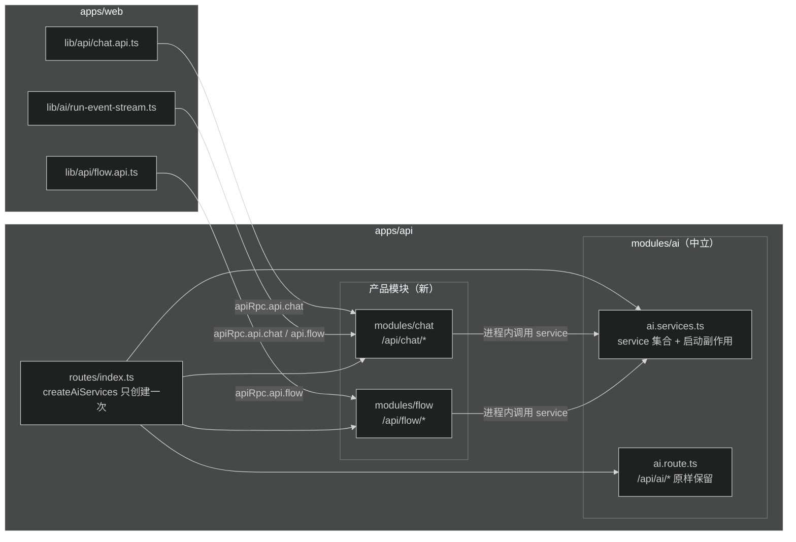

# 设计：AI 服务层拆分与产品模块骨架

## 总体数据流



## 1. modules/ai 服务层拆分

### 新文件 `apps/api/src/modules/ai/ai.services.ts`

- 导出 `createAiServices(runtime: AppRuntime): AiServices`。
- 内容：`ai.route.ts` 里 `return new OpenAPIHono()` 之前的全部 service 组装逻辑原样搬入（application、webhook、usage-audit、invocationRunner、toolRegistry、configuration、prompt、skill、agentDefinition、session、runExecutor、attachment、run、completion 各 service，含 `modelSupportsImageInput` 闭包）。
- 三个启动副作用跟着 service 走，放进 `createAiServices`：webhook dispatcher 创建与启动（`AI_WEBHOOK_ENABLED` 时）、session 一致性检查、run 恢复扫描。理由：副作用与 service 实例绑定，谁创建 service 谁触发，恰好一次。
- `AiServices` 接口字段：`applicationService`、`webhookService`、`usageAuditService`、`configurationService`、`promptService`、`skillService`、`agentDefinitionService`、`sessionService`、`runService`、`completionService`、`attachmentService`、`toolRegistry`、`invocationRunner`。

### `ai.route.ts` 改造

- 签名改为 `createAiRoute(runtime: AppRuntime, services: AiServices)`。
- 保留鉴权中间件创建（`requireAuth`、`requireRead`、`requireManage`、`requireUsageRead`、`requireProductApp`、`requireRuntimePrincipal`），挂载全部子路由，路径和行为不变。
- 删除原有 service 组装代码和三个启动副作用（已移入 services 文件）。

### `modules/ai/index.ts`

导出 `createAiServices`、`AiServices` 类型，保留 `createAiRoute` 导出。

## 2. 产品模块

### 目录

```
apps/api/src/modules/chat/
├── chat.openapi.ts   # OpenAPI 路由定义，tags: ["Chat"]
├── chat.route.ts     # 组装：requireAuth + ai services 转发
└── index.ts

apps/api/src/modules/flow/
├── flow.openapi.ts   # tags: ["Flow"]
├── flow.route.ts
└── index.ts
```

薄代理没有自有业务规则，不建 service/repository/presenter；后续收产品逻辑时再加。

### 端点映射（以 web 实际调用盘点为准）

| AI 端点 | chat | flow |
|---|---|---|
| GET /agents | /api/chat/agents | /api/flow/agents |
| GET /sessions | /api/chat/sessions | 不暴露 |
| POST /sessions | /api/chat/sessions | /api/flow/sessions |
| PATCH /sessions/:id | /api/chat/sessions/:sessionId | 不暴露 |
| DELETE /sessions/:id | /api/chat/sessions/:sessionId | 不暴露 |
| GET /sessions/:id/transcript | /api/chat/sessions/:sessionId/transcript | /api/flow/sessions/:sessionId/transcript（带 lane query） |
| GET /runs/:runId | /api/chat/sessions/:sessionId/runs/:runId | /api/flow/sessions/:sessionId/runs/:runId |
| GET /active-run | /api/chat/sessions/:sessionId/active-run | 不暴露 |
| POST /runs/:runId/abort | /api/chat/.../abort | /api/flow/.../abort |
| GET /runs/:runId/structured-outputs | 不暴露 | /api/flow/.../structured-outputs |
| POST /runs（SSE 启动） | /api/chat/sessions/:sessionId/runs | /api/flow/sessions/:sessionId/runs |
| GET /runs/:runId/events/stream（SSE 恢复） | /api/chat/.../events/stream | 不暴露（flow 无恢复路径） |
| POST /attachments | /api/chat/attachments | 不暴露 |
| GET /attachments/:id/content | /api/chat/attachments/:attachmentId/content | 不暴露 |

规则：

- 鉴权一律 `createRequireAuth(runtime.auth)`（starter_user cookie），不走 `requireRuntimePrincipal`。
- `RuntimeAccessContext` 用 `toRuntimeAccessContext(c.var.principal, c.var.resourceScope)` 构造，与 AI 路由同源。
- 请求 schema 复用 `@starter/contracts` 的现有 schema，OpenAPI 定义用 `@api/openapi/responses` 的 helper；产品侧不新造 DTO。
- 响应 data 用通用成功信封（`genericSuccessResponse`，data 为 unknown）：主 `AppType` 已接近 TS 声明序列化上限，产品面再复制一份 AI 响应 schema 会触发 TS7056。响应结构由同一 service 产出、与对应 `/api/ai/*` 端点同构，调用方用 contracts schema 运行时校验；请求侧类型不受影响。
- SSE 启动端点支持 Accept 分流（JSON 启动模式与 SSE），行为对齐 run.route.ts。

### SSE 流写出逻辑抽公共

`run.route.ts` 两处重复的 streamSSE 写流块（约 40 行 × 2）抽成 `apps/api/src/modules/ai/run/run-sse.ts` 导出 `writeRunEventStream(c, events)`；`run.route.ts`、chat、flow 三方共用。AI 侧行为不变。

## 3. middleware 与装配

- `routes/index.ts`：`createAiServices(runtime)` 创建一次，传给 `createAiRoute`、`createChatRoute`、`createFlowRoute`。
- **产品路由只在运行时挂载，不并入主 `AppType`**（实现时确认的偏离）：chat/flow 并入后主 RPC 类型超出 TS 声明序列化上限（TS7056），dts 构建失败、typed client 推断退化。挂载时对子应用做 `as unknown as Hono<HonoEnv>` 类型断言，运行时行为与 OpenAPI 文档不变。
- 产品面 RPC 类型独立导出：`src/rpc/chat.ts`（`ChatAppType`）、`src/rpc/flow.ts`（`FlowAppType`），package.json 增加 `./rpc/chat`、`./rpc/flow` 导出，tsup 构建入口同步增加。web 侧各建独立 typed client。
- `middleware/body-limit.middleware.ts`：`POST /api/chat/attachments` 加入文件上传限额分支（与 `/api/ai/attachments` 同规则）。
- `middleware/secure-headers.middleware.ts`：`/api/chat/attachments/:attachmentId/content` 加入跨域 embed 白名单（与 `/api/ai/...` 同规则）。
- 主 `AppType`（`apps/api/src/rpc.ts`）保持任务前规模，现有 `rpc-type.probe.ts` 断言不变。

## 4. web 切换

- 新建 `lib/api/chat.api.ts`：agents、sessions 五个操作、transcript、run get、active-run、abort，走独立 typed client `chatRpc`（`hc<ChatAppType>`，来自 `@starter/api/rpc/chat`）。
- 新建 `lib/api/flow.api.ts`：agents、createSession、lane transcript、structured-outputs、run get、abort，走 `flowRpc`（`hc<FlowAppType>`，来自 `@starter/api/rpc/flow`）。
- `lib/api/ai-attachments.api.ts` 改名 `lib/api/chat-attachments.api.ts`，路径改 `/api/chat/attachments`；`attachmentContentUrl` 同步改。
- `lib/ai/run-event-stream.ts`：`StartRunStreamInput` 增加 `product: 'chat' | 'flow'` 字段，内部按它选 chatRpc 或 flowRpc；`resumeRunStream` 固定走 chat。
- 删除 `lib/api/ai-chat.api.ts`。
- hooks 与组件不改逻辑，只改 import 来源。
- 测试更新：`apps/web/test/run-event-stream.test.ts` 的 apiRpc mock 结构改为产品 client；`apps/web/test/ai-attachments.test.ts` 的 URL 断言改 `/api/chat/attachments`（文件名同步改 `chat-attachments.test.ts`）。

## 5. 测试

- 新增 `apps/api/src/test/product-modules.smoke.test.ts`：
  - 同一登录用户下 `GET /api/chat/agents` 与 `GET /api/ai/agents` 返回 data 相等（同构校验）。
  - `POST /api/chat/sessions` 创建、`PATCH` 改名、`GET /sessions` 列表、`DELETE` 归档全链路。
  - `POST /api/flow/sessions` 创建后 `GET /api/flow/sessions/:id/transcript?lane=main` 读取。
  - `GET /api/flow/agents` 与 `/api/ai/agents` data 相等。
  - 未登录 401。
- 现有 ai 测试（`pnpm --filter @starter/api test`）必须全绿；不允许改断言语义。

## 6. 明确不做

- 不动 `/api/ai/*` 任何路径、schema、行为。
- 不建 flow 业务表，不加 Agent scope 列，不注册产品 tool / output contract。
- admin 前端继续直调 `/api/ai/admin/*`（平台管理面，属于 AI 中立接口的合法调用方，不在本任务范围）。
