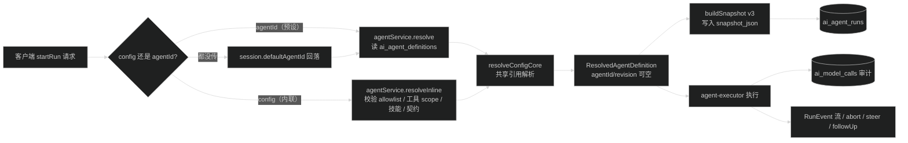
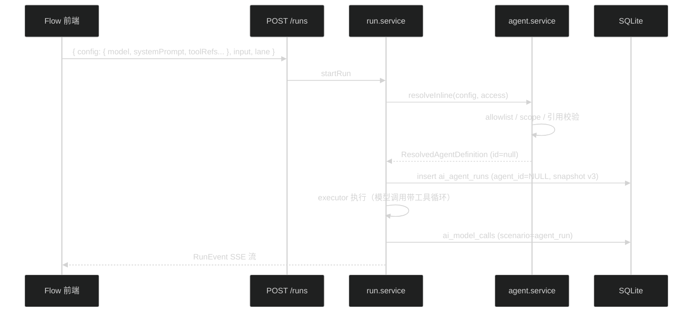

# 设计：startRun 支持内联 Agent 配置

## 1. 核心思路

Run 执行链路现状是两段式：

```
agentService.resolve(agentId) ──产出──> ResolvedAgentDefinition ──喂给──> agent-executor ──> Run
```

executor 只认 `ResolvedAgentDefinition`，不关心配置从哪来；Run 的幂等、steer、审计全部挂在启动时写入的 `snapshot_json` 上，与 Agent 定义天然解耦。

本设计只加一条产出路径：从请求体内联构造 `ResolvedAgentDefinition`，其余链路零改动。Agent 定义从"唯一入口"降格为"命名预设"。



## 2. 契约变更（packages/contracts/src/ai.ts）

### 2.1 新增 `inlineAgentRunConfigSchema`

```ts
export const inlineAgentRunConfigSchema = z.strictObject({
  model: strictAiModelRefSchema,
  systemPrompt: z.string().trim().min(1).max(100_000).optional(),
  systemPromptId: uuidSchema.optional(),
  skillIds: agentSkillIdsSchema.default([]),
  toolRefs: agentToolRefsSchema.default([]),
  outputContract: aiOutputContractRefSchema.nullable().default(null),
  outputMode: aiOutputModeSchema.default('optional'),
  thinkingLevel: agentThinkingLevelSchema.default('off'),
  maxTurns: z.number().int().min(1).max(32).default(8),
}).refine(
  (v) => (v.systemPrompt !== undefined) !== (v.systemPromptId !== undefined),
  { message: 'systemPrompt 与 systemPromptId 必须二选一' },
)
```

默认值与 `defaultAgentDefinitionConfig` 对齐（除 model 与 systemPrompt 必填、maxTurns 取 8）。systemPrompt 内联文本对齐 completion 模块的既有语义。

### 2.2 `startAgentRunSchema` 加字段

```ts
export const startAgentRunSchema = z.strictObject({
  agentId: uuidSchema.optional(),
  config: inlineAgentRunConfigSchema.optional(),
  lane: agentLaneSchema.optional(),
  input: agentRunInputTextSchema,
  idempotencyKey: agentRunIdempotencyKeySchema.optional(),
  attachmentIds: agentAttachmentIdsSchema.optional(),
}).refine((v) => !(v.agentId !== undefined && v.config !== undefined), {
  message: 'agentId 与 config 不能同时提供',
})
```

都不传时回落 session 默认 Agent 的行为在 service 层实现（需要查 session），schema 层无法校验。

### 2.3 快照 v3（读兼容 2 与 3）

```ts
export const agentRunSnapshotSchema = z.strictObject({
  schemaVersion: z.union([z.literal(2), z.literal(3)]),
  agentId: uuidSchema.nullable(),
  agentRevision: z.number().int().min(1).nullable(),
  model: strictAiModelRefSchema,
  systemPromptId: uuidSchema.nullable(),
  skillIds: agentSkillIdsSchema,
  toolRefs: agentToolRefsSchema,
  outputContract: aiOutputContractRefSchema.nullable().default(null),
  outputMode: aiOutputModeSchema.default('optional'),
  thinkingLevel: agentThinkingLevelSchema,
  maxTurns: z.number().int().min(1).max(32),
}).superRefine((v, ctx) => {
  // v2：两者必填；v3：成对出现（同 null 或同非 null）
  if (v.schemaVersion === 2 && (v.agentId === null || v.agentRevision === null)) 报错
  if (v.schemaVersion === 3 && (v.agentId === null) !== (v.agentRevision === null)) 报错
})
```

写入端只产 v3。`agentRunSchema` 的 superRefine 中 `snapshot.agentId === run.agentId`、`snapshot.agentRevision === run.agentRevision` 的比对改为可空值等价比较（null === null 通过）。

内联 Run 的 `systemPromptId` 可为 null（内联文本场景），v2 同样允许 null，无兼容问题。

## 3. 数据库迁移（0027）

`apps/api/src/infra/db/schema/index.ts` 中 `aiAgentRuns`：

- `agentId`：`notNull()` 去掉，保留 `references(aiAgentDefinitions.id, onDelete: 'restrict')`。
- `agentRevision`：`notNull()` 去掉。
- 新增 CHECK：`(agent_id IS NULL) = (agent_revision IS NULL)`，与 `ai_agent_sessions` 的 subject pair check 同一模式。

索引 `ai_agent_runs_agent_created_idx` 保留，SQLite 对 NULL 参与索引无碍。

迁移步骤：改 schema → `pnpm --filter @starter/api db:generate` → 检查生成的 0027 SQL（SQLite 修改列约束需要表重建，drizzle-kit 自动处理）→ `db:migrate`。回滚依赖 drizzle 生成的 down 语句。

## 4. API 代码变更

### 4.1 `apps/api/src/modules/ai/agent/agent.service.ts`

- `ResolvedAgentDefinition.id` 改为 `string | null`，`revision` 改为 `number | null`（概念从"Agent 定义解析结果"泛化为"执行配置解析结果"）。
- 提取私有函数 `resolveConfigCore(config, access)`：模型校验（`resolveModel`）、systemPrompt 解析（内联文本直用或 `promptService.resolveSystemPromptContent`）、技能启用检查、工具 scope 检查、输出契约元数据比对、技能描述拼接。`resolve(id)` 与新增的 `resolveInline(config, access)` 都走它。
- `resolveInline(config: InlineAgentRunConfig, access)`：`resolveConfigCore` 后返回 `{ id: null, revision: null, ... }`。注意 access 为 `product_app` 主体时直接抛 403（新错误码复用 `AI_MODEL_NOT_ALLOWED` 不合适——用现有授权类错误码，实现时从 `ApiErrorCodes` 里选最贴近的"主体不被允许"项，没有就加一个）。

### 4.2 `apps/api/src/modules/ai/run/run.service.ts`

- `startRun` 入口分流：

```ts
const resolved = input.config
  ? await agentService.resolveInline(input.config, access)
  : await resolveDefaultOrExplicit(); // 现有 agentId ?? session.defaultAgentId 逻辑
```

- `buildSnapshot` 签名改为 `(resolved: ResolvedAgentDefinition)`，产 v3，`agentId`/`agentRevision` 取可空值。
- `createRunExecutionContext` 与 `repository.create` 的 `agentId`/`agentRevision` 参数类型放宽为可空。
- telemetry 增加 `starter.ai.run.config.source: 'agent' | 'inline'` 属性；`starter.ai.agent.id` 为 inline 时省略。
- `runModelRef`（steer/followUp 回读）改用读兼容 schema，行为不变。

### 4.3 新增公开工具列表路由

`apps/api/src/modules/ai/agent/agent.openapi.ts` + `agent.route.ts`：`GET /api/ai/tools`（`requireAuth`），返回 `service.listTools()`（现有方法，name/version/description）。Flow 前端选工具用。

## 5. Flow 前端变更

### 5.1 `apps/web/lib/flow/flow-document.ts`

`FlowAgentNodeData` 加可选字段：

```ts
config?: FlowAgentInlineConfig  // model / systemPrompt / thinkingLevel / maxTurns / toolRefs / skillIds
```

旧文档无此字段照常解析（zod optional），向后兼容。运行态规则：`config` 存在 = 自定义模式（忽略 `agentId`）；否则要求 `agentId` 非空。

### 5.2 `apps/web/app/(site)/_components/flow/flow-inspector.tsx`

Agent 节点面板加模式切换（SegmentedControl 或简单两个按钮）：

- 预设模式：现有 AgentSelect + promptTemplate。
- 自定义模式：模型下拉（`GET /api/ai/models`）、思考强度下拉（7 档）、系统提示词 Textarea、maxTurns 数字输入、工具多选（`GET /api/ai/tools`）、技能多选（`GET /api/ai/skills`，过滤 enabled）。promptTemplate 两种模式共用。

### 5.3 `flow-workspace.tsx` / `flow-validate.ts` / `use-flow-run.ts` / `run-event-stream.ts`

- `FlowChainStep` 的 `agentId: string` 改为 `agentId | config` 二选一结构。
- 运行前校验分支：自定义节点校验 config 完整（schema 层已保证必填项）。
- `startRunStream` 的请求体直接透传 `config`（契约已加字段，前端类型自动获得）。
- 新建 `apps/web/components/ui/model-select.tsx`（下拉组件，形态对齐 AgentSelect，数据源换模型列表）。

## 6. 数据流：一次内联 Run 的持久化事实



## 7. 取舍记录

| 决策 | 备选 | 不选的原因 |
| --- | --- | --- |
| `agent_id` 可空 + 快照 v3 | 每次内联 Run 造一行影子 Agent 定义 | 污染 `ai_agent_definitions`，破坏 listPublic 语义和启停管理 |
| 共享 `resolveConfigCore` | 内联路径独立写一套校验 | 同一规则两份实现必然漂移，allowlist/scope 是安全边界 |
| 写 v3、读 2+3 | 全部快照重写为 v3 | 存量行不可变是设计原则（快照是执行事实），读取端兼容即可 |
| `systemPrompt` 内联文本必填二选一 | 只允许 `systemPromptId` 引用 | Flow 节点的角色提示词是节点私有内容，强迫用户去管理端建 Prompt 是本任务要消除的摩擦 |
| product_app 主体拒绝内联 | 一视同仁放开 | 外部 App 的终端用户选模型等于成本失控面扩大；App 级策略属非目标，先用最小拒绝面 |
| Flow 保持前端编排 | 服务端 DAG | 用户明确选 C 非 C+；服务端编排是独立大工程 |

## 8. 兼容与回滚

- 契约：`startAgentRunSchema` 只加可选字段，老客户端零影响；快照读兼容保证存量 Run 接口不变。
- 迁移：0027 up 放宽约束（无数据改写），down 恢复约束（需确认无 NULL 行，回滚前跑清理检查）。
- 功能回滚：整体 revert commit 即可，无运行时开关需求。
- Flow 文档：`config` 为 optional 字段，旧文档不迁移。

## 9. 风险点

- `ResolvedAgentDefinition.id` 可空化波及 `createRunExecutionContext`、telemetry、presenter 的类型链，需要类型检查全绿兜底。
- SQLite 表重建迁移在有大表时锁表；`ai_agent_runs` 体量在 starter 场景可接受，迁移文件需人工 review 生成的 SQL。
- 工具/技能列表接口的权限面：`GET /api/ai/tools` 暴露工具名与描述（无 schema、无 handler），与 `GET /api/ai/skills` 现状同级，无新增敏感面。
