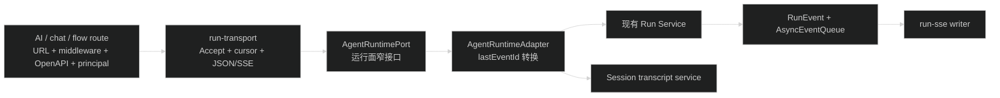

# D2 技术设计：AgentRuntimePort 与共享 Transport

## 1. 目标与边界

D2 在现有 Run Service 外围增加一个运行面端口和一个 HTTP/SSE transport 适配层。端口负责把产品调用映射到现有运行能力；transport 负责把已经校验的调用映射成 JSON 或 SSE。Run 状态机、事件持久化、Session 数据、公开 URL 和响应 DTO 继续由现有模块拥有。

D2 不新增数据库表或 migration，不改变 `RunEvent` wire format，不实现 D3 的 capability policy、SSE 恢复提示、Webhook 或 flow 恢复端点。



## 2. AgentRuntimePort

新建 `apps/api/src/modules/ai/runtime/agent-runtime.port.ts`，只声明产品运行面需要的类型和接口。该文件只依赖 `@starter/contracts` 的 DTO/输入类型以及 API 的 `RuntimeAccessContext`；不依赖 Hono、repository、Pi 包或 service factory 的 `ReturnType`。

接口形状固定为：

```ts
export interface AgentRuntimeStartInput {
  access: RuntimeAccessContext
  sessionId: string
  input: StartAgentRunInput
  requestId: string
}

export interface AgentRuntimeStartResult {
  runId: string
  events: AsyncIterable<RunEvent>
}

export type AgentRuntimeEventCursor =
  | { afterSequence: number }
  | { lastEventId: string }

export interface AgentRuntimePort {
  start(input: AgentRuntimeStartInput): Promise<AgentRuntimeStartResult>
  get(access: RuntimeAccessContext, sessionId: string, runId: string): AgentRun
  active(access: RuntimeAccessContext, sessionId: string, lane: string): AgentRun | null
  subscribe(
    access: RuntimeAccessContext,
    sessionId: string,
    runId: string,
    cursor: AgentRuntimeEventCursor,
  ): AsyncIterable<RunEvent>
  abort(access: RuntimeAccessContext, sessionId: string, runId: string): AgentRun
  steer(
    access: RuntimeAccessContext,
    sessionId: string,
    runId: string,
    input: SteerAgentRunInput,
  ): Promise<AgentRun>
  followUp(
    access: RuntimeAccessContext,
    sessionId: string,
    runId: string,
    input: FollowUpAgentRunInput,
  ): Promise<AgentRun>
  transcript(
    access: RuntimeAccessContext,
    sessionId: string,
    query: AgentTranscriptQuery,
    requestId?: string,
  ): Promise<AgentTranscript>
  outputs(access: RuntimeAccessContext, sessionId: string, runId: string): StructuredOutputList
}
```

实际实现中 `steer`、`followUp`、`transcript` 使用 contracts 已有的输入类型和 query 类型，不能引入新的 DTO。

`AgentRuntimeEventCursor` 是端口唯一的事件游标抽象。`sequenceForEvent` 不出现在端口接口或产品 route 中；适配器接收 `{ lastEventId }` 后，才调用现有 Run Service 的事件 ID 转 sequence 方法。未知 ID 继续由现有 service 抛出 400 `COMMON_INVALID_REQUEST`。

## 3. Concrete adapter 与装配

新建 `apps/api/src/modules/ai/runtime/agent-runtime.adapter.ts`，接收结构化的 Run/Session backend 方法集合，而不是导入 concrete service 的 `ReturnType`。适配规则如下：

- `start` 直接转发现有 `startRun`，原样保留 `{ runId, events }`。
- `get`、`active`、`abort`、`steer`、`followUp` 分别映射到 `get`、`activeRun`、`abort`、`steer`、`followUp`。
- `outputs` 映射到运行面 `structuredOutputs`，不暴露 admin structured outputs。
- `transcript` 映射到 Session Service 的 `transcript`，因此端口覆盖运行面需要的历史读取，但不吞并 Session CRUD。
- `subscribe` 对 `{ afterSequence }` 原样调用现有订阅；对 `{ lastEventId }` 先调用现有 `sequenceForEvent`，再调用现有 `subscribe`。

`createAiServices()` 在创建 `runService` 和 `sessionService` 后创建一个 `runtimePort`，并把它加入 `AiServices`。`AiServices` 仍可为 AI 管理路由提供完整 service 集合；它不是产品路由的入参类型。

## 4. 共享 Transport

新建 `apps/api/src/modules/ai/run/run-transport.ts`，导出两个 helper：

- `startRunTransport(c, port, input)`：调用 `port.start(input)`。当 `Accept` 包含 `application/json` 且不包含 `text/event-stream` 时，返回现有 `startAgentRunJsonSchema` 的成功信封；其余情况把 `result.events` 直接交给 `writeRunEventStream()`。
- `resumeRunTransport(c, port, input)`：读取已校验的 `afterSequence` 和原始 `Last-Event-ID`。当 `afterSequence > 0` 时始终传 `{ afterSequence }`；当它为 `0` 且存在 `Last-Event-ID` 时传 `{ lastEventId }`；否则传 `{ afterSequence: 0 }`。然后把 `port.subscribe()` 的 iterable 交给同一个 SSE writer。

Accept 规则保持当前兼容矩阵：缺省、`*/*`、仅 `text/event-stream` 和同时包含 JSON/SSE 时使用 SSE；仅包含 `application/json` 时使用 JSON。D2 不重新实现 RFC 权重解析，也不改变现有客户端行为。

Transport 不负责 middleware、principal 构造、URL、OpenAPI response、业务 policy、RunEvent 生产或错误码转换。`writeRunEventStream()` 继续负责 heartbeat、sequence 去重、终态停止和断开处理；D3 之前不增加恢复 frame。

## 5. 初始事件流生命周期

当前 `startRun()` 已创建独立的初始 `AsyncEventQueue`，但 RunEvent publisher 只广播给恢复订阅者，且终态时没有关闭该队列。D2 在不改变事件内容的前提下补齐生命周期：

1. publisher 每次成功持久化事件时同时 push 到初始 queue 和已有 subscribers。
2. `commitTerminal()` 在发布终态事件后关闭初始 queue；即使终态事务未提交，也必须关闭 queue，避免 JSON/SSE 调用永久等待。
3. SSE writer 结束或连接断开时，iterator 的 `return()` 应能结束初始 queue，释放仍在运行时保留的等待者；不得调用 Run Service 的 `abort`。
4. 幂等命中返回的 `start` 结果本身已经是 service 创建的回放 iterable，transport 仍直接消费它，不再追加一次 `subscribe(0)`。

这样新建 Run 的首个 SSE 会从 `start()` 返回的 iterable 读取 `run.started` 到唯一终态事件，不会产生第二个 sequence 0 订阅或丢失首个事件。

## 6. 路由依赖收敛

- `run.route.ts` 使用 `AgentRuntimePort` 处理 start、get、active、subscribe、abort、steer、follow-up、outputs；timeline、trace 和 admin structured outputs 继续从明确的只读 Run Service 依赖读取。
- `chat.route.ts` 接收本地定义的窄依赖：Agent public list、Session CRUD、`AgentRuntimePort` 和附件 upload/read。chat 的 transcript、Run 读取、active、start、恢复和 abort 均走端口。
- `flow.route.ts` 接收 Agent public list、创建 Session 和 `AgentRuntimePort`。flow 的 transcript、start、get、abort 和 outputs 均走端口。
- `createRoutes()` 只把 `aiServices` 中对应字段组装成上述窄依赖。chat/flow 不再接收或 import 完整 `AiServices`，也不直接引用 Run Service 的 `sequenceForEvent`。
- AI、chat、flow 三个 start handler 和 AI/chat 两个恢复 handler 都调用 `run-transport`；公开路径、OpenAPI schema 和 JSON envelope 不变。

## 7. 验收与风险

验证重点：

- port 源文件静态检查不出现 Hono、repository、Pi 包或 `ReturnType` service import。
- 三个 route 的 Accept 矩阵结果一致；start SSE 的 `event/id/data` 仍是已有 RunEvent。
- `afterSequence > 0` 覆盖 Last-Event-ID；`0 + Last-Event-ID` 由 adapter 解析，未知 ID 仍为 400。
- fake port 的 start iterable 被直接消费，subscribe 不被调用；terminal 后 iterator 停止，连接断开不调用 abort。
- chat active/transcript、flow outputs 和既有产品同构测试保持通过。

主要风险是异步 queue 关闭时机：如果只替换 route 而不让初始 queue 接收持久化事件，首个 SSE 会永久等待；如果终态不关闭 queue，JSON 模式和断开的 SSE 会留下等待者。实现和测试必须把这两个生命周期作为 D2 的强制验收项。

回滚只允许按 route 级别暂时恢复旧 service 调用；不得在系统中保留两套会分别决定 Accept、游标或启动流来源的主路径。
