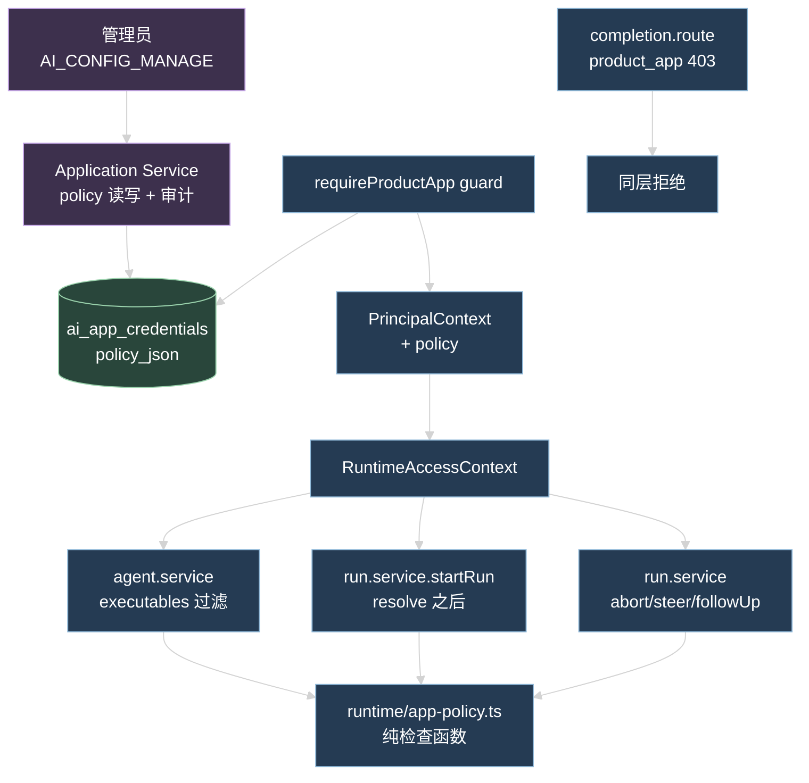
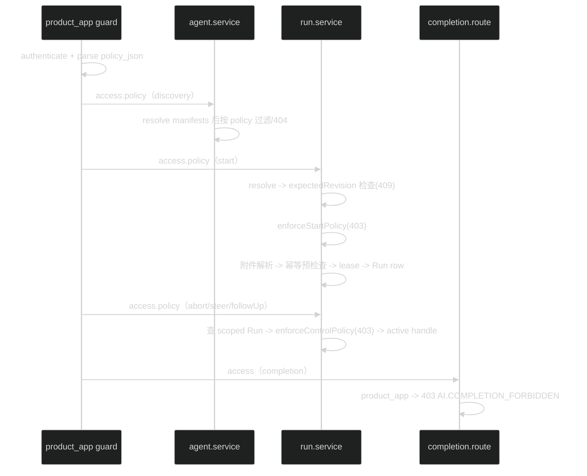

# D3 技术设计：应用能力策略与事件交付

## 1. 范围

三个交付块，全部建立在 D1（Executable Manifest）和 D2（AgentRuntimePort + 共享 transport）之上：

1. Capability policy：应用凭据保存版本化 strict policy，product_app 的 discovery、start、controls 全部经同一份检查函数。
2. Terminal Webhook：payload 绑定持久 terminal RunEvent 的 identity，扫描用复合游标，多实例 dispatcher 用条件更新领取 delivery。
3. SSE recovery：非终态断流发送版本化 `stream.resume_required` transport frame；flow 补齐恢复端点。

不改动：RunEvent wire format、Run 状态机、lane lease、attempt/retry、D1 manifest 的 hash 规则、`/api/ai` 公开 URL、chat/flow 既有端点行为。

## 2. 数据流总图



policy 的读取只有一条路径：guard 在 `authenticate` 成功后从 credential 行 parse `policy_json`，放进 `PrincipalContext.policy`，`toRuntimeAccessContext` 原样带到 `RuntimeAccessContext.policy`。Run Service、agent service、completion route 都从 access 上读，不做第二次查库。

## 3. Capability Policy

### 3.1 policy schema（contracts）

```ts
export const aiApplicationPolicySchema = z
  .strictObject({
    schemaVersion: z.literal(1),
    executables: z
      .array(z.strictObject({ id: uuidSchema, version: z.number().int().min(1) }))
      .max(100),
    controls: z.array(z.enum(['abort', 'steer', 'follow_up'])).max(3),
    maxSideEffect: aiToolSideEffectSchema,
  })
  .superRefine((value, context) => {
    // 重复 executable id 与重复 control 都拒绝，不做静默去重。
  })
```

- `version` 是 Agent revision（D1 manifest 的 `version` 同源），不是 semver。
- `maxSideEffect` 与 D1 manifest 的聚合 `sideEffect` 同一枚举：`read_only < idempotent_write < non_idempotent_write`。
- strict parse：未知字段、重复 executable id、重复 control、空 `executables` 之外的非法组合全部 400 `COMMON.INVALID_REQUEST`（schema 层拒绝）。

### 3.2 存储与 migration

`ai_app_credentials` 加一列：

```text
policy_json text null
```

- 存量行不回填：`NULL` 表示「未配置 policy」，语义是拒绝全部 product_app 运行面动作（discovery 返回空列表、start/controls 403）。不把缺省解释成 wildcard。
- `ai_app_credential_audit_events.action` 增加取值 `policy_updated`（text 列，无需 migration）。

### 3.3 CRUD 与审计

| 动作 | 端点 | 行为 |
| --- | --- | --- |
| create | `POST /api/ai/admin/applications` | 请求体必填 `policy`；`aiApplicationPolicySchema` strict 校验，失败 400 |
| update policy | `PATCH /api/ai/admin/applications/{appId}/policy` | 新端点；body `{ policy }`；active 才能更新，revoked 返回 409 `AI.APP_CREDENTIAL_REVOKED`；事务内更新 + 审计 `policy_updated` |
| rotate | 既有 | 不改 policy_json |
| revoke | 既有 | 不改 policy_json，认证立即失败 |

`aiApplicationSchema`（DTO）增加 `policy: aiApplicationPolicySchema.nullable()`：null 表示存量未配置，admin 可见并可补配。`toApplication` 读取时 parse，行内数据损坏（写入时已校验，理论不发生）按 null 返回并记 WARN。

### 3.4 guard 到 access 的传递

`application.guard.ts` 的 `createRequireProductApp`：

1. `authenticate(secret)` 返回的 record 携带 `policyJson`。
2. `policyJson` 存在时 `aiApplicationPolicySchema.safeParse`；成功得 policy，失败记 WARN 并按 null 处理（fail closed）。
3. principal 对象增加 `policy` 字段（`AiApplicationPolicy | null`）。

`principal.ts`：

```ts
export interface PrincipalContext {
  // 既有字段不变
  policy?: AiApplicationPolicy | null   // 仅 product_app 填充
}
export interface RuntimeAccessContext {
  // 既有字段不变
  policy?: AiApplicationPolicy | null
}
```

`toRuntimeAccessContext(principal, scope)` 返回 `{ principal, scope, policy: principal.policy ?? null }`。`starterRuntimeAccess` 与 starter_user guard 不设置该字段。所有既有调用点签名不变。

### 3.5 检查函数（单一实现）

新文件 `apps/api/src/modules/ai/runtime/app-policy.ts`，只依赖 contracts 与 `RuntimeAccessContext`：

```ts
strongestSideEffect(sideEffects: AiToolSideEffect[]): AiToolSideEffect   // 从 executable-manifest.presenter.ts 移入
enforceStartPolicy(access, resolved: { id: string; revision: number; tools: AiToolSideEffect[] }): void
enforceControlPolicy(access, control: 'abort' | 'steer' | 'follow_up'): void
manifestAllowedByPolicy(manifest: ExecutableManifestV1, policy: AiApplicationPolicy): boolean
```

规则：

- `access.principal.kind !== 'product_app'` 时全部直接通过（starter_user 行为不变）。
- product_app 且 `access.policy` 为 null（存量未配置或损坏）：start 与 controls 一律 403 `AI.APP_POLICY_FORBIDDEN`，discovery 返回空列表。
- start：`resolved.revision` 必须精确等于 policy 中该 agentId 的 `version`，且 `strongestSideEffect(resolved.tools)` 不超过 `maxSideEffect`；任一不满足 403。
- controls：`abort` / `steer` / `follow_up` 必须在 `policy.controls` 内，否则 403。
- discovery 过滤：`manifest.version === policy 中该 id 的 version` 且 `manifest.sideEffect` 不超过 `maxSideEffect`。

`sideEffectRank` / `strongestSideEffect` 移到本文件后，`executable-manifest.presenter.ts` 改为从这里 import，Run Service 与 presenter 共用一份聚合逻辑。

### 3.6 检查点位置



- `run.service.startRun`：检查插在 `expectedAgentRevision` 冲突检查之后、`resolveInputImages` 之前。因此 policy 拒绝不 reserve、不领 lease、不建 Run row、不消费 idempotency key（幂等预检查还在后面）。
- `expectedAgentRevision`（409）与 policy（403）是两个独立检查：前者校验请求自身一致性，后者校验授权；请求期望 revision 与当前不符时先报 409。
- `run.service.abort/steer/followUp`：查到 scoped Run 之后、操作 active handle 之前。只查 controls，不重查 executable revision（Run 启动时已通过当时的 policy；policy 事后收紧不追溯已在跑的 Run）。
- `agent.service.listExecutableManifests`：product_app 时先循环取全量 enabled 列表（pageSize 100 翻页，Agent 定义数量级小），逐个 resolve 后按 `manifestAllowedByPolicy` 过滤，再按请求的 page/pageSize 内存切片，`total` 为过滤后数量。
- `agent.service.getExecutableManifest`：product_app 且 policy 不允许时抛 404 `COMMON.NOT_FOUND`，不暴露资源存在性。
- `completion.route.ts`：handler 顶部 `c.var.principal.kind === 'product_app'` 时抛 403 `AI.COMPLETION_FORBIDDEN`。`POST /api/ai/test` 挂的是 cookie requireAuth，product_app 本就进不来，不动。
- Session 的 `defaultAgentId` 不在 session.service 提前校验：product_app 不传 agentId 时 start 的 resolve 结果同样过 `enforceStartPolicy`，start 是强制检查点。

### 3.7 错误码

| code | HTTP | 场景 |
| --- | --- | --- |
| `AI.APP_POLICY_FORBIDDEN` | 403 | product_app 的 start / controls / null policy；discovery 侧是静默过滤或 404 |
| `AI.COMPLETION_FORBIDDEN` | 403 | product_app 调用 `POST /api/ai/completions` |

跨 scope 的 Session/Run 访问继续 404，policy 拒绝发生在 scope 校验之后，不改变存在性隐藏规则。

## 4. Terminal Webhook

### 4.1 payload 扩展

`webhookRunTerminalPayloadSchema` 增加三个字段：

```ts
eventId: uuidSchema.nullable()          // 对应 terminal RunEvent 的 eventId
sequence: z.number().int().min(1).nullable()  // 该事件的 run 内 sequence
eventProtocolVersion: z.literal(1)
```

- identity 与 `ai_run_events` 中的持久 terminal 事件一致：eventId、sequence 直接取自该行。
- interrupted Run 由启动恢复扫描落终态，不经过 RunEventPublisher，没有 terminal RunEvent：`eventId` / `sequence` 为 null，`eventProtocolVersion` 恒 1。
- 存量 delivery 行的 `payload_json` 是入队时快照，投递时原样发送不 re-parse，旧格式投递不受影响。

### 4.2 表结构与扫描

`ai_webhook_deliveries` 加五列（全部 nullable，存量行为 null）：

```text
event_id text null
sequence integer null
event_protocol_version integer null
claimed_at timestamp null
claim_expires_at timestamp null
```

唯一键保持 `(endpointId, runId)`：第一版只有 `run.terminal` 一种事件，一个 Run 对一个端点恰好一条 delivery；interrupted 无 eventId 的行也由该键保证幂等。

`webhook.repository.listTerminalProductAppRunsAfter` 两处改动：

1. 游标从 `watermarkMs: number` 改为 `{ finishedAt: number; runId: string } | null`。null 表示从起点扫；where 条件为 `finishedAt > cursor.finishedAt OR (finishedAt = cursor.finishedAt AND id > cursor.runId)`，排序 `finishedAt asc, id asc`。同一毫秒超过批上限 200 条的记录下一批继续扫，不再跳过。
2. `leftJoin ai_run_events`（`runId` 相同且 `type IN ('run.completed','run.failed','run.aborted')`），取 terminal 事件的 `eventId` / `sequence`。Run Service 保证一个 Run 最多一条 terminal 事件，join 不放大行数；interrupted Run join 不到，两列为 null。

dispatcher 的内存状态从 `lastSweptFinishedAt: number` 改为 `lastSweptCursor: { finishedAt, runId } | null`，每批结束后更新为最后一条的复合值；中途异常不推进（既有语义）。

### 4.3 delivery claim

多实例互斥用条件更新领取：

```text
claimDueDeliveries(limit, now, ttlMs):
  1. 查 due 行：status='pending' 且 (claim_expires_at IS NULL OR claim_expires_at <= now)
     且 (next_attempt_at IS NULL OR next_attempt_at <= now)，带 endpoint url/secret
  2. 逐条条件 UPDATE：SET claimed_at=now, claim_expires_at=now+ttl
     WHERE id=? AND status='pending' AND (claim_expires_at IS NULL OR claim_expires_at <= now)
  3. 返回更新成功的行（rowsAffected=1）
```

- TTL 常量 `DELIVERY_CLAIM_TTL_MS = 60_000`（代码常量，不进环境变量）：足够覆盖单次出站请求（urlGuard 自带超时），实例崩溃后 60s 可被其他实例重领。
- `markDelivered` / `markRetry` / `markDead` 同时置 `claimed_at = null, claim_expires_at = null`：完成即释放，retry 的行到期后可被任意实例重领。
- 出站请求头增加 `X-Starter-Delivery-Id: <delivery.id>`：接收方按它做幂等（at-least-once 语义下重投是合法的）。
- 单实例内 `ticking` 互斥保持不变；claim 防的是跨实例。

## 5. SSE recovery

### 5.1 transport frame

contracts 新增独立 schema（不进 RunEvent 联合，不写 `ai_run_events`）：

```ts
export const streamResumeRequiredFrameSchema = z.strictObject({
  type: z.literal('stream.resume_required'),
  eventProtocolVersion: z.literal(1),
  lastSequence: z.number().int().min(0),
  reason: z.literal('transport_closed'),
})
```

### 5.2 writer 改动（`run-sse.ts`）

`writeRunEventStream` 只改这一处，AI / chat / flow 三个入口同时生效：

1. 循环中维护 `lastSequence = Math.max(lastSequence, value.sequence)`（含去重前的每个事件）。
2. `stream.onAbort` 置 `aborted = true`（连接已断，写 frame 无意义）。
3. 循环结束后：`!terminal && !aborted` 时写一帧：

```text
event: stream.resume_required
data: {"type":"stream.resume_required","eventProtocolVersion":1,"lastSequence":N,"reason":"transport_closed"}
```

- 不带 SSE `id` 字段（transport frame 没有 eventId）。
- iterator 抛错（catch 分支）同样满足 `!terminal && !aborted`，也写 frame；写失败静默忽略（此时连接多半已断）。
- 正常 terminal 流不发。heartbeat 仍是 comment，不创建 RunEvent。
- 客户端收到 frame 后按 `afterSequence = lastSequence` 连 `GET .../events/stream` 恢复，收不到时轮询 `GET /runs/{runId}` 的 `live`。

### 5.3 flow 恢复端点

flow 当前只有启动 SSE，没有恢复入口。补齐与 chat 同构的端点：

```text
GET /api/flow/sessions/{sessionId}/runs/{runId}/events/stream
```

- query 复用 `runTimelineQuerySchema`（`afterSequence`），handler 走 `resumeRunTransport`，与 chat 的 `getChatRunEventsStreamRoute` 逐行对齐（含 `Last-Event-ID` 优先级）。
- flow 面向 starter_user cookie，policy 不参与。

## 6. 兼容与回滚

- starter_user 全链路（discovery、start、controls、completion、SSE、Webhook 配置）行为不变；`RuntimeAccessContext.policy` 对其恒 null。
- 存量 credential 无 policy：认证仍成功，运行面动作 403，admin 可通过新端点补配。管理面 CRUD 不受影响。
- 存量 delivery / endpoint 数据不动；新列全 nullable，旧版本代码读写不受影响。
- Webhook payload 加字段是 additive：strict schema 只在入队时 parse 一次，第三方用新 schema 校验旧 payload 会失败——这是第三方侧的升级点，投递器不回填旧 payload。
- 回滚：撤下 policy 管理端点与检查函数调用点后，`policy_json` 与 delivery 新列保留为死数据，不改写 RunEvent 与既有 delivery。

## 7. 测试映射

| prd 验收 | 测试文件与用例 |
| --- | --- |
| policy schema / CRUD / 审计 / 400 | `ai-app-credentials.test.ts`：create 必填 policy、未知字段与重复 capability 400、update policy + `policy_updated` 审计、revoked 409、rotate 保留 policy、DTO 返回 policy |
| discovery 精确 revision | `ai-application-policy.test.ts`（新文件）：policy 内且 revision 匹配的 manifest 可见；revision 变化后消失；不在 policy 内的 404 |
| start 403 矩阵 | `ai-application-policy.test.ts`：未授权 Agent、revision 不匹配、sideEffect 超限、null policy 均 403 `AI.APP_POLICY_FORBIDDEN` |
| policy 失败无副作用 | `ai-application-policy.test.ts`：403 后断言无 Run 行、无 lease（同 lane 可立即再启动）、同 idempotencyKey 换合法 Agent 可用 |
| controls 403 | `ai-application-policy.test.ts`：policy.controls 缺 abort/steer/follow_up 时对应端点 403，允许的正常；跨 scope 仍 404 |
| completion 禁用 | `ai-application-policy.test.ts`：product_app 调 completion 403 `AI.COMPLETION_FORBIDDEN`；starter_user 正常 |
| starter_user 不受影响 | 既有全量测试回归（453+ 条不改动断言） |
| webhook identity | `ai-webhook.test.ts`：payload 的 eventId/sequence 与 `ai_run_events` 一致；重复扫描不重复建 delivery；interrupted Run 两列 null |
| 同时间戳不漏 | `ai-webhook.test.ts`：直接插入 201+ 条相同 `finished_at` 的终态 Run，多轮 tick 后 delivery 全部入队 |
| claim 互斥 | `ai-webhook.test.ts`：两个 dispatcher 共享同一 db，先后 tick 同一 delivery 只投一次；claim 过期后可重领；`X-Starter-Delivery-Id` 头存在 |
| SSE frame | `run-event-recovery.test.ts`：正常 terminal 无 frame；非终态 EOF（构造不含 terminal 的事件流）收到 frame 且 `lastSequence` 正确；按 afterSequence 重连续传不丢不重 |
| flow 恢复端点 | `product-modules.smoke.test.ts`：断开后按 runId + afterSequence 恢复，事件连续且以终态收尾 |

## 8. 已知边界

- policy 不含速率 / 预算 / 并发限额（prd Out of Scope）。
- `listExecutableManifests` 的 product_app 过滤在内存做：Agent 定义超过单页 100 条时循环翻页取全量，数量级可控；若未来 Agent 上千再考虑 SQL 侧过滤。
- claim TTL 内实例崩溃的 delivery 最长延迟 60s 重投；接收方按 `X-Starter-Delivery-Id` 幂等。
- `stream.resume_required` 只覆盖「iterator 正常结束但无终态」与「iterator 抛错」两种服务端可写场景；客户端 TCP 半开等网络层断开靠 SSE 自身的断开检测，无 frame。
