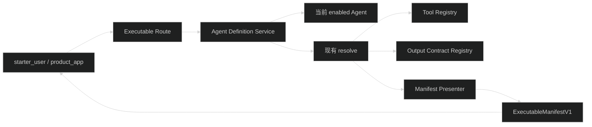
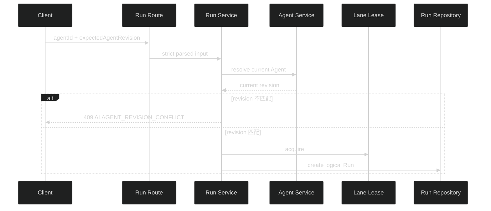

# D1：Executable Manifest 设计

## 1. 生成流程



新 route 使用现有 runtime principal，不读取数据库 record，也不返回管理配置。Service 查询当前 enabled Agent，并复用现有 `resolve(id, access)` 做 scope、模型和资源可用性检查。Presenter 只接收已解析对象和展示字段。

## 2. 公开契约

Manifest V1 的公开结构：

```ts
interface ExecutableManifestV1 {
  manifestSchemaVersion: 1
  kind: 'agent'
  id: string
  version: number
  name: string
  description: string
  inputSchema: JsonObject
  output: {
    contract: AiOutputContractRef
    schema: JsonObject
  } | null
  eventProtocolVersion: 1
  controls: Array<'abort' | 'steer' | 'follow_up'>
  sideEffect: 'read_only' | 'idempotent_write' | 'non_idempotent_write'
  manifestHash: string
}
```

`inputSchema` 来自独立的 `executableAgentInputSchema`，字段只含：

```ts
{
  lane?: string
  input: string
  idempotencyKey?: string
  attachmentIds?: string[]
}
```

目标 Agent 和版本由 Manifest identity 与 Run envelope 指定，不进入 capability 自身的输入 schema。

Output Contract schema 使用 Zod 4 的 draft-7 JSON Schema 转换。`visibility='admin'` 只限制运行结果值，不隐藏 schema；schema 本身不包含运行结果或 secret。

## 3. Hash

Presenter 构造内部 hash 输入：

```ts
{
  manifestSchemaVersion,
  kind,
  id,
  version,
  inputSchema,
  output,
  eventProtocolVersion,
  controls,
  sideEffect,
  execution: {
    model,
    thinkingLevel,
    maxTurns,
    retryPolicy,
    systemPrompt: { revision, contentHash },
    skills: [{ id, revision, contentHash }],
    tools: [{ name, version, manifestHash }]
  }
}
```

使用现有 `canonicalJson` 和 `sha256Hex`。Prompt/Skill 正文、Provider/model 和 Tool handler 不进入公开 DTO；`name`、`description` 只作为展示字段，不进入 hash。模型引用只进入内部 hash 输入，不单独公开。

Tool 副作用等级按以下顺序取最大值：

```text
read_only < idempotent_write < non_idempotent_write
```

没有 Tool 时为 `read_only`。

## 4. 版本校验



`expectedAgentRevision` 只与显式 `agentId` 配对。校验放在 `startRun` 现有 resolve 之后、附件和幂等逻辑之前。失败不领取进程内或持久 lease，不创建 Run，也不消费 idempotency key。

## 5. 模块位置

- `packages/contracts/src/ai.ts`：Manifest、调用输入、列表、参数和期望 revision schema。
- `packages/contracts/src/common.ts`：revision conflict error code。
- `apps/api/src/modules/ai/agent/executable-manifest.presenter.ts`：公开 DTO、JSON Schema 和 hash。
- `apps/api/src/modules/ai/agent/agent.service.ts`：list/get executable manifest。
- `apps/api/src/modules/ai/agent/agent.openapi.ts`、`agent.route.ts`：新 endpoint。
- `apps/api/src/modules/ai/run/run.service.ts`：期望 revision 校验。
- `apps/api/src/test/ai-executable-manifest.test.ts`：独立集成测试。

不新增 repository 或数据库表。

## 6. 错误与兼容

| 条件 | HTTP | Error code |
| --- | --- | --- |
| 未认证 | 401 | 现有认证错误 |
| Manifest 不存在、非 enabled | 404 | `COMMON.NOT_FOUND` |
| Agent 当前配置无法执行 | 现有行为 | `AI.AGENT_CONFIG_INVALID` 等 |
| 期望 revision 与当前不同 | 409 | `AI.AGENT_REVISION_CONFLICT` |
| 期望 revision 请求形状错误 | 400 | `COMMON.INVALID_REQUEST` |

现有 `/api/ai/agents` 不改变。`expectedAgentRevision` 可选，因此现有 API 客户端和产品 route 不需要同步修改。

## 7. 回滚

D1 没有 migration。回滚时删除 executable schema、presenter、route 和 revision conflict 检查即可；现有 Agent summary、Run resolved manifest 和 Run 主路径不需要改写。
