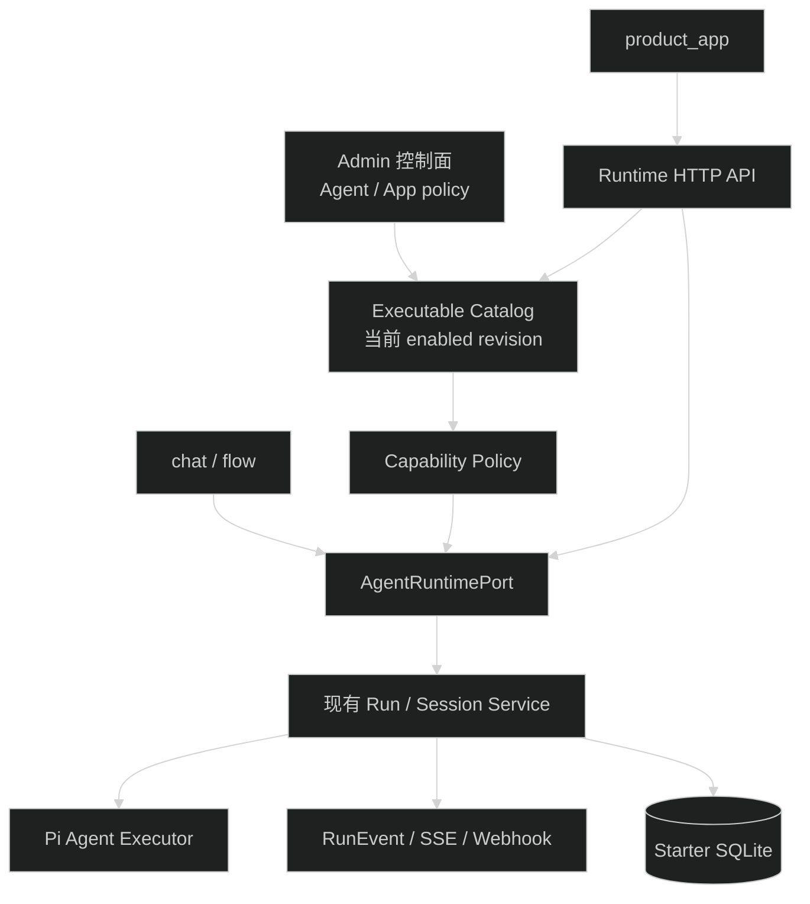
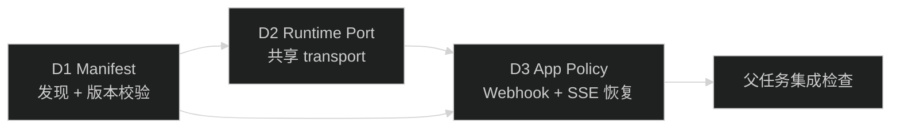
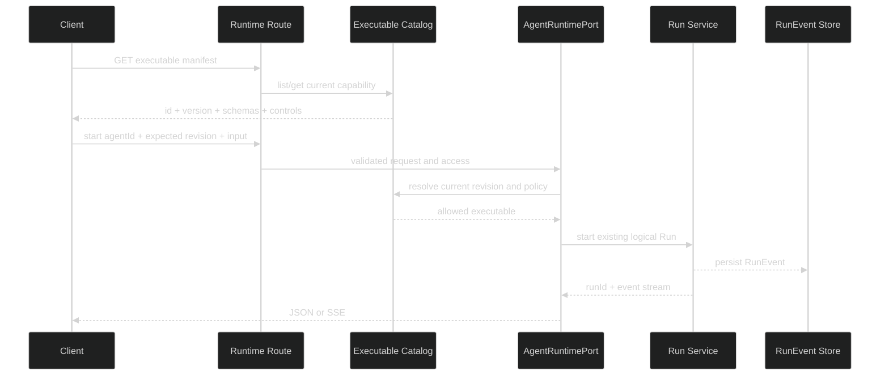

# 阶段 D 总体设计

## 1. 边界

阶段 D 在现有控制面和 Run Service 之间增加发布契约与窄运行端口，不替换 Pi Agent executor、RunEvent、Session 或数据库状态机。



依赖方向固定：

```text
packages/contracts
  <- apps/api/modules/ai agent/runtime/run
  <- apps/api/modules/chat and modules/flow
```

`packages/contracts` 不依赖 Hono、数据库或 Pi。产品模块只能调用 `modules/ai` 导出的窄接口，`modules/ai` 不能反向导入 chat/flow。

## 2. 三类事实

| 事实 | 所有者 | 用途 |
| --- | --- | --- |
| Agent Definition 与当前 revision | Agent 控制面 | 管理当前发布配置 |
| Executable Manifest | Agent service + presenter | 描述当前可以调用什么 |
| Resolved Run Manifest | Run Service + Starter SQLite | 证明某次 Run 实际使用了什么 |

Executable Manifest 由当前 enabled Agent 解析结果生成，不持久化第二份主数据。它包含稳定 hash，但不提供历史版本执行。Resolved Run Manifest 保持现有写入和读取语义。

## 3. 子任务依赖



### D1

建立公开 `ExecutableManifestV1`，只发布当前 enabled Agent。Run 请求可以携带期望 Agent revision；不匹配时在创建 lease 和 Run row 前返回冲突。

### D2

提取 `AgentRuntimePort`，统一 start/get/active/subscribe/abort/steer/follow-up/transcript/outputs。Hono Accept 与 SSE cursor 规则放入共享 transport helper，URL、middleware 和 OpenAPI 定义仍由各产品 route 持有。

### D3

应用凭据保存版本化 strict policy。policy 按精确 Agent revision、允许 controls 和最大副作用等级检查。终态 Webhook 绑定已有 terminal RunEvent identity；SSE transport 在未见终态就结束时发送恢复 frame。

D3 不发送 message、thinking、Tool 参数或其他中间事件 Webhook。

## 4. 主流程



版本或 policy 检查必须早于幂等预检查、lane lease 和 Run row。这样失败请求不占 lane、不消费 idempotency key，也不产生审计上无法解释的 Run。

## 5. 兼容策略

- 保留 `/api/ai/agents` summary 接口，新建 `/api/ai/executables` 运行契约接口。
- `expectedAgentRevision` 为可选字段；旧客户端不传时继续运行当前 revision。
- D3 对 `product_app` 即使未传该字段，也按 credential policy 的精确 revision 检查。
- AI、chat、flow 的 URL、JSON envelope 和 RunEvent wire format 不变。
- SSE 恢复提示使用独立 transport schema，不写入 `ai_run_events`，不伪装成业务事件。
- Webhook 继续提供 at-least-once 语义，接收方按 event/delivery identity 去重。

## 6. 状态归属

- Manifest 不新增数据库表；当前 Agent revision 和注册表是生成来源。
- D3 policy 由应用凭据 repository 写入 Starter SQLite，guard 只读取并构造运行上下文。
- Run 状态仍只由 Run Service 修改。
- Webhook delivery 仍由 webhook repository/dispatcher 修改，新增领取字段后使用条件更新。
- SSE transport frame 只存在于连接，不进入 RunEvent、Timeline 或 transcript。

## 7. 风险与处理

- 同一 Tool 版本跨部署定义漂移会让同一 Agent revision 的 manifest hash 改变。D1 把 Tool manifest hash 纳入 executable hash，并把漂移作为定义错误处理。
- Agent 名称和描述变化不增加 revision。它们可以展示，但不能进入执行字段 hash。
- 当前不能读取旧 Agent 配置，因此发现接口不能承诺历史 revision。请求旧版本返回冲突，不读取历史 Run manifest 来执行。
- Webhook 现有单字段时间水位可能跳过同时间戳记录。D3 改为稳定复合游标，并为多实例 dispatcher 增加 delivery claim。

## 8. 回滚

- D1 可撤下 executable 路由和期望 revision 字段；旧 Agent summary 与 Run 主路径保持可用。
- D2 可把 route 重新接回现有 service；不删除或复制 Run 状态机。
- D3 可禁用 policy 管理和新版 transport/Webhook 行为；保留新增 policy 与 delivery 历史数据，不改写已有 RunEvent。
