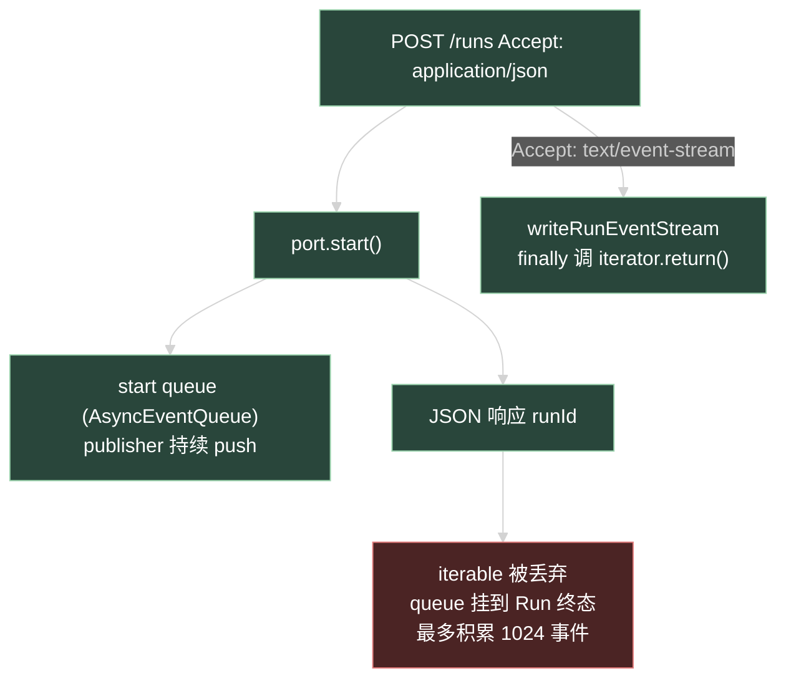

# 技术设计：阶段 D 审查风险修复

12 个修复项全部是小改动，本设计只展开有行为影响或方案选择的 5 项（R1、R2、R4、R10、R12），其余按 prd 直接执行。

## R1：终态收尾 unhandled rejection 防护

### 现状

`run.service.ts` 有 7 个 fire-and-forget 调用点：6 个 `void finalizeRun(...)`（行 484、509、571、584、594、615）和 1 个 `void runToTerminal(...)`（行 652）。`runToTerminal` 内部 await `finalizeRun`，异常会传播到 `void` 调用处成为 unhandled rejection；`finalizeRun` 内部分段 try/catch，但第 1214 行 `structuredOutputRepository.listByRun(runId)`（structured output required 检查）在 try 块外同步执行，SQLite 读失败直接抛出。

### 方案

不逐调用点加 `.catch`（7 处重复），在 `runToTerminal` 与 `finalizeRun` 函数体最外层各包一层 try/catch，记 error 日志（含 runId、sessionId、requestId、err），函数返回 void。内部既有的分段 catch 语义不变，最外层只是最后防线。

依据：终态事务（主库条件更新）在 `finalizeRun` 前部已提交的路径不受影响；兜底 catch 只发生在收尾后续步骤失败时，此时 Run 已落终态或由恢复扫描处理，进程存活优先。恢复扫描（`recoverInterrupted`）本身已由 `createAiServices` 的 readiness 包装（失败也 resolve 只记日志），无需改动。

### 错误写法与正确写法

```ts
// Wrong：逐调用点补 catch，7 处重复且新增调用点容易漏
void finalizeRun(context, terminal).catch((cause) => { logger.error(...) })

// Correct：函数体最外层兜底，调用点保持 void
async function finalizeRun(context, terminal) {
  try {
    /* 既有分段逻辑不动 */
  } catch (cause) {
    logger.error({ err: cause, runId: context.execution.runId, ... }, 'Run 终态收尾失败（兜底）')
  }
}
```

## R2：JSON 模式 start queue 生命周期

### 现状与数据流



`AsyncEventQueue.push` 对已关闭 queue 直接 return（`pi-event-mapper.ts` 的 `if (this.closed) return`），`iterator.return()` 调用 `end()` 关闭 queue。因此 JSON 分支结束 queue 后：publisher 继续 push 全部丢弃，Agent loop 与终态事务完全不受影响，Run 行为与 SSE 客户端断开（既有语义「只结束订阅不 abort Run」）同构。

### 方案

`run-transport.ts` 的 `startRunTransport` JSON 分支在返回响应前：

```ts
if (acceptsJson(...)) {
  await result.events[Symbol.asyncIterator]().return?.()
  return c.json(...)
}
```

幂等命中路径（service 返回既有 Run 的 subscribe 回放 iterable）同样被结束——该 iterable 本就是为本次请求建立的回放流，JSON 模式下无消费者，结束是正确语义。

不改 `writeRunEventStream`（其 finally 已有 `iterator.return?.()`），不改 port 接口签名。

## R4：delivery DTO 投影 event identity

`ai_webhook_deliveries` 表已有 `event_id` / `sequence` / `event_protocol_version` 列（migration 0031）。改动链：

1. contracts：`aiWebhookDeliverySchema` 加 `eventId: uuidSchema.nullable()`、`sequence: z.number().int().min(1).nullable()`、`eventProtocolVersion` 引用 R3 常量的 literal nullable。
2. repository 的 delivery 列表查询 select 补三列。
3. presenter/DTO 转换处透传。
4. `webhook.openapi.ts` 的 delivery 列表 response schema（如为 z.object 推导则自动带过；若手写需补字段）。
5. `ai-webhook.test.ts` 既有列表断言扩展三字段；interrupted Run 的 delivery 断言 null。

nullable 语义与 webhook payload 一致：interrupted Run（无 terminal 事件行）两列为 null，`eventProtocolVersion` 有值（协议版本与是否有事件无关——按 migration 实际写入值投影，enqueue 时统一写 1）。

## R10：Agent 选择器全量拉取

`agentDefinitionListQuerySchema.pageSize` 上限 100 是公开协议约束，不为 admin UI 放宽。方案：`application.query.ts`（或页面内）新增非 hook 的 `fetchAllEnabledAgentDefinitions(queryClient)`：循环 `queryClient.fetchQuery` 按 `useAgentDefinitionsQuery` 的 query key 逐页拉取，直到某页条数小于 pageSize 或达到安全上限（如 20 页 = 2000 条，超出记 warn 停止），返回拼接数组。Modal 打开时调用一次并缓存进 React Query（key 含页码的既有缓存不冲突）。

选择器数据源从 `useAgentDefinitionsQuery({ page: 1, pageSize: 100 })` 切到该全量结果；Agent 数量不足一页时行为与现状完全一致。

## R12：ai-system-design.md 降至注入上限以下

当前 40713 字节，需减少约 8000。两个手段：

1. **拆分 Webhook 节**：§3.5（Webhook 投递职责）+ §5.3 表格中 `ai_webhook_endpoints` / `ai_webhook_deliveries` 行的详细说明 + 失败边界中 webhook 相关行，抽到新文件 `.trellis/spec/api/backend/webhook-guidelines.md`（按 code-spec 七段结构重组：Scope/Signatures/Contracts/矩阵/Cases/Tests/Wrong-Correct）。`ai-system-design.md` 原位置保留 3-4 行概要 + 链接。预计减 4500-5500 字节。
2. **去重**：`ai-system-design.md` 中与 `agent-run-guidelines.md` 重复的条目收敛为链接——§4.1 的 policy 检查步骤细节、§5.1 后的 SSE resume frame 细节（两处均为 D3 双写的），各保留一句结论 + 指向权威文件。预计减 1500-2500 字节。

约束：拆分与去重不改变任何规则语义；`webhook-guidelines.md` 内容以当前 `ai-system-design.md` §3.5 与 agent-run-guidelines 的 webhook 测试条目为准重组，不新造规则。`index.md`（backend）注册新文件。目标 `< 32768` 字节，完成后用 `python3 ./.trellis/scripts/task.py validate` 确认无截断 warning。

## 其余项方案（无分支，直接执行）

- R3：`packages/contracts/src/ai.ts` 导出 `export const AI_EVENT_PROTOCOL_VERSION = 1 as const`；`z.literal(AI_EVENT_PROTOCOL_VERSION)` 与 API 侧四处引用。zod 的 `z.literal` 接受任意字面量值，常量 `as const` 后类型与推断不变。
- R5：`shared/env.ts` 中 `AI_WEBHOOK_TIMEOUT_MS` 的 schema 加 `.max(30000)`，错误信息写明「必须 ≤ 30000ms（delivery claim TTL 60s 的安全边界）」。
- R6：`run-event-recovery.test.ts` 用 Hono 小 app 包 `writeRunEventStream`，传一个挂起的 iterable，读取部分响应后 `res.body.cancel()`，断言输出不含 `stream.resume_required`。
- R7：`run-transport.test.ts` 扩展：JSON Accept 的 start 断言 iterator `return()` 被调用（spy）；幂等命中的 JSON 响应同样断言。
- R8：`ai-agent-runs.test.ts` 或专项：注入抛错的 `structuredOutputRepository.listByRun`（现有注入点已支持 test double），断言 Run 正常落终态、无 unhandledRejection（`process.on('unhandledRejection')` 临时监听收集）。
- R9：`application.query.ts` 加 `useUpdateAiApplicationPolicyMutation`（PATCH，body 用 contracts 的 `updateAiApplicationPolicySchema`）；`AiApplications.tsx` 行操作加「编辑策略」（active 才显示）；Modal 表单字段与创建共用一个子组件（`PolicyFormFields`，含 maxSideEffect / controls / executables，executables 数据源来自 R10）；提交成功后关闭 Modal、invalidate applications 列表缓存。i18n 新增 zh/en 键（编辑标题、按钮、成功提示）。
- R11：直接改写 §8 过时段落为现状描述，一句话，无方案分支。

## 兼容性

- 公开 URL、RunEvent wire format、Run 状态机、policy 语义、webhook 签名与 payload 均不变。
- `aiWebhookDeliverySchema` 加字段是响应新增字段，向后兼容。
- `AI_WEBHOOK_TIMEOUT_MS` 上限是新校验：超限配置原属「会击穿 claim TTL 的错误配置」，启动失败是期望行为；正常配置（≤30s）不受影响。
- spec 拆分只动 `.trellis/`，不影响代码。

## 回滚点

每项独立可回滚：R1/R2 是单文件小改；R3 常量替换可整体还原；R4 还原 schema 三字段；R9/R10 只在 admin；R12 拆分文件可合并回去。
