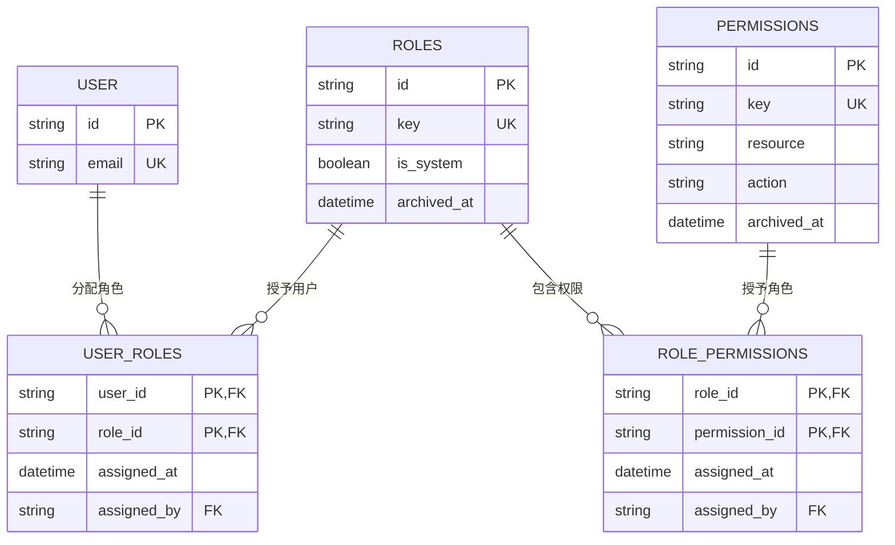
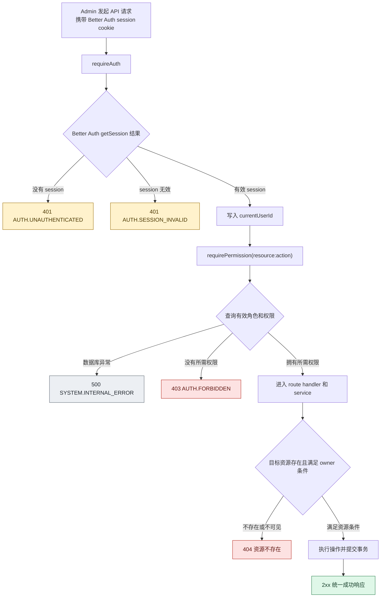
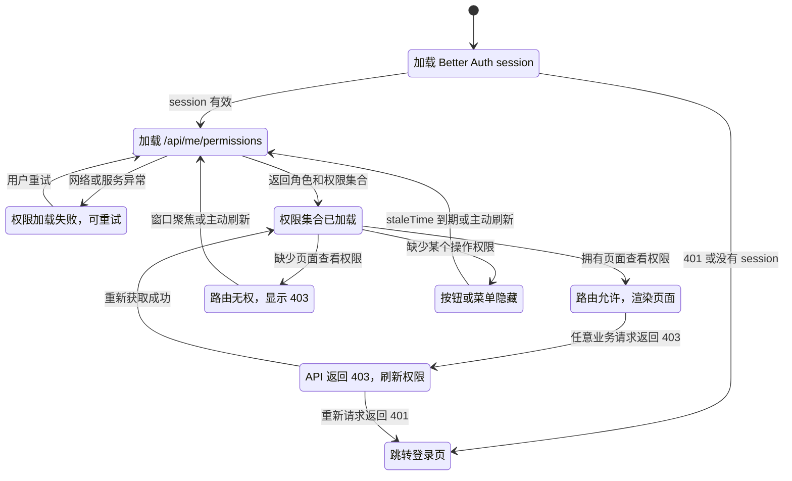
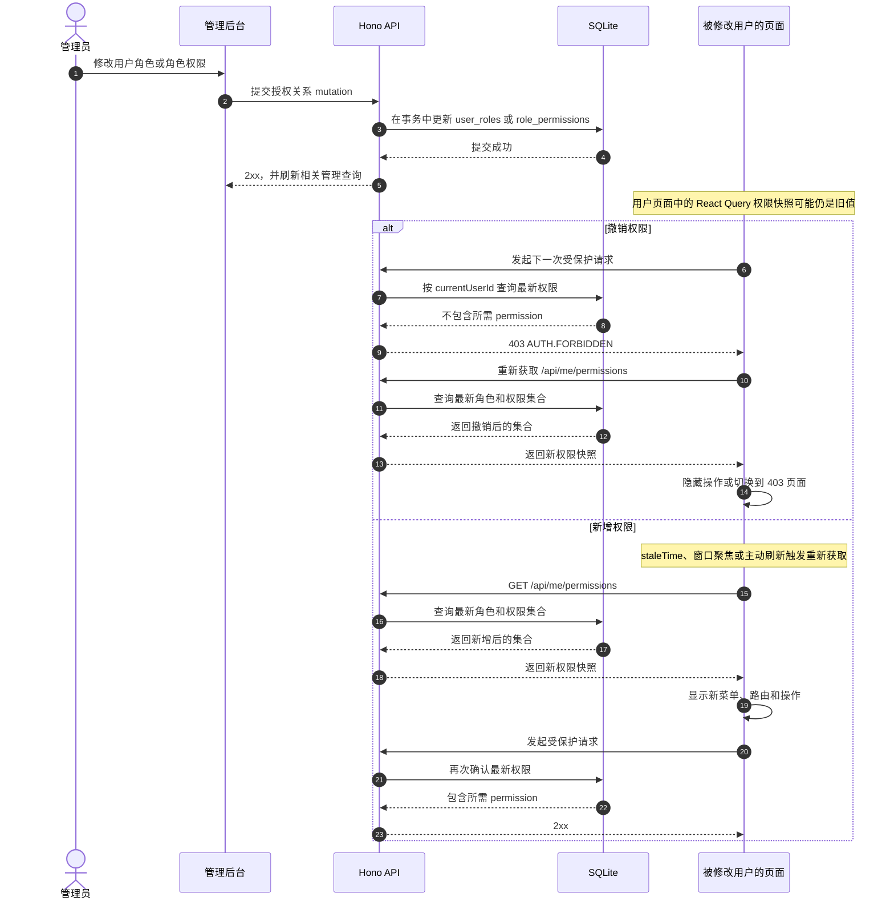

# 当前脚手架的用户权限设计调研

> 调研对象：`apps/api`、`apps/admin` 和 `packages/contracts`
>
> 调研日期：2026-08-09
>
> 结论先行：首版采用数据库驱动的全局 RBAC。API 每次授权请求基于当前 `currentUserId` 查询有效权限，前端通过独立的 `/api/me/permissions` 获取权限集合并用 React Query 管理；前端只控制界面和导航，API 中间件始终是安全边界。Better Auth Admin plugin 复用用户管理，角色权限关系和业务授权中间件先自建；Organization plugin 留给后续多租户版本。

## 权限状态流转图

### RBAC 数据关系



一个用户可以拥有多个角色，有效权限是所有未归档角色中未归档权限的并集。首版不支持角色继承、通配符权限或用户直接分配 permission。

### 一次 API 请求的完整授权判定



这张图表达两个独立条件：RBAC 判断“这个用户能不能做这类动作”，service 的 owner 条件判断“这个用户能不能操作这个具体资源”。只通过其中一个条件都不能执行操作。

### Admin 前端权限状态



前端 `PermissionReady` 只表示 React Query 已拿到一份权限快照。即使快照尚未刷新，API 仍会按数据库最新状态判断，因此前端的短暂旧状态不会扩大实际权限。

### 管理员修改权限后的同步时序



状态同步的时间边界如下：

| 状态                 | 生效时间                                       | 是否安全边界                   |
| -------------------- | ---------------------------------------------- | ------------------------------ |
| 数据库角色和权限关系 | 管理事务提交后立即生效                         | 是，API 查询的数据来源         |
| API 授权结果         | 用户下一次受保护请求时使用最新状态             | 是                             |
| React Query 权限快照 | 403、窗口聚焦、主动刷新或 staleTime 到期后更新 | 否，只控制 UI                  |
| 菜单、路由和按钮     | 权限快照更新后的下一次 React render            | 否                             |
| Better Auth session  | 401 或 session 过期时失效                      | 只负责身份认证，不负责业务授权 |

## 1. Auth0 RBAC 核心发现

### 1.1 权限模型

- Auth0 的 RBAC 关系是 User -> Role -> Permission：角色聚合权限，用户分配一个或多个角色后获得这些角色的权限。官方说明角色之间重叠时采用累加关系，最终权限是各角色权限的并集。[Auth0 RBAC](https://auth0.com/docs/manage-users/access-control/rbac)
- Auth0 的权限属于 API 定义的权限或 scope。官方示例使用 `read:admin-messages`，也使用 `create:bar`、`read:foo` 等格式；`resource:action` 适合作为本项目命名约定，但不是调研资料中声明的 Auth0 强制语法。[Auth0 Express RBAC 示例](https://developer.auth0.com/resources/code-samples/api/express/basic-role-based-access-control)、[Auth0 Access Token Profiles](https://auth0.com/docs/secure/tokens/access-token-profiles)
- Auth0 Core RBAC 的角色管理流程是创建角色、给角色添加权限、把角色分配给用户；官方 Core RBAC 页面同时列出“直接给用户分配权限”作为可选步骤。[Auth0 Core RBAC](https://auth0.com/docs/manage-users/access-control/configure-core-rbac)
- 在本次核验的 Auth0 Core RBAC 官方资料中，没有找到角色嵌套、角色继承或通配符权限的定义。首版不应假设 `user:*` 会自动匹配多个权限，也不应设计角色继承；需要扩大能力时再单独设计权限匹配规则和测试。
- Auth0 的 Organization 角色有两种来源：tenant role 和 Organization-scoped role。Organization 成员可以有多个角色，这些角色在用户通过该 Organization 登录时生效。[Auth0 Organization Member Roles](https://auth0.com/docs/manage-users/organizations/configure-organizations/add-member-roles)
- 同一个用户在不同 Organization 中可以拥有不同角色。Token 还可以带 `org_id`，因此多租户授权必须把组织上下文作为授权输入，而不是只看全局 user id。[Auth0 Access Token Profiles](https://auth0.com/docs/secure/tokens/access-token-profiles)

### 1.2 Token/Session 中的权限携带

Auth0 对 API bearer token 的处理可以概括为：

```json
{
  "scope": "openid profile read:patients",
  "permissions": ["read:patients", "write:patients"]
}
```

- 开启 API RBAC 后，`scope` 是“客户端请求的权限”和“用户被授予的权限”的交集。[Enable RBAC for APIs](https://auth0.com/docs/get-started/apis/enable-role-based-access-control-for-apis)
- 同时开启 Add Permissions in the Access Token 后，`permissions` claim 包含用户被授予的全部权限。Auth0 文档明确指出，这可以减少额外获取权限的请求，但会增大 token 体积。[Enable RBAC for APIs](https://auth0.com/docs/get-started/apis/enable-role-based-access-control-for-apis)
- Auth0 的 `access_token` 和 `rfc9068_profile` token dialect 默认只有 `scope`，对应的 `_authz` dialect 才包含 `permissions`。`permissions` 是数组，官方示例值为 `create:bar`、`create:foo`、`read:bar`、`read:foo`。[Access Token Profiles](https://auth0.com/docs/secure/tokens/access-tokens/access-token-profiles)
- `scope` 更适合表达本次 token 请求和 API 授权后的有效 scope；`permissions` 更适合让资源服务器或客户端直接读取用户的完整权限集合。两者不是同义字段，不能只因为都包含字符串就混用。
- 当前项目是 Better Auth cookie session，不是 Auth0 JWT bearer token。不能把 `permissions` claim 直接塞进 Better Auth session 后就认为后端完成了授权。建议保留 session 作为身份凭据，权限以服务端数据库为准，前端通过独立接口读取展示所需集合。

### 1.3 中间件校验流程

Auth0 Express 示例的关键流程是：

1. 客户端带 `Authorization: Bearer <access-token>` 请求 API。
2. Express JWT middleware 校验 token 的签名、issuer、audience 和有效期。
3. 授权 middleware 从 token 的 `permissions` 或 `scope` 中查找当前 endpoint 要求的权限。
4. 缺少权限时返回 `403 Forbidden`，示例响应为 `{ "message": "Permission denied" }`。[Auth0 Express RBAC 示例](https://developer.auth0.com/resources/code-samples/api/express/basic-role-based-access-control)

当前脚手架的等价流程应改为：

1. `requireAuth` 调用 Better Auth `getSession`，失败或没有 session 时返回 401。
2. `requireAuth` 把 `session.user.id` 写入 Hono `currentUserId`。
3. `requirePermission(permission)` 从 `currentUserId` 查询角色关联的有效权限。
4. 找到要求的 permission 后进入 route handler；查不到时返回 403。
5. handler 继续执行资源所有权检查。RBAC 只回答“能否执行某类动作”，不替代 `fileId + ownerId` 这类资源边界。

## 2. 后端落地方案

### 2.1 Drizzle Schema

#### 设计选择

权限需要一张表，角色和权限的关联也需要持久化。推荐采用“代码定义权限目录 + 数据库保存角色分配”的组合：

- API route 使用代码中的 `permissions` 常量，避免字符串拼写错误，并让权限成为可搜索、可测试的接口契约。
- migration 或 seed 把权限目录同步到 `permissions` 表，Admin 页面从表中展示可分配权限。
- 角色名称和角色权限关系放数据库，允许管理员在不发布前端代码的情况下调整角色。
- 不允许管理员在 UI 中任意创建未注册的 permission。新增权限先改代码目录，再通过 seed/migration 注册。

#### 四张表

下表中的列名使用 snake_case，TypeScript schema 使用项目现有的 camelCase 属性和 timestamp helper。

| 表                   | 关键字段                                                                                                                   | 约束和索引                                                                                                                                       |
| -------------------- | -------------------------------------------------------------------------------------------------------------------------- | ------------------------------------------------------------------------------------------------------------------------------------------------ |
| `roles`            | `id`、`key`、`name`、`description`、`is_system`、`archived_at`、`created_at`、`updated_at`                 | `id` 主键；`key` 唯一；`is_system=true` 的角色不能改 key、不能删除或归档；按 `key` 和 `archived_at` 查询                               |
| `permissions`      | `id`、`key`、`resource`、`action`、`description`、`is_system`、`archived_at`、`created_at`、`updated_at` | `key` 唯一；`resource + action` 唯一；`key` 由 `resource:action` 构造；系统权限不能删除，归档前检查是否仍被活动角色使用                  |
| `user_roles`       | `user_id`、`role_id`、`assigned_at`、`assigned_by`                                                                 | `(user_id, role_id)` 复合主键；两个外键分别指向 Better Auth 的 `user.id` 和 `roles.id`；用户删除 cascade；角色删除采用禁止删除或先解除关联 |
| `role_permissions` | `role_id`、`permission_id`、`assigned_at`、`assigned_by`                                                           | `(role_id, permission_id)` 复合主键；两个外键；角色或权限物理删除时 cascade；同时建立 `(permission_id, role_id)` 反向索引支持权限影响分析    |

建议的查询索引如下：

- `user_roles(user_id, role_id)`：按当前用户找角色。
- `role_permissions(role_id, permission_id)`：按角色找权限。
- `permissions(key)`：按接口需要的 permission key 定位权限。
- `role_permissions(permission_id, role_id)`：管理员查看某权限被哪些角色使用。
- `roles(key)`、`roles(archived_at)`：角色查找和活动角色过滤。

SQLite 已在当前 runtime 中打开 foreign keys。关联表的写入应放在事务中，保证用户角色和角色权限的多步修改不会产生半成品关系。[当前数据库规范](../../spec/api/backend/database-guidelines.md)

#### 删除和系统角色

- 首版预置 `admin`、`operator`、`viewer` 等角色时，将 `admin` 和权限目录标为系统数据。
- 角色和权限使用 `archived_at` 做软删除。读取有效权限时必须过滤 `archived_at is null`，归档角色立即失去权限。
- 不提供物理删除权限的管理接口。物理删除角色前也应检查 `user_roles` 和 `role_permissions`，避免破坏审计或历史数据。
- 关联表是当前授权关系，不承担历史审计；如果以后需要完整审计，再单独增加 role assignment audit 表，不把审计字段塞进授权查询。
- 禁止给用户直接加 permission，所有全局 RBAC 授权通过 role -> permission 关系完成。这样可以保持 User -> Role -> Permission 的单一解释方式。

### 2.2 中间件设计

#### 目录和调用顺序

建议新增独立 authorization 模块，与 Better Auth 的认证模块分开：

```text
apps/api/src/modules/authorization/
  authorization.schema.ts
  authorization.repository.ts
  authorization.service.ts
  authorization.guard.ts
  authorization.openapi.ts
```

`authorization.guard.ts` 只负责请求级判断，repository 只负责 Drizzle 查询，service 负责权限目录和业务错误，符合当前 API 的 `route -> service -> repository` 结构。[API 后端规范](../../spec/api/backend/index.md)

目标调用形态：

```ts
const requireAuth = createRequireAuth(runtime.auth);
const requirePermission = createRequirePermission(runtime.db);

app.get(
  "/api/users",
  requireAuth,
  requirePermission("user:list"),
  listUsersHandler,
);

app.post(
  "/api/users",
  requireAuth,
  requirePermission("user:create"),
  createUserHandler,
);

app.delete(
  "/api/users/:id",
  requireAuth,
  requirePermission("user:delete"),
  deleteUserHandler,
);
```

`requirePermission` 放在 `requireAuth` 之后，直接复用 `c.var.currentUserId`。不建议每个业务 route 自己读取 session 或复制权限查询。若 Hono route 类型不便表达两个 middleware，可以提供一个组合 helper，但内部仍保持认证和授权职责分离。

#### 授权查询

单个 permission 的查询可以使用 join：

```sql
SELECT 1
FROM user_roles ur
JOIN roles r ON r.id = ur.role_id
JOIN role_permissions rp ON rp.role_id = r.id
JOIN permissions p ON p.id = rp.permission_id
WHERE ur.user_id = ?
  AND r.archived_at IS NULL
  AND p.archived_at IS NULL
  AND p.key = ?
LIMIT 1;
```

查询参数只来自 `currentUserId` 和代码中的 permission 常量。服务端必须用参数化 Drizzle 查询，不接受前端传入的角色名或权限集合作为授权依据。

#### 错误契约

- 没有 session 或 session 无效：HTTP `401`，使用现有 `AUTH.UNAUTHENTICATED` 或 `AUTH.SESSION_INVALID`。
- 有效 session 但没有 permission：HTTP `403`，建议新增 `AUTH.FORBIDDEN`，文案为“当前账号没有这个操作的权限”。
- 权限查询数据库失败：让全局错误处理返回 `500 SYSTEM.INTERNAL_ERROR`，不要把数据库错误当成 403。
- OpenAPI 为需要权限的 route 同时声明 `401` 和 `403` response。现有 `AppError` 已允许 403，contracts、OpenAPI、API smoke test 和 Admin 错误处理需要一起更新。[API 错误处理规范](../../spec/api/backend/error-handling.md)

权限 middleware 不能绕过资源所有权检查。例如 `file:delete` 只说明用户可以删除文件类资源，`files.service.ts` 仍需要按 `fileId` 和 `currentUserId` 找到归属后才能删除。未来管理员删除他人文件时，应另定义明确的 `file:delete:any` 权限并调整 service 的 owner 条件，不能通过前端隐藏按钮实现。

### 2.3 缓存策略选择

| 方案                        | 权限新鲜度                | 实现成本 | 当前项目评价                           |
| --------------------------- | ------------------------- | -------- | -------------------------------------- |
| 每次请求查询 DB             | 立即生效                  | 低       | 推荐，适合低并发管理后台和 SQLite      |
| 登录或 session 初始化时加载 | 需重新登录或刷新 session  | 中       | 不推荐，撤销权限可能继续有效           |
| 进程内`Map` 短缓存        | 受 TTL 影响，多实例不一致 | 中       | 可作为后续单实例优化，不能作为首版默认 |
| Redis 或外部缓存            | 可共享，但增加基础设施    | 高       | 当前范围外                             |

首版推荐每次受保护请求查询权限，不缓存授权结果。理由是权限查询只需一次 join，当前项目没有 Redis，SQLite 适合管理后台的低并发请求；管理员撤销角色后，下一次 API 请求即可拒绝。前端的权限集合可以用 React Query 缓存 30 秒到 1 分钟，但它只影响菜单和按钮显示，不影响 API 的实际授权。

如果未来必须加进程内缓存，应按 `userId` 缓存短 TTL，并在所有角色变更成功后清除目标用户缓存。多实例部署时，单实例清除不够，必须改为每请求查库、共享缓存或带版本号的集中失效机制。

## 3. 前端落地方案

### 3.1 权限获取时机

推荐独立接口，不把权限集合直接塞进 Better Auth session：

```http
GET /api/me/permissions
Cookie: better-auth.session_token=...
```

建议响应：

```json
{
  "ok": true,
  "data": {
    "roles": ["operator"],
    "permissions": ["user:list", "file:list"],
    "version": 12
  },
  "meta": {
    "requestId": "req_01...",
    "timestamp": "2026-08-09T00:00:00.000Z"
  }
}
```

选择独立接口的原因：

- Better Auth session 负责身份和 session 生命周期，业务权限由应用自己的四张表负责。
- 当前 `/api/me` 的返回值主要是 Better Auth session 和登录 provider，权限接口可以避免把应用授权 DTO 和 Better Auth 返回类型绑在一起。
- 前端可单独失效权限 query，不必因为角色变更清空认证 session。
- `permissions` 数组只用于 UI 和操作提示；后端每次请求重新从数据库判断。

Admin 可新增 `permissionsQueryKeys`，使用 TanStack Query 保存 server state，不写入 Zustand 或 localStorage，符合现有 Admin 状态规范。[Admin 状态规范](../../spec/admin/frontend/state-management.md)

建议默认配置：

- `staleTime: 30_000`。
- 切回窗口时允许 refetch。
- 登录成功后同时 invalidate session 和 permissions query。
- 角色管理 mutation 成功后 invalidate 当前管理员自己的 permissions query；目标用户下次请求由 API 重新判断。
- 401 清空相关 query 并跳转登录；403 先 invalidate permissions query，再决定是否显示无权限页。

把权限放进 `/api/me` 作为一次请求的混合方案也可行，但会让 session DTO 和应用授权 DTO 绑定。只有在登录后的首屏请求非常敏感时才采用混合方案，不建议首版为此修改 Better Auth session 类型。

### 3.2 权限控制组件

先定义稳定的权限类型和纯判断函数：

```ts
type Permission = `${string}:${string}`;

type PermissionState = {
  roles: string[];
  permissions: Permission[];
  version: number;
};

function hasPermission(
  permissions: readonly Permission[],
  required: Permission,
): boolean {
  return permissions.includes(required);
}
```

`usePermission` 读取 permissions query：

```ts
export function usePermission(permission: Permission) {
  const query = usePermissionsQuery();
  return {
    allowed: query.data?.permissions.includes(permission) ?? false,
    isLoading: query.isLoading,
    isError: query.isError,
  };
}
```

组件级控制建议提供 `PermissionGuard`：

```tsx
<PermissionGuard permission="user:create">
  <CreateUserButton />
</PermissionGuard>
```

组件行为：

- 权限加载中：返回稳定的 loading 状态，避免按钮在首屏闪烁。
- 权限加载失败：不显示受保护操作，并显示可重试的权限加载错误；不能默认放行。
- 权限不存在：不渲染受保护内容，页面级守卫显示 403 页面。
- 普通查看页面不应因为缺少某个写权限而整页不可见；页面和操作使用不同 permission。

路由级控制沿用当前 `apps/admin/src/app/router/auth-guard.ts` 的登录守卫，在 `resolveAdminRouteAccess` 后增加权限判断。路由记录需要增加可选 `permission` 字段，`apps/admin/src/app/router/records.ts` 作为菜单、路由和权限声明的单一来源：

```ts
{
  id: "users",
  path: "/users",
  permission: "user:list",
  component: UsersPage,
}
```

菜单生成时过滤 `permission`，直接访问 URL 时仍由 router guard 返回 403。按钮、批量操作、表格行操作使用 `usePermission` 或 `PermissionGuard`。权限 key 不应散落在页面文案中。

Auth0 React SDK 的可借鉴点是集中提供 `isLoading`、`isAuthenticated`、`user` 和认证方法，并通过 `withAuthenticationRequired` 保护路由。[auth0-react README](https://github.com/auth0/auth0-react) 当前项目不需要复制 SDK，而是把现有 Better Auth session query 和新增 permissions query 组合成同样清晰的状态边界。

### 3.3 权限变更同步

采用“后端立即生效，前端被动发现并主动刷新”的策略：

1. 管理员修改角色关系后，数据库事务提交即成为新的权限事实。
2. 受影响用户下一次受保护 API 请求重新查询数据库，撤销权限立即返回 403。
3. Admin 的权限集合默认缓存 30 秒，并在窗口重新获得焦点时刷新；这只影响 UI 显示延迟。
4. 任意 API 请求收到 403 时，客户端 invalidate `/api/me/permissions` 并重新获取一次。若仍无权，显示 403 页面或禁用操作；不要因 403 直接退出登录。
5. 收到 401 时，说明身份 session 无效或过期，清空 query 并跳转 `/login`。
6. 如果产品将来要求“页面打开时主动发现权限变化”，增加定时 refetch 或页面进入时 refetch，不引入 WebSocket 作为首版依赖。

因此，在不使用服务端缓存的首版中，后端权限撤销最长在下一次受保护 API 请求生效；前端按钮可能在 query stale 时间内仍显示，但点击后仍会被 403 拦截。报告必须把这两个时间点区分开。

## 4. 前后端配合关键点

- 401 和 403 必须有不同语义：401 处理登录态，403 处理权限不足。前端不能把 403 当成登出。
- 前端下发的 permission key、隐藏的菜单和 route guard 都不是安全边界；API 每个写接口必须挂 `requirePermission`。
- `/api/me/permissions` 返回的是 UI 可读集合，API middleware 仍从数据库读取；不能让客户端把 permissions 数组回传给 API 作为授权凭据。
- 权限 key 必须只有一个规范。推荐 `resource:action`，同时在 contracts、API route 常量、权限 seed、Admin route records 中复用同一份命名。
- RBAC 与资源范围分开：角色决定动作类型，service 决定目标资源是否属于当前用户；需要跨用户操作时另设 `:any` 权限并调整 service 条件。
- 角色修改、角色权限修改和权限目录归档需要使用数据库事务，并使当前用户的权限 query 失效。多实例缓存不能只清除本进程的 Map。
- OpenAPI 的 401/403 response、contracts 的 error code、API smoke test 和 Admin `ApiRequestError` 必须同步更新。[API 错误处理规范](../../spec/api/backend/error-handling.md)

## 5. Better Auth 集成建议

### 5.1 直接复用

- 继续使用 Better Auth 处理注册、登录、OAuth、session cookie、session 过期和用户基础资料。
- 如果需要管理后台的创建用户、列出用户、修改用户角色、封禁、解封、模拟登录和 session 管理，可以启用 Admin plugin。官方文档明确列出这些管理员操作，并说明默认有 `admin` 和 `user` 角色。[Better Auth Admin Plugin](https://www.better-auth.com/docs/plugins/admin)
- Better Auth Admin plugin 还提供可配置的 access controller、角色权限定义和 `hasPermission` / `userHasPermission` 检查。它的示例权限结构是 `{ project: ["create", "update"] }`，与本项目想在 API route 上使用的 `user:create` 字符串不同。[Better Auth Admin Plugin](https://www.better-auth.com/docs/plugins/admin)
- 如果未来启用多租户，可以复用 Organization plugin 的组织、成员、邀请、角色、team 和 organization hooks。官方文档说明组织默认有 owner、admin、member 角色，也支持自定义权限。[Better Auth Organization Plugin](https://www.better-auth.com/docs/plugins/organization)

### 5.2 首版自建

- 自建 `roles`、`permissions`、`user_roles`、`role_permissions`，因为当前需求需要明确的全局 User -> Role -> Permission 数据模型、`resource:action` key、独立权限接口和自定义 Hono middleware。
- 自建权限目录 seed、授权查询 repository、`requirePermission` guard、`/api/me/permissions` endpoint 和 Admin 的 `usePermission`/`PermissionGuard`。
- 不为这套首版 RBAC 开发自定义 Better Auth plugin。它不是 Better Auth 认证生命周期的扩展，而是当前 API 的业务授权层；等到需要让权限随 Better Auth session 类型自动扩展或需要复用插件 endpoint 时再评估。
- Admin plugin 可以与自建 RBAC 并存，但要避免两个同名 `admin` 角色成为两个事实来源。推荐首版要么只复用 Admin plugin 的用户管理操作，要么完全使用自建 RBAC 管理操作；不要让一次用户角色变更只更新其中一套表。

### 5.3 何时改用 Organization plugin

当一个用户在不同客户、团队或租户中需要不同权限时，增加 `organizationId` 维度，并让授权查询同时接收 active organization。此时可以让 Organization plugin 管理成员和组织角色，再把组织角色映射到应用 permission；不能继续把所有角色都当成全局角色。

## 6. 扩展路线

### 6.1 RBAC 首版

- 全局角色和 permission key 使用四张表。
- 角色权限是并集，不支持通配符和继承。
- API 每次请求查有效权限。
- Admin 通过 `/api/me/permissions` 获取集合，UI 做路由和操作过滤。
- 使用 `AUTH.FORBIDDEN` 表示已登录但无权访问。

### 6.2 RBAC 到 ABAC

当“同一个角色只能操作自己创建的资源”“只能访问某部门用户”等规则增多时，保留稳定的 action permission，把资源属性判断放进 service/policy 层：

```text
permission check: user:update
resource check: target.ownerId === currentUserId
attribute check: target.departmentId in currentUserDepartments
```

不要在首版预先创建泛化的 `policies` 表。先把权限 middleware 和资源条件检查分成两层，未来再根据真实策略数量设计 policy DSL 或 `policies` 表。这样不会让简单 RBAC 查询承担属性表达式解析。

### 6.3 ABAC 到多租户

- Better Auth Organization plugin 负责 organization、member、invitation 和 active organization 生命周期。
- `user_roles` 后续拆成或扩展为带 `organization_id` 的组织角色关联；全局系统管理员可以保留单独的 global role 关系。
- `/api/me/permissions` 必须带当前 organization 上下文，否则前端无法知道权限属于哪个租户。
- API 的 `requirePermission` 需要接收 `{ userId, organizationId, permission }`，所有业务资源查询也必须带 organization 条件。
- 组织切换、邀请、成员角色修改和组织删除属于 Organization plugin 的生命周期，但最终业务资源仍需要应用自己的 tenant owner 条件。

## 首版实施清单

以下清单按两天内完成一个可用版本安排，具体页面视觉和完整审计不在本报告范围内。

### 第一天上午：数据和契约

- [ ] 在 API authorization 模块创建四张表 schema。
- [ ] 为 `admin`、`operator`、`viewer` 和首批业务 permission 建立 seed。
- [ ] 增加用户角色、角色权限查询所需索引。
- [ ] 生成并检查 Drizzle migration，在临时 SQLite 测试库执行。
- [ ] 在 `packages/contracts` 增加 permission DTO、`AUTH.FORBIDDEN` 和请求/响应 schema。

### 第一天下午：后端授权

- [ ] 实现 authorization repository/service。
- [ ] 实现 `createRequirePermission(db, permission)`，要求先执行 `requireAuth`。
- [ ] 为用户列表、用户创建、用户删除等 API 添加 `user:list`、`user:create`、`user:delete` 示例权限。
- [ ] 实现 `/api/me/permissions`，返回当前角色、权限和可选 version。
- [ ] 为无 session、无权限、权限查询失败分别添加 API smoke test。
- [ ] 更新 OpenAPI 的 401/403 responses。

### 第二天上午：Admin 权限工具

- [ ] 新增 permissions API adapter 和 TanStack Query hooks。
- [ ] 实现 `usePermission`、`PermissionGuard` 和 route record 的可选 permission 字段。
- [ ] 将菜单过滤、路由守卫和按钮级权限控制接入一个示例页面。
- [ ] 处理 permissions loading、请求失败、403 和 401。
- [ ] 登录、退出和角色 mutation 后失效对应 query。

### 第二天下午：用户-角色-权限管理页

- [ ] 实现用户列表和当前角色展示。
- [ ] 实现给用户分配/撤销角色。
- [ ] 实现角色的权限勾选和保存事务。
- [ ] 系统角色不可删除，归档角色不能继续分配。
- [ ] 验证两个浏览器 session：管理员修改另一个用户权限后，该用户下一次受保护请求立即得到正确结果。
- [ ] 运行 API 和 Admin 的 type-check、lint、format、smoke tests，并完成报告中的验收表。

## 来源

- [Auth0 RBAC](https://auth0.com/docs/manage-users/access-control/rbac)
- [Enable Role-Based Access Control for APIs](https://auth0.com/docs/get-started/apis/enable-role-based-access-control-for-apis)
- [Configure Core Authorization Features](https://auth0.com/docs/manage-users/access-control/configure-core-rbac)
- [Manage RBAC Permissions](https://auth0.com/docs/manage-users/access-control/configure-core-rbac/manage-permissions)
- [Manage RBAC Roles](https://auth0.com/docs/manage-users/access-control/configure-core-rbac/roles)
- [Add Roles to Organization Members](https://auth0.com/docs/manage-users/organizations/configure-organizations/add-member-roles)
- [Access Token Profiles](https://auth0.com/docs/secure/tokens/access-token-profiles)
- [Auth0 Express RBAC Code Sample](https://developer.auth0.com/resources/code-samples/api/express/basic-role-based-access-control)可以
- [Better Auth Admin Plugin](https://www.better-auth.com/docs/plugins/admin)
- [Better Auth Organization Plugin](https://www.better-auth.com/docs/plugins/organization)
- [auth0-react](https://github.com/auth0/auth0-react)

> 外部文档是动态页面。实现前重新核对 Better Auth 当前版本的 plugin schema 和 endpoint 名称；本报告中的代码是接口草图，不是已编译代码。
