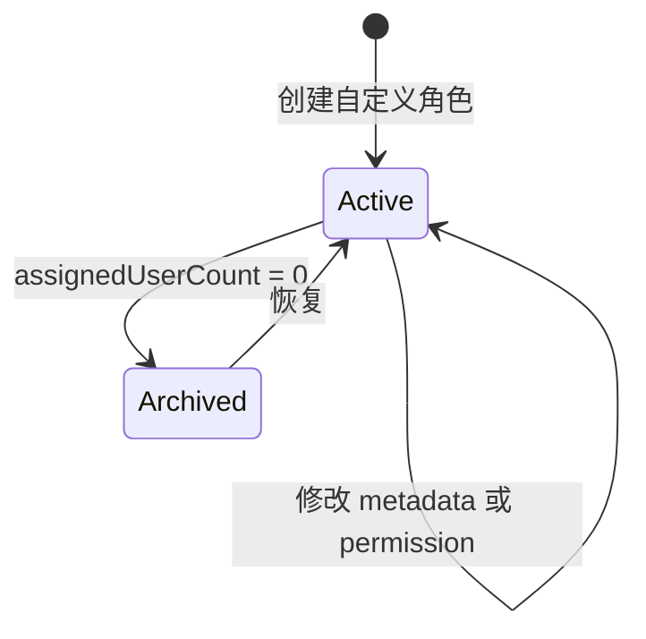

# 自定义角色生命周期与影响分析设计

## 1. 结论

本任务在现有 authorization 模块内增加自定义角色创建、metadata 修改、归档、恢复、角色影响查询和 permission 影响查询。

不新增数据库表或字段，不生成 migration。现有 `roles`、`role_permissions`、`user_roles` 和 `authorization_audit_events` 已经具备所需数据；现有索引可以支持按 role、permission 和归档状态查询。

所有写接口继续经过两层检查：

1. route 检查 `authorization:manage`，尽早拒绝无权限请求。
2. repository transaction 内重新检查 actor 是否为活动平台 `admin`，再执行状态校验、写入和审计。

permission 目录仍由 `PermissionKeys` 和数据库活动记录共同决定。Admin 不能创建、改名或删除 permission。

## 2. 当前基线

| 部分 | 当前行为 | 本任务变化 |
| --- | --- | --- |
| 角色目录 | `GET /api/authorization/roles` 只返回活动角色 | 增加 active/archived 状态查询，默认仍返回活动角色 |
| 角色创建 | 无接口 | 创建自定义角色和初始 permission |
| 角色 metadata | 无接口 | 自定义角色可以修改名称和描述 |
| 角色 permission | 现有 PUT 替换活动角色 permission | 保留接口；归档角色仍不可修改 |
| 生命周期 | schema 有 `archivedAt`，无管理接口 | 增加归档与恢复，不物理删除 |
| 影响查询 | 无接口 | 增加 role 和 permission 两种影响查询 |
| 平台管理员边界 | transaction 内检查活动 `admin` | 所有新增写函数复用同一检查 |
| 审计 | 已记录用户角色和角色 permission 变化 | 增加角色创建、更新、归档、恢复事件 |
| Admin | 用户和角色两个 Tab | 增加角色状态筛选、角色操作和 permission 影响 Tab |

## 3. 角色状态模型

### 3.1 角色类型

| 类型 | 判断 | metadata | permission | 归档/恢复 |
| --- | --- | --- | --- | --- |
| 平台根角色 | `key === admin` 且 `isSystem=true` | 只读 | 只读，自动拥有全部活动注册 permission | 禁止 |
| 内置角色 | `operator`、`viewer` 且 `isSystem=true` | 只读 | 活动时允许平台管理员修改 | 禁止 |
| 自定义活动角色 | `isSystem=false`、`archivedAt=null` | 可修改 | 可修改 | 可以归档，但必须没有用户分配 |
| 自定义归档角色 | `isSystem=false`、`archivedAt!=null` | 只读，先恢复再修改 | 只读，先恢复再修改 | 可以恢复 |

所有 create 输入都强制写 `isSystem=false`。客户端不能提交 `isSystem`。

系统角色保护以数据库 `isSystem` 为最终依据，不只比较三个已知 key。三个 `RoleKeys` 继续用于现有平台根角色和默认角色语义。

### 3.2 状态转换



- 创建、修改、归档和恢复都要求 transaction 内的平台管理员检查。
- 重复归档已归档角色、重复恢复活动角色按幂等成功返回，不更新时间，不写审计事件。
- 归档不删除 `role_permissions`。恢复后继续使用归档前的 permission 集合。
- 归档不创建或删除 `user_roles`。提交时必须确认当前没有用户分配。

## 4. Contracts

### 4.1 输入 schema

在 `packages/contracts/src/index.ts` 增加：

```ts
export const roleNameSchema = z.string().trim().min(1).max(80)
export const roleDescriptionSchema = z.string().trim().max(500).nullable()

export const createRoleSchema = z.object({
  key: roleKeySchema,
  name: roleNameSchema,
  description: roleDescriptionSchema,
  permissionKeys: uniqueArraySchema(permissionSchema),
})

export const updateRoleSchema = z
  .object({
    name: roleNameSchema.optional(),
    description: roleDescriptionSchema.optional(),
  })
  .refine((value) => value.name !== undefined || value.description !== undefined)

export const roleCatalogStatusSchema = z.enum(['active', 'archived']).default('active')
```

约束：

- `permissionKeys` 可以为空，与现有角色 permission 替换语义一致。
- role name 不要求唯一，稳定身份只由 key 决定。
- description 的空表单值在 Admin adapter 中转成 `null`。
- API 必须要求 key；名称转 key 只在 Admin 提供建议，不在服务端隐式生成。

### 4.2 角色 DTO

扩展 `AuthorizationRole`：

```ts
interface AuthorizationRole {
  key: string
  name: string
  description: string | null
  isSystem: boolean
  archivedAt: string | null
  metadataEditable: boolean
  permissionsEditable: boolean
  lifecycleEditable: boolean
  permissionKeys: Permission[]
}
```

服务端计算三个 editable 字段，Admin 不复制系统角色判断：

- `metadataEditable = !isSystem && archivedAt === null`
- `permissionsEditable = key !== admin && archivedAt === null`
- `lifecycleEditable = !isSystem`

### 4.3 影响 DTO

```ts
interface AuthorizationRoleImpact {
  roleKey: string
  assignedUserCount: number
}

interface AuthorizationPermissionImpact {
  permissionKey: Permission
  roleKeys: string[]
  affectedUserCount: number
}
```

当前 user schema 没有停用状态。`assignedUserCount` 和 `affectedUserCount` 统计现存 `user` 记录，不把它们描述成“可登录用户”。

### 4.4 Error code

新增两个稳定 code：

- `AUTH.ROLE_KEY_CONFLICT`：活动或归档角色已经占用该 key，HTTP 409。
- `AUTH.ROLE_IN_USE`：角色仍有用户分配，HTTP 409，details 为 `{ assignedUserCount }`。

其他错误继续复用：

- 输入或 permission 无效：`COMMON.INVALID_REQUEST`，400。
- role 或 permission 不存在：`COMMON.NOT_FOUND`，404。
- 非平台管理员、系统角色写入：`AUTH.FORBIDDEN`，403。

## 5. API

### 5.1 接口列表

| Method | Path | Permission | 说明 |
| --- | --- | --- | --- |
| GET | `/api/authorization/roles?status=active\|archived` | `authorization:read` | 默认 active，返回角色和活动 permission 目录 |
| POST | `/api/authorization/roles` | `authorization:manage` | 创建自定义角色和初始 permission |
| PATCH | `/api/authorization/roles/{roleKey}` | `authorization:manage` | 修改活动自定义角色名称和描述 |
| PUT | `/api/authorization/roles/{roleKey}/permissions` | `authorization:manage` | 保留现有接口 |
| POST | `/api/authorization/roles/{roleKey}/archive` | `authorization:manage` | 归档无用户分配的自定义角色 |
| POST | `/api/authorization/roles/{roleKey}/restore` | `authorization:manage` | 恢复自定义角色 |
| GET | `/api/authorization/roles/{roleKey}/impact` | `authorization:read` | 查询角色分配用户数 |
| GET | `/api/authorization/permissions/{permissionKey}/impact` | `authorization:read` | 查询 permission 的有效角色和用户影响 |

`GET /api/authorization/roles` 不带 query 时保持当前响应范围，只返回活动角色。现有客户端不需要立即传参数。

### 5.2 创建 transaction

顺序：

1. 查询请求中的活动、已注册 permission，拒绝缺失或归档 key。
2. transaction 内检查 actor 是否为活动平台 `admin`。
3. 查询任意状态的同 key role；存在时返回 `role-key-conflict`。
4. 插入 `roles`，固定 `isSystem=false`、`archivedAt=null`。
5. 批量插入初始 `role_permissions`，`assignedBy` 使用当前 actor。
6. 插入一条 `role.created` 审计事件。
7. 返回创建后的角色 DTO。

role 和 permission 关系或审计任一步失败，整个 transaction 回滚。

### 5.3 metadata 修改 transaction

顺序：

1. 查询活动目标 role。
2. transaction 内检查 actor 是否为活动平台 `admin`。
3. 目标 `isSystem=true` 时拒绝。
4. 合并 PATCH 字段并得到规范化 before/after。
5. before 与 after 相同则返回当前 DTO，不更新时间，不写审计。
6. 更新名称、描述和 `updatedAt`。
7. 插入一条 `role.updated` 审计事件。

归档角色必须先恢复，不能直接 PATCH。

### 5.4 归档 transaction

顺序：

1. 查询任意状态的目标 role。
2. transaction 内检查 actor 是否为活动平台 `admin`。
3. 目标 `isSystem=true` 时拒绝。
4. 已归档时按幂等成功返回。
5. 联结 `user_roles` 和 `user` 统计 `assignedUserCount`。
6. 数量大于 0 时返回 `role-in-use`，不更新、不写审计。
7. 设置 `archivedAt` 和 `updatedAt`。
8. 插入一条 `role.archived` 审计事件。

影响查询只是操作前提示。第 5 步必须在写 transaction 中重新执行。

### 5.5 恢复 transaction

顺序：

1. 查询任意状态的目标 role。
2. transaction 内检查 actor 是否为活动平台 `admin`。
3. 目标 `isSystem=true` 时拒绝。
4. 已活动时按幂等成功返回。
5. 清空 `archivedAt` 并更新 `updatedAt`。
6. 插入一条 `role.restored` 审计事件。

恢复不写 `user_roles`，只重新启用角色和原有 `role_permissions`。

## 6. 影响查询语义

### 6.1 Role impact

`GET /roles/{roleKey}/impact` 查询任意状态角色，返回与该 role 关联且仍存在的用户数量。使用 `COUNT(DISTINCT user.id)`，避免异常重复关系影响结果。

该接口不返回完整用户列表。本任务只需要在修改 permission 和归档前给出人数提示；用户详情继续通过现有用户管理和授权用户列表查看。

### 6.2 Permission impact

permission impact 表示当前有效授权结果，不只是 `role_permissions` 关系：

1. permission 必须属于 `PermissionKeys`，并且数据库记录未归档。
2. 普通活动角色通过 `role_permissions` 获得 permission。
3. 活动 `admin` 角色对每个活动注册 permission 都有效，即使没有对应 `role_permissions` 行。
4. `roleKeys` 去重并排序。
5. `affectedUserCount` 对所有有效角色下的现存用户按 user ID 去重。
6. 归档角色和归档 permission 不计入结果。

这一语义必须与 `findCurrentAuthorization` 和 `hasPermission` 的 `admin` 特殊分支一致。

## 7. 授权审计

### 7.1 新 action

在 `AuditActions` 增加：

- `role.created`
- `role.updated`
- `role.archived`
- `role.restored`

`targetType` 均为 `role`，`targetId` 为 role key。

### 7.2 Payload

审计 payload 继续按 action 使用封闭 schema，并在 `insertAuditEvent` 中显式投影字段。

```ts
// role.created
before: { role: null }
after: {
  role: {
    name: string
    description: string | null
    permissionKeys: Permission[]
    archived: false
  }
}

// role.updated
before: { name: string; description: string | null }
after: { name: string; description: string | null }

// role.archived / role.restored
before: { archived: boolean }
after: { archived: boolean }
```

role key 已保存在 `targetId`，payload 不重复保存。`role.created` 的 permissionKeys 规范排序。

### 7.3 读取兼容

`toAuthorizationAuditEvent` 按 action 选择 schema。JSON 无法解析、payload 与 action 不匹配或 targetType 不是 `role` 时继续返回 `SYSTEM.INTERNAL_ERROR` 500。

Admin 审计页按联合类型展示：

- created：名称、描述和初始 permission。
- updated：metadata before/after。
- archived/restored：状态 before/after。
- 现有用户角色和角色 permission 事件继续显示 key 差异。

## 8. Admin

### 8.1 页面结构

继续使用 `/settings/authorization`，不增加路由。

- 用户 Tab：保持现状，只使用活动角色目录分配角色。
- 角色 Tab：增加 active/archived `Segmented` 状态选择、创建按钮和生命周期操作。
- Permission Tab：列出活动注册 permission，按需打开影响 Drawer。

角色状态选择默认 active。query key 必须包含 status，不能让活动与归档响应共用缓存。

### 8.2 创建角色

创建 Drawer 使用 Ant Design Form：

- 名称
- key
- 描述
- permission Tree

key 建议由 Admin 纯函数生成：

1. 名称 trim、转小写并做 Unicode NFKD 规范化。
2. 去除拉丁组合音标。
3. 非 ASCII 字母数字转换为 `-`，合并连续分隔符并去掉首尾分隔符。
4. 结果必须匹配 `roleKeySchema`；不匹配时返回空建议。
5. 不做中文拼音转换，不增加 slug 依赖。

表单维护 `keyTouched`。管理员手动编辑 key 后，名称变化不再覆盖 key。服务端仍执行最终 schema 和唯一性校验。

### 8.3 修改和影响提示

- metadata Drawer 只提交名称和描述。
- permission Drawer 打开时查询 role impact，显示当前分配用户数。
- permission 实际变化时，保存前用 confirm 展示新增、移除 key 和受影响用户数。
- role impact Drawer 显示分配用户数。
- permission impact Drawer 显示有效角色 key 和去重用户数。

### 8.4 归档和恢复

- 归档动作先查询最新 role impact。
- `assignedUserCount > 0` 时显示人数并禁用确认。
- 数量为 0 时使用 modal.confirm 提交归档。
- API 因并发变化返回 409 时显示服务端消息并刷新角色及 impact query。
- 已归档角色只显示恢复和影响操作。

### 8.5 Query 失效

角色 create/update/archive/restore 和 permission replace 成功后失效：

- active 与 archived role catalog。
- authorization users。
- current permissions。
- role impact 和 permission impact。

mutation 失败不主动清空现有数据。全局 401/403 行为保持不变。

## 9. 数据库与 migration

本任务不修改 schema，不运行 `db:generate` 或 `db:migrate`。

现有索引：

- `roles_key_unique` 支持 key 唯一性。
- `roles_archived_at_idx` 支持状态目录。
- `user_roles_role_user_idx` 支持 role 分配计数。
- `role_permissions_permission_role_idx` 支持 permission 影响查询。
- authorization audit action、target 和时间索引支持新 action 查询。

完成后仍运行 `pnpm --filter @starter/api db:check`，确认没有未生成的 schema 差异。

## 10. 兼容与回滚

### 10.1 向后兼容

- `GET /api/authorization/roles` 默认 active，保持现有调用行为。
- `AuthorizationRole` 只增加字段，不删除现有字段。
- 现有 user role 和 role permission 接口路径不变。
- 新建的活动自定义角色在旧代码中仍能参与权限计算和用户分配。
- 无数据库 schema 变化。

### 10.2 回滚

- 角色数据和 permission 关系使用现有表，移除新 UI/API 后仍能被旧授权查询读取。
- 已归档角色在旧代码中仍会被过滤；需要重新使用时必须在回滚前恢复。
- 新审计 action 写入后，旧版本 presenter 不认识这些 action，会让审计查询返回 500。回滚 endpoint 或 Admin 时必须保留新 action 的 contracts、presenter 和审计展示支持，不能整批回退到不认识新 action 的版本。
- 不删除已经写入的审计事件。

## 11. 风险

- permission impact 只读取 `role_permissions`，漏掉平台 `admin` 的自动权限。查询必须显式合并 admin 分支。
- 归档只信任预览人数。提交 transaction 必须重新统计分配用户。
- create 先插角色、后写 permission 或审计但不使用同一 transaction，会留下部分角色。
- 把 metadata 和 permission 放进同一个 PATCH，会让审计 action 和 Admin 提示无法准确区分。
- key 建议在名称每次变化时强制覆盖，会改掉管理员已经确认的 key。必须记录 `keyTouched`。
- 扩展审计 union 后只改 contracts、不改 presenter 或 Admin renderer，会导致类型错误或运行时 500。

## 12. 验证范围

- contracts schema、DTO、error code 和 audit union。
- API route、OpenAPI、service、repository transaction、影响查询和审计解析。
- Admin API adapter、query key、失效逻辑、key 建议纯函数、角色操作和审计展示。
- API smoke test、Admin Vitest、仓库检查、构建和数据库 schema 检查。
- Admin 桌面和移动视口检查：长 role key、permission key、Drawer、确认框和表格不能重叠或撑破布局。
