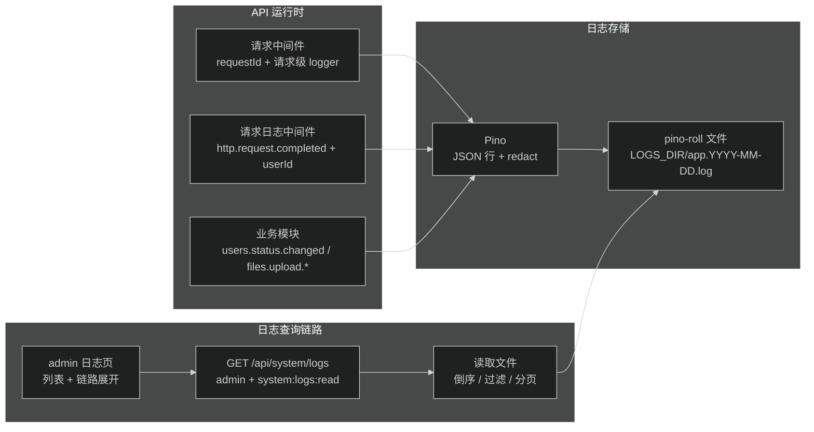

# design.md — admin 日志查看与日志可观测性优化

## 目标与边界

在现有 Pino 日志体系上补齐三层能力：

1. 请求日志带 `userId`，支持按用户排查。
2. 关键业务分支写结构化事件日志（用户状态变更、文件上传）。
3. admin 后台内置日志查看页：列表 + 关键字/level 过滤 + 分页 + 按 requestId 展开链路。

不做：Sentry、外部日志平台（Loki/Axiom）、指标埋点、自动刷新（SSE）。

## 现状（已验证）

- Pino JSON 行输出；`LOGS_DIR` 配置后 pino-roll 按天轮转写 `LOGS_DIR/app.YYYY-MM-DD.log`（默认未开启，`.env.example` 中注释）。
- `request-context.middleware.ts`：requestId 生成/透传，派生带 requestId 的请求级 logger（`c.var.logger`）。
- `request-log.middleware.ts`：`http.request.completed`，payload 无 userId。
- `auth.guard.ts`：认证后写入 `c.var.currentUserId`，执行顺序早于请求日志取值（`await next()` 之后）。
- 权限：`createRequirePermission(db, key)` + `middleware: [requireAuth, ...]`；`hasPermission` 对 admin 角色直接放行全部权限（`authorization.repository.ts:220-237`），新权限键无需改 role_permissions。
- 审计：用户状态变更已有数据库审计表（`users.repository.ts` 的 `insertAuditEvent`），但无结构化日志。
- admin：features/ 目录 + routes.tsx + records.ts 注册模式；`api/system/` 已有 health；菜单组在 `navigation.ts`。

## 架构与数据流



## 交付物 A：请求日志补 userId

`request-log.middleware.ts` payload 增加：

```ts
userId: c.var.currentUserId ?? undefined,
```

未认证请求不输出该字段（pino 省略 undefined）。401/403/404 等无认证请求保持原样。

## 交付物 B：业务事件日志埋点

位置统一在 route handler（`c.var.logger` 已带 requestId），不改 service 签名。事件命名遵循 `domain.action.result`。

### B1 用户状态变更（users.route.ts updateUserStatus）

- 成功：`info`，`event: "users.status.changed"`，字段 `actorId`（当前操作者）、`targetUserId`、`from`、`to`。
- `from` 来源：`users.repository.ts` 的 `UpdateUserStatusResult` 增加 `from: UserStatus`（`targetUser.status`），service 透传。幂等短路分支返回的 `from` 与 `status` 相同。
- 失败（AppError 抛错）不单独埋点：全局 onError 已有日志 + 审计表不写。保持最小集。

### B2 文件上传（files.route.ts upload）

route handler 内 try/catch：

- 成功：`info`，`event: "files.upload.succeeded"`，字段 `fileId`、`name`、`size`、`mimeType`、`ownerId`。
- 失败：`event: "files.upload.failed"`，字段 `name`、`size`、`ownerId`、`err`（AppError 记录 `code`/`message`，其他异常记录完整 err）。级别：`AppError` 用 `warn`（含 413 大小超限等预期失败），未知异常用 `error`。

## 交付物 C：API 日志查询接口

### 权限与路由

- 新权限键：`PermissionKeys.SYSTEM_LOGS_READ = "system:logs:read"`（contracts，字母序排在 FILE_* 之后）。
- migration：`permissions` 表插入 `is_system = 1` 记录（参照 0002 的 authorization-audit:read 写法），不绑 role_permissions（admin 短路放行）。
- 路由：`system` 模块新增 `GET /api/system/logs`，`middleware: [requireAuth, requirePermission(db, SYSTEM_LOGS_READ)]`。

### 接口契约

```
GET /api/system/logs
query:
  requestId?: string   # 链路过滤，精确匹配
  level?: "info" | "warn" | "error"
  query?: string       # 关键字：对行 JSON.stringify 子串匹配（覆盖 requestId/userId/event/message）
  limit?: number       # 默认 100，最大 500
  before?: number      # 游标：只返回 time < before 的条目（倒序分页）
响应: { ok, data: { items: LogEntry[] }, meta }
LogEntry = 解析后的完整 Pino 行对象（含 time/level/msg/event/requestId/userId/module/err 等）
```

- `LOGS_DIR` 未配置：返回 400 AppError「未配置日志目录」，不 crash。
- 过滤后条目按 `time` 倒序（最新在前）；`requestId` 过滤时返回正序（链路时间线）。
- 返回 `items` 为解析后的对象，前端按需渲染字段。

### 读取实现（system.service.ts）

- 文件匹配：`LOGS_DIR` 下 `app*` 文件（pino-roll 按天命名），按文件名倒序（新文件在前）。
- 逐文件读取、逐行 `JSON.parse`（跳过解析失败行），按 `level`/`query`/`requestId`/`before` 过滤，收集满 `limit` 即停止。
- 单行解析失败直接跳过（不中断查询）。

## 交付物 D：admin 日志页

- `apps/admin/src/features/system/`：
  - `api/system/logs.api.ts`：`getSystemLogs(params)`，走现有 `apiRequest`。
  - `api/system/logs.query.ts`：queryKeys + useLogsQuery（react-query）。
  - `pages/LogViewer.tsx`：筛选栏（level 下拉、关键字输入、requestId 输入）+ 表格（时间/level/event/message/requestId/userId/durationMs）+ 倒序分页（加载更多，传 before）。
  - 行点击 → Drawer 展示同 requestId 全链路（请求接口传 `requestId`，时间正序列表）。
- `routes.tsx`：注册 `systemRoutes`（path `/system/logs`，permission `SYSTEM_LOGS_READ`）。
- `records.ts`：`appRouteRecords` 追加。
- `navigation.ts`：settings 组加菜单项；i18n 加 `menu.system.logs` 等文案 key。
- 路由守卫：`requireAdminRoutePermission`（现有机制，前端 `hasPermission`）。

## 测试

- API smoke（`apps/api/src/test/system-logs.smoke.test.ts`，参照现有 smoke 模式）：
  - 注入临时 LOGS_DIR（预写若干 JSON 行）与临时 SQLite；
  - 未认证 401；非 admin 403；admin 200；
  - query/level/requestId 过滤、limit、before 分页；
  - LOGS_DIR 未配置时报错；损坏行跳过。
- admin：参照 `apps/admin/src/test/` 现有 UI 测试模式，覆盖列表渲染、筛选触发、链路展开。

## 兼容性与回滚

- 只新增，不改现有日志写入格式：旧日志行在接口中照常显示。
- 新权限键只影响新增接口；admin 自动获得，其他角色不受影响。
- 接口只读，风险低；`LOGS_DIR` 未配置时接口明确报错，不影响其他接口。
- 回滚：撤 migration + contracts 键 + 接口/页面即可，无数据迁移。

## 任务结构决策

单任务顺序执行 A→B→C→D→测试。理由：交付物耦合紧密（页面依赖接口，接口价值依赖 A/B 的日志质量），拆分 parent/child 收益低。
