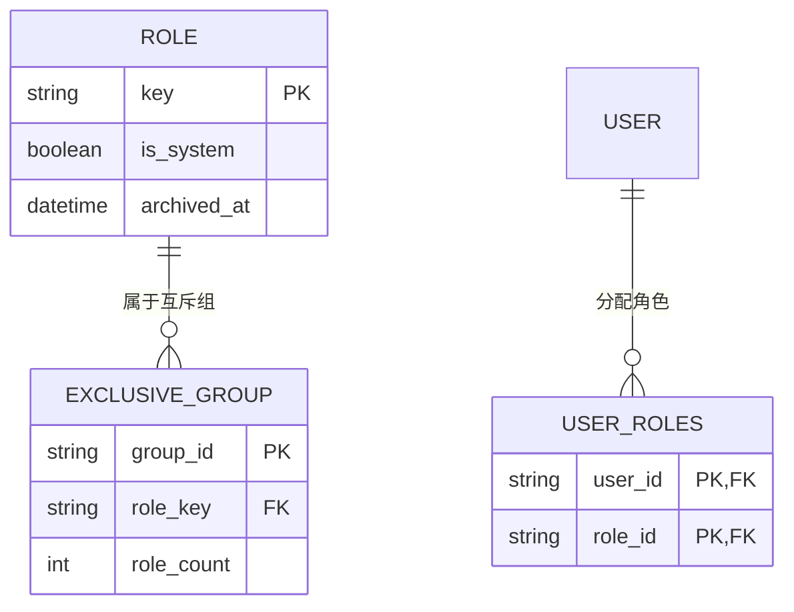
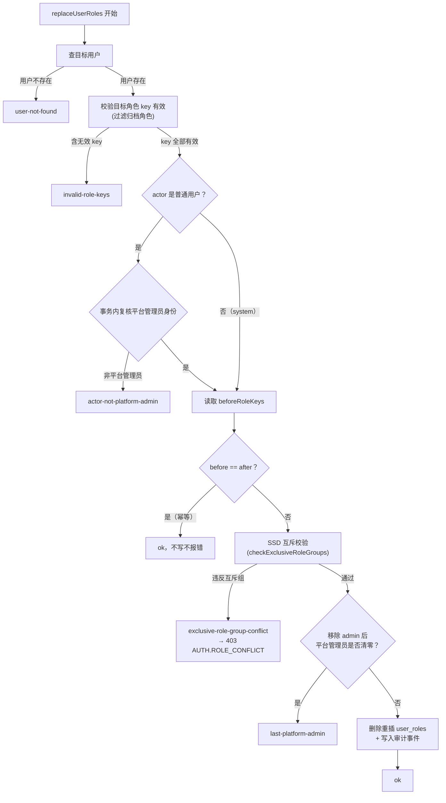

# 技术设计：NIST RBAC 职责分离（SSD）落地

## 目标边界

落地 NIST RBAC (INCITS 359) Constrained 层中的**静态职责分离（SSD）**：定义互斥角色约束，用户角色分配违反约束时拒绝写入。不实现 DSD（动态职责分离）、Hierarchical（角色继承）、cardinality（角色基数）。调研报告另行产出在 `research/nist-rbac-incits-359.md`。

## 决策记录

| 决策点       | 结论                                                          | 理由                                                                                            |
| ------------ | ------------------------------------------------------------- | ----------------------------------------------------------------------------------------------- |
| 实现范围     | SSD only                                                      | DSD 依赖 session（激活角色）概念，当前无此模型；管理后台单会话固定身份，DSD 与 SSD 实际效果等价 |
| 互斥组配置   | 代码常量预置（contracts），无表、无管理接口                   | 安全治理配置不常变；发版变更可审计；未来要可配置时再加表迁移成本低                              |
| 存量数据处理 | 只在校验写入路径拦截，不扫存量、migration 不碰数据            | 用户角色只能经 replaceUserRoles 整体替换写入，下一次修改时自然校验；避免破坏性迁移              |
| 预置互斥组   | `[['admin']]` 独占角色（持有 admin 时不能持有任何其他角色） | admin 是平台根角色，独占是合理治理语义；结构支持任意组，后续可加                                |

## 数据模型与校验流程

### 互斥组与角色关系（SSD 约束）



约束语义：`EXCLUSIVE_GROUP` 中的角色按 `role_count` 分两种规则：

- `role_count >= 2`：组内两两互斥，一个用户至多持有组内一个角色。
- `role_count == 1`：独占角色，用户持有该角色时不能持有任何其他角色。

当前预置互斥组 `[['admin']]`，即 admin 为独占角色。互斥组只存在于代码常量（contracts），不是数据库表，上图仅表达约束语义，不新增任何存储。

### replaceUserRoles 写事务校验流程



互斥校验插入位置在幂等短路之后、last-platform-admin 检查之前：幂等短路放行"无变化的存量违规"（不扫存量决策），互斥校验只拦截实际变更的写入。

## 数据与契约

### 互斥组常量（packages/contracts）

```ts
// 与 RoleKeys 同文件
export const ExclusiveRoleGroups: readonly (readonly string[])[] = [
  [RoleKeys.ADMIN], // 单元素组 = 独占角色：持有该角色时不能持有任何其他角色
] as const
```

语义规则：

- 组内角色数 >= 2：两两互斥，目标角色集中至多出现组内一个角色。
- 组内角色数 == 1：独占角色，目标角色集中若包含该角色，则目标角色集大小必须为 1。
- 组内角色使用 `key` 表达；不存在的角色 key 在组中忽略（角色可能被归档或未创建）。

### 新错误码（packages/contracts）

```ts
AUTH_ROLE_CONFLICT: 'AUTH.ROLE_CONFLICT', // HTTP 403
```

### 校验位置

`apps/api/src/modules/authorization/authorization.repository.ts` 的 `replaceUserRoles` 事务内：

1. 现有顺序不变：查目标用户 → 校验角色 key 有效 → actor 平台管理员校验（事务内）→ 幂等短路。
2. 在幂等短路**之后**、last-platform-admin 检查**之前**插入互斥校验（幂等短路放行"无变化的存量违规"，符合不扫存量决策）。
3. 互斥校验命中返回新 kind：

```ts
| { kind: 'exclusive-role-group-conflict', group: readonly string[], conflictingKeys: string[] }
```

`conflictingKeys` 是目标角色集中命中的组内角色 key（排序），供错误文案展示。

### 错误映射（authorization.service.ts）

`exclusive-role-group-conflict` → `AppError(403, ApiErrorCodes.AUTH_ROLE_CONFLICT, '角色分配违反职责分离约束：角色 X 与 Y 不能同时分配')`。文案具体用词在实现时按 `xdd-plain-docs` 技能规范书写。

### OpenAPI

`replaceUserRoles` 的 403 response 错误码列表补充 `AUTH.ROLE_CONFLICT`（`authorization.openapi.ts`）。

## 前端影响

- Admin 角色分配 mutation 失败时展示后端 `ApiRequestError.message`（现有机制已生效），无需新增前端特判。
- 不新增 Admin 页面改动；角色管理页不做互斥组展示（MVP 范围外）。

## 测试

`apps/api/src/test/` 新增或扩展 smoke test（`authorization.smoke.test.ts` 或新文件）：

1. 给用户分配 `[admin, operator]` → 403 `AUTH.ROLE_CONFLICT`，用户角色不变。
2. 给用户分配 `[admin]` → 成功。
3. 给用户分配 `[operator, viewer]` → 成功（不在互斥组内）。
4. 幂等：用户已是 `[admin]`，再次提交 `[admin]` → 幂等成功不报错。
5. 已存在违规存量数据（测试内直接构造）不被扫描或自动修改，仅写入路径拦截。

## 兼容性与风险

- 无 schema 变更、无 migration。
- `bootstrapAdminByEmail`（把用户角色替换为 admin）不触发互斥校验，保持系统级能力不变（actorType=system 路径与普通用户写入路径一致时需确认：bootstrap 的目标角色集为 `[admin]` 单角色，天然满足约束）。
- 互斥组常量变更需要发版，属于预期行为。
- DSD 与 cardinality 不实现，调研报告中说明理由与未来引入条件。

## 调研报告要求

`research/nist-rbac-incits-359.md` 至少覆盖：

- INCITS 359 三层结构（Core / Hierarchical / Constrained）与正式元素（Users、Roles、Permissions、Sessions、UA、PA、RH、SSD、DSD）。
- 标准元素 → 当前脚手架映射表：已实现 / 本次落地 / 不做（含理由）。
- SSD 语义选择说明：互斥角色组 vs 冲突角色集；独占角色的表达。
- 来源标注（INCITS 359、Sandhu et al. 1996 RBAC96、NIST 相关出版物）；无法核验的写成待确认项。
