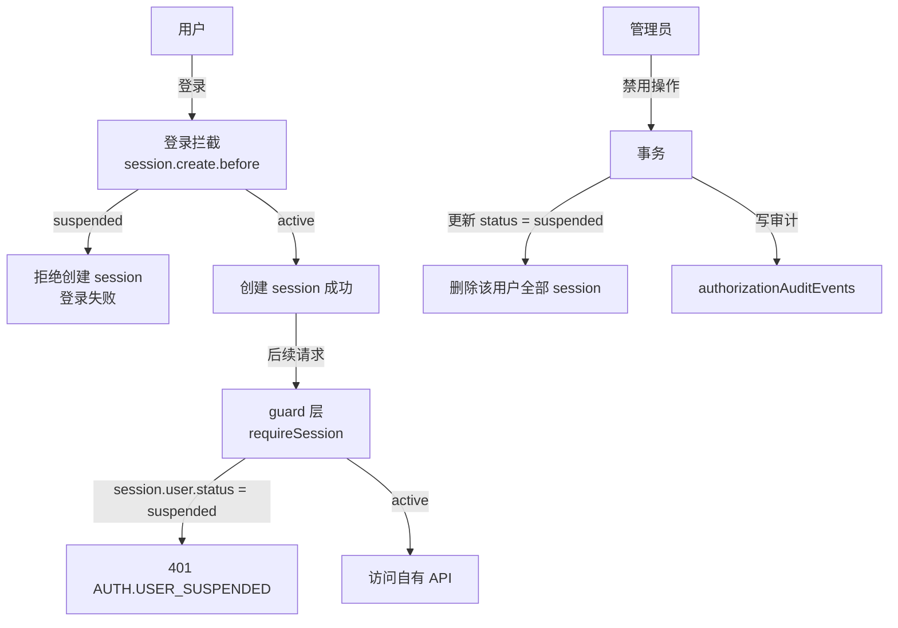
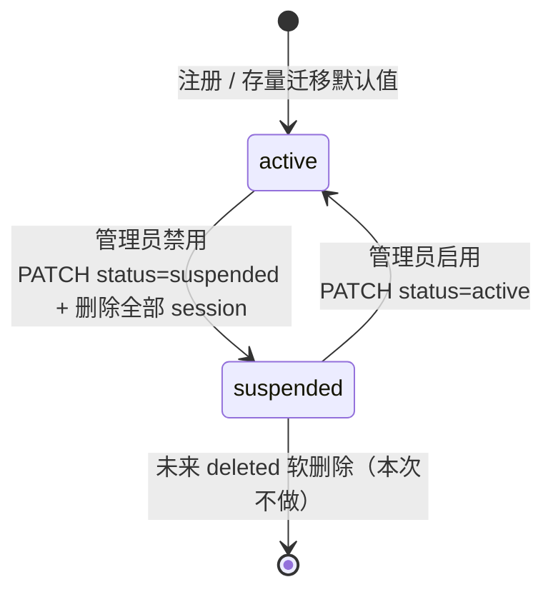
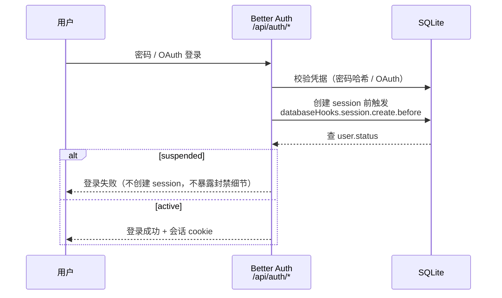
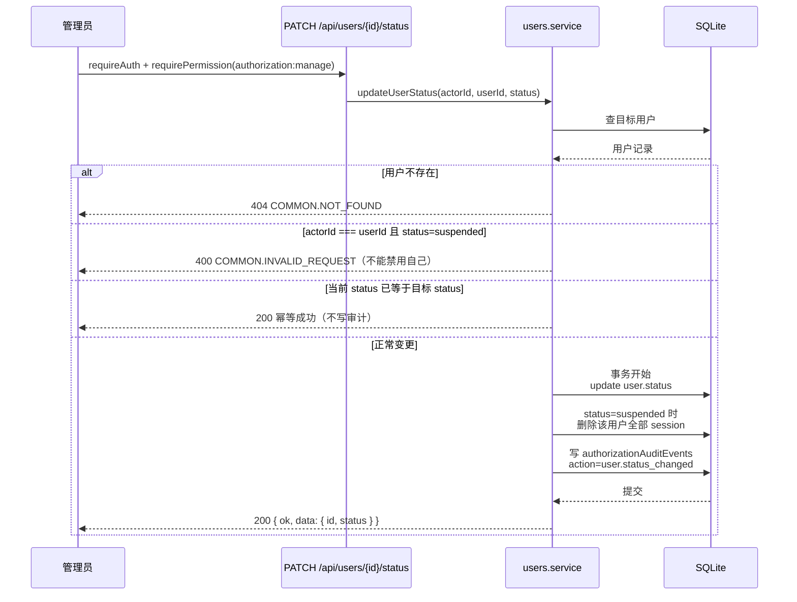

`

# Design：用户生命周期状态

## 1. 总览

用户状态是认证链路的守门员，三层拦截，从紧到松：

1. **登录拦截**：`databaseHooks.session.create.before` 拒绝 suspended 用户创建 session
   （覆盖密码登录与 OAuth 登录，因为登录最终都走 session create）。
2. **会话失效**：禁用操作在同一事务里删除该用户全部 session——已有会话（包括
   Better Auth 内部接口的会话）立即失效，无需依赖 Better Auth 内部行为。
3. **guard 兜底**：自有 API 的 `requireSession` 检查 `session.user.status`，suspended 返回
   401 `AUTH.USER_SUSPENDED`（防御性，防止 session 未删干净的边缘情况）。



## 2. 数据模型

`apps/api/src/modules/auth/auth.schema.ts` 的 `user` 表新增：

```ts
status: text("status").notNull().default("active"),
```

表级 CHECK 约束：`status IN ('active', 'suspended')`（课程 168 的类型约定：
枚举用 TEXT + CHECK）。

> **实现偏差（已验证）**：drizzle-kit 0.31.10 对带 CHECK 的新列生成表重建脚本时
> 存在 bug（`INSERT ... SELECT` 把新列也放进 SELECT 列表，而旧表无该列），
> migration 无法执行。因此去掉 DB 层 CHECK，改用应用层强校验：
> `packages/contracts` 的 `userStatusSchema`（z.enum）在接口入口拦截，
> 写入路径只有经过 Zod 校验的 service 和不明写 status 的 Better Auth。

- 默认值 `active` 保证存量用户迁移后全部可用。
- migration 由 `pnpm --filter @starter/api db:generate` 生成。
- **风险点**：SQLite 的 ALTER TABLE ADD COLUMN 对带 CHECK 的列支持有限，drizzle-kit
  可能生成重建表脚本；实施时验证生成结果，能跑通 `db:migrate` 即可。



## 3. Better Auth 配置（apps/api/src/modules/auth/auth.config.ts）

```ts
user: {
  additionalFields: {
    status: {
      type: "string",
      required: false,
      defaultValue: "active",
      input: false, // 客户端不可写
    },
  },
},
databaseHooks: {
  session: {
    create: {
      before: async (session) => {
        // 闭包 db 查 user.status，suspended 返回 false 拒绝创建 session
      },
    },
  },
},
```

- `additionalFields` 让 `getSession` / 登录响应返回的 `user` 对象自带 `status`，
  guard 层零额外查询。
- **类型风险点**：`session.user.status` 的类型推断取决于 better-auth 对
  additionalFields 的泛型推导；实施时验证，若类型不可达则在 guard 里用 drizzle
  显式查询 user.status（此时 user 表 schema 已含该列，成本一次本地查询）。



## 4. 错误码与契约（packages/contracts/src/index.ts）

- 新增 `ApiErrorCodes.AUTH_USER_SUSPENDED = "AUTH.USER_SUSPENDED"`。
- 新增 `UserStatus = "active" | "suspended"`、`userStatusSchema = z.enum(...)`。
- `UserManagementUser` 增加 `status: UserStatus`（列表与详情 DTO 都带上）。
- 新增 `updateUserStatusSchema = z.object({ status: userStatusSchema })` +
  `UpdateUserStatusInput` 类型。
- 新增 `AuditActions.USER_STATUS_CHANGED = "user.status_changed"`、
  `auditUserStatusPayloadSchema = z.object({ status: userStatusSchema })`，
  并扩展审计 payload 联合类型。
- 防呆错误：禁用自己用 `COMMON.INVALID_REQUEST`（400）+ 明确 message，
  不新增专门错误码（与角色替换的 AUTH_ROLE_CONFLICT 不同——那是多约束冲突，
  这里是单规则校验，400 足够）。

## 5. API：PATCH /api/users//status

- 请求体：`{ status: "active" | "suspended" }`。
- 中间件链：`requireAuth` → `requirePermission(AUTHORIZATION_MANAGE)`。
- service 逻辑（`users.service.ts` 新增 `updateUserStatus`）：

  1. 查目标用户，不存在 → 404 `COMMON.NOT_FOUND`。
  2. 防呆：`actorId === userId && status === "suspended"` → 400 `COMMON.INVALID_REQUEST`
     （"不能禁用自己"）。
  3. 幂等：当前 status === 目标 status → 直接 200 返回，不写审计。
  4. 事务（db.transaction）：
     - 更新 `user.status`；
     - 若目标为 suspended：`DELETE FROM session WHERE user_id = ?`（全部会话失效）；
     - `insertAuditEvent`：action `user.status_changed`，actorType "user"，
       actorId = 当前操作人，targetType "user"，targetId = 目标用户，
       before/after = `{ status }`。
  5. 返回 `{ ok: true, data: { id, status } }`。
- repository 新增：`updateStatus(userId, status)`、`deleteSessionsByUser(userId)`（事务内调用）。
- OpenAPI：`users.openapi.ts` 新增路由定义（tags Users、cookieAuth、400/401/403/404 响应）。



## 6. guard（apps/api/src/modules/auth/auth.service.ts）

`requireSession` 在取到 session 后检查：

```ts
if (session.user.status === "suspended") {
  throw new AppError(ApiErrorCodes.AUTH_USER_SUSPENDED, "账号已被禁用", 401);
}
```

- 错误码 401：凭证（会话）不再有效，与 AUTH_UNAUTHENTICATED 同级语义，但错误码
  独立便于前端识别与排查。
- 此检查覆盖所有自有 API（files / profile / users / authorization 等），
  因为全部经过 `createRequireAuth`。

```mermaid
flowchart LR
    REQ[业务请求] --> G{requireSession<br/>getSession}
    G -->|无有效会话| 401A[401 AUTH.UNAUTHENTICATED]
    G -->|有会话| C{session.user.status?}
    C -->|suspended| 401B[401 AUTH.USER_SUSPENDED]<br/>账号已被禁用
    C -->|active| P[requirePermission<br/>按模块权限点]
    P -->|无权限| 403[403 AUTH.FORBIDDEN]
    P -->|有权限| OK[处理请求]
```

## 7. 前端（apps/admin）

- `src/api/users/users.api.ts`：新增 `updateUserStatus(userId, status)`，
  调 `PATCH /api/users/{userId}/status`（走现有 `apiRequest`）。
- `src/features/users/pages/UserManagement.tsx`：
  - 列表增加状态展示（Tag：active / suspended）。
  - 行操作：active → "禁用"（Popconfirm 确认）、suspended → "启用"；完成后刷新列表。
  - 禁用自己时后端 400，前端展示错误信息即可（不额外做前端防呆）。

## 8. 测试（apps/api/src/test/）

新增 `user-status.smoke.test.ts`（复用 `helpers.ts` 的 createTestApp / register）：

1. 管理员禁用用户后：该用户密码登录失败（断言不返回 200、无 session 建立）。
2. 已登录用户被管理员禁用：该用户下一次自有 API 请求返回 401 `AUTH.USER_SUSPENDED`。
3. 启用后：该用户可重新登录并访问。
4. 权限矩阵：未登录 401；operator/viewer 无 `authorization:manage` → 403；
   admin 可操作；目标用户不存在 → 404。
5. 防呆：admin 禁用自己的账号 → 400。
6. 幂等：连续两次禁用 → 两次都 200。
7. 审计：禁用后 `authorizationAuditEvents` 出现 `user.status_changed` 记录。

## 9. 关键决策记录

| 决策        | 选择                             | 理由                                   |
| ----------- | -------------------------------- | -------------------------------------- |
| 状态集合    | active + suspended 两态          | deleted 软删除是独立工程，延后         |
| 禁用即时性  | 删 session + guard 查 status     | 即时失效，含 Better Auth 内部接口      |
| 登录拦截    | session.create.before 返回 false | 统一覆盖密码/OAuth，不暴露封禁细节     |
| 权限点      | 复用 authorization:manage        | 现有体系无 user:* 前缀，避免动种子数据 |
| 防呆        | 不能禁用自己 → 400              | 与 NIST SSD 保护精神一致               |
| lastLoginAt | 不加                             | 独立统计字段，scope 最小化             |

## 10. 兼容性与回滚

- 存量数据：新列默认 active，无数据迁移风险。
- 回滚：删除新 migration 文件并重新 generate（项目无 db:rollback 脚本）去掉 status 列；接口删除即可。
- 禁用用户后无法登录是预期行为；启用即恢复，无其他副作用。
