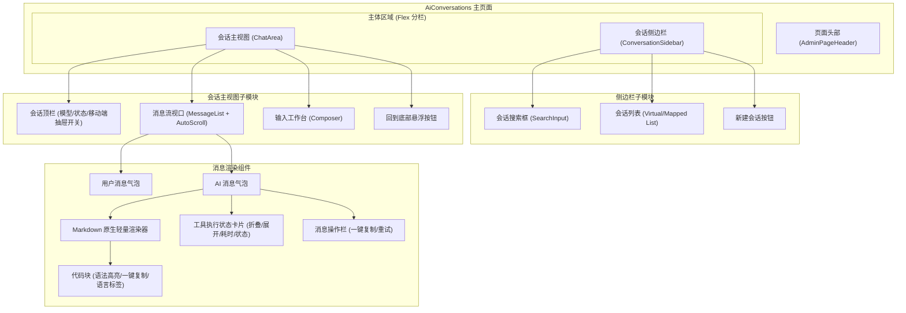
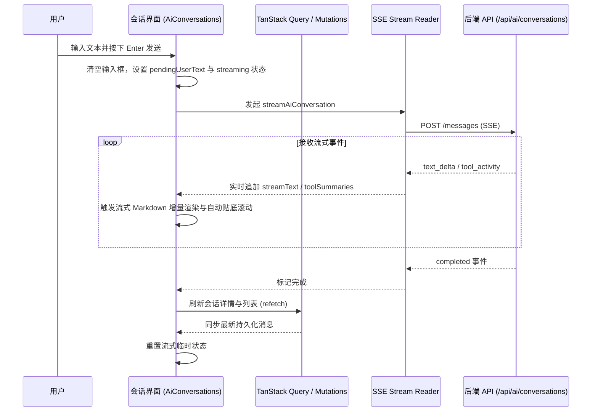
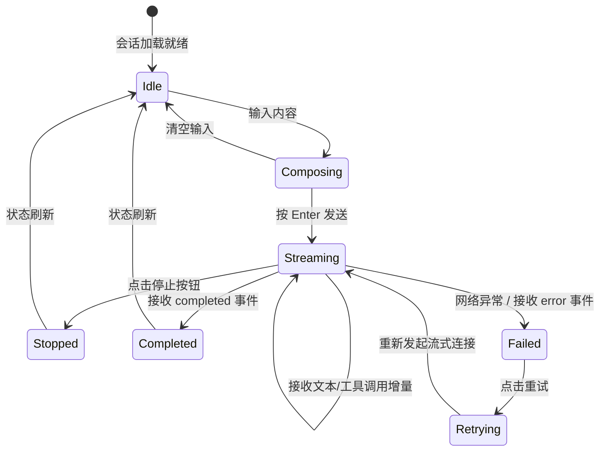

# 优化AI会话admin页面UI交互与显示设计 - 技术设计

## 1. 整体架构与组件拆分

AI 会话页面拆分为轻量、职责明确的子模块，保证组件可维护性与渲染性能。



## 2. 数据流与流式响应生命周期



## 3. 轻量 Markdown 与代码高亮设计

为了避免引入重型外部依赖并保证在 React 19 / Vite 环境下 100% 稳定可靠，实现一个专注于 AI 常见输出格式的 Markdown 结构化解析组件：
- **Block 级别**：
  - Code Block（` ```lang ... ``` `）：分离代码语言和代码内容，顶部带语言徽标和一键复制按钮。
  - Heading（`#`, `##`, `###`, `####`）：自适应字号与字重。
  - Blockquote（`> `）：左侧引用条与浅色底色。
  - Unordered / Ordered List（`- `, `* `, `1. `）：结构化列表项。
  - Table（`| ... |`）：带表头和自适应横向滚动的表格。
  - Paragraph & Linebreak：保留自然换行。
- **Inline 级别**：
  - Inline Code（`` `code` ``）：专属灰色/主题背景标签。
  - Bold（`**text**`）、Italic（`*text*`）、Strikethrough（`~~text~~`）。
  - Link（`[text](url)`）：受保护链接（`target="_blank" rel="noopener noreferrer"`）。

## 4. 交互细节与状态机


