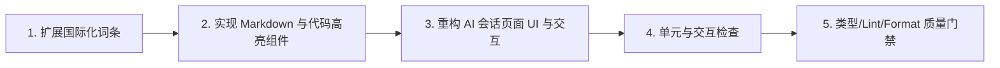

# 优化AI会话admin页面UI交互与显示设计 - 执行计划

## 执行阶段流程

## 步骤清单

### 步骤 1：国际化词条扩展
- 文件：`apps/admin/src/i18n/locales/zh.ts` 和 `apps/admin/src/i18n/locales/en.ts`
- 内容：新增复制成功、复制失败、快捷提示词（解释代码、优化 SQL、编写测试等）、搜索会话占位符、回到底部、工具折叠等文案。

### 步骤 2：封装轻量 Markdown 与代码块组件
- 文件：`apps/admin/src/features/ai/components/MarkdownRenderer.tsx` 与 `apps/admin/src/features/ai/components/CodeBlock.tsx`
- 内容：
  - 纯 TS/React 实现 Markdown 词法分析与安全渲染。
  - 支持多行代码块、行内代码、语言标签、一键复制、表格、引用、列表、粗体。
  - 遵循 Tailwind + Rose Pine 主题样式。

### 步骤 3：重构与升级 `AiConversations.tsx`
- 侧边栏：加入即时搜索过滤框、优化会话选中态高亮与操作体验。
- 空状态：提供场景化快捷 Prompt 卡片（Quick Starters），点击自动填入输入框。
- 消息流：
  - 接入 `MarkdownRenderer` 与 `CodeBlock`。
  - 用户与 AI 气泡视觉层次区分（精致徽标、操作栏、单条消息全文复制）。
  - 工具调用（Tool Activity）折叠/展开卡片。
  - 流式打字机微动效、平滑滚动、回到底部浮动按钮。
- 输入区：
  - 键盘事件优化：Enter 发送，Shift+Enter 换行。
  - 模型选择器与停止生成/发送按钮联动与状态指示。

### 步骤 4：质量门禁检查
- 运行：
  - `pnpm --filter @starter/admin check-types`
  - `pnpm --filter @starter/admin lint`
  - `pnpm --filter @starter/admin format:check`
  - `pnpm --filter @starter/admin test`
