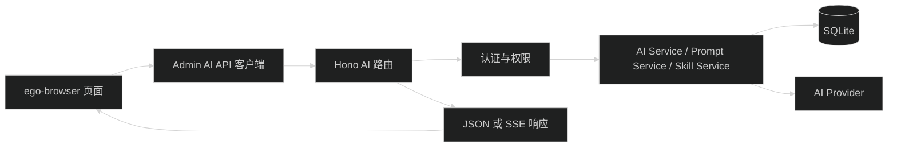

# Admin AI 模块验证设计

## 目标与边界

本任务只验证现有实现，不修改 `apps/admin`、`apps/api` 或 `packages` 下的产品代码。验证分为三层：

1. 浏览器页面：确认页面能打开，操作反馈、文案和响应式布局符合预期。
2. 浏览器实际请求：确认页面调用的 method、路径、参数、响应 envelope 和 SSE 事件正确。
3. 服务端已有测试：确认 AI 模块现有测试和仓库质量检查没有回归。

发现可复现问题后，写入验证报告，不在本任务内修复。

## 验证环境

- 使用 `pnpm run dev` 启动工作区服务。
- Admin：`http://localhost:2333`。
- API：`http://localhost:7788`，健康检查：`/health`。
- 浏览器操作使用 ego-browser 的独立 task space，复用本机已有登录态，但不读取或输出密码、Cookie、API Key 等敏感值。
- API Provider 写操作只使用本地开发数据。Provider 凭据、真实模型调用和全局默认配置在没有明确必要时不修改。

## 页面、权限和接口范围

| 页面 | 读取接口 | 写入或动作接口 | 访问要求 |
| --- | --- | --- | --- |
| `/ai/chat` | `/api/ai/conversations`、`/api/ai/models`、`/api/ai/preferences`、`/api/ai/prompt-templates` | 会话创建、删除、消息 SSE、停止、重试 | 登录 |
| `/ai/system-prompts` | `/api/ai/system-prompts`、`/api/ai/settings/system-prompt` | 系统提示词 CRUD、设置全局默认 | 读取需 `ai:config:read`，写入需 `ai:config:manage` |
| `/ai/prompt-templates` | `/api/ai/prompt-templates` | Prompt 模板 CRUD | 列表需登录，写入需 `ai:config:manage` |
| `/ai/skills` | `/api/ai/skills`、技能详情 | Skills CRUD | 列表需登录，详情和写入需 `ai:config:manage` |
| `/ai/settings` | `/api/ai/models`、`/api/ai/preferences` | 个人默认模型、模型测试 SSE | 登录 |
| `/ai/providers` | `/api/ai/admin/providers`、`/api/ai/admin/models` | Provider 配置、认证检查、启停、刷新、白名单、全局默认 | 读取需 `ai:config:read`，写入需 `ai:config:manage` |
| `/ai/usage` | `/api/ai/usage/calls`、`/api/ai/usage/calls/:callId` | 筛选、分页、详情抽屉 | 需 `ai:usage:read` |

## 请求与响应观察方式

使用浏览器的网络事件和页面状态核对以下内容：

- 页面加载是否发出预期请求，是否重复请求或请求失败后没有提示。
- JSON 请求是否使用正确的 method、路径、请求体和 `credentials: include`。
- 普通响应是否是 `{ ok, data, meta }`，失败响应是否显示服务端 message 和错误 code。
- 模型测试和会话请求是否正确处理 `start`、`text_delta`、`tool_activity`、`completed`、`done`、`error` 事件。
- mutation 成功后列表、详情、模型和偏好是否刷新；失败后页面是否保留当前编辑内容。
- 未登录和无权限场景是否分别得到登录跳转或 403 页面，不显示可执行的受保护操作。

## 页面操作覆盖

- 页面首次加载：loading、成功、空数据、API 失败。
- 管理表格：新建、编辑、启停、删除确认、删除取消、保存中禁用和保存失败。
- Provider 与模型：筛选、能力筛选、全选当前筛选、清空选择、默认模型保存、配置抽屉和认证检查。
- 对话：新建、选择、搜索、发送、Enter/Shift+Enter、流式输出、停止、失败、重试、复制、删除和滚动到底部。
- 模型测试：选择模型、发送、停止、重试、复制、清空和无模型提示。
- 用量审计：关键词筛选、结果筛选、时间范围、清除筛选、分页、详情抽屉和工具状态。
- 窄视口：侧边栏、抽屉、表格横向滚动、输入区和按钮是否可用。

## 数据清理与结果记录

- 新建的系统提示词、Prompt 模板和 Skill 使用带任务标识的临时名称。
- 验证结束前删除临时记录；如果删除失败，报告中记录残留 ID 和原因。
- 不把 Prompt 内容、模型回答、凭据或 Cookie 写入报告。报告只记录必要的名称、路径、状态码、错误 code 和脱敏后的现象。
- 报告保存到 `.trellis/tasks/08-17-verify-admin-ai-module/validation-report.md`，按页面和接口分组，区分通过、失败和阻塞。

## 处理失败与回滚

本任务没有产品代码回滚点。若服务启动失败，先记录端口、环境变量校验或依赖错误并停止浏览器操作；不擅自改环境配置。若验证数据清理失败，只保留必要的脱敏记录并停止继续写操作。服务和浏览器 task space 在确认验证结束后关闭。

## 页面到 API 的检查路径

