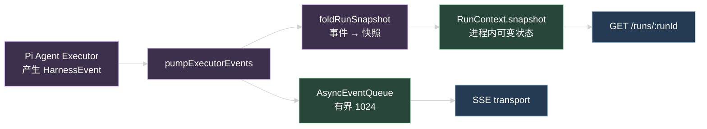
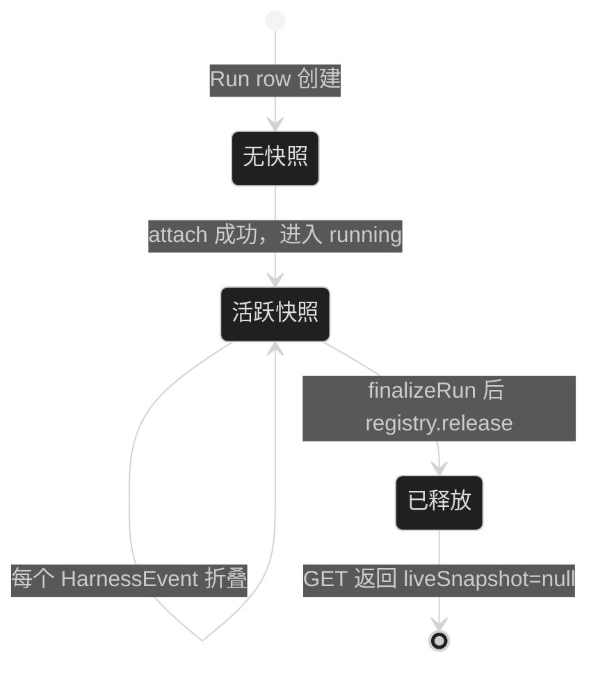
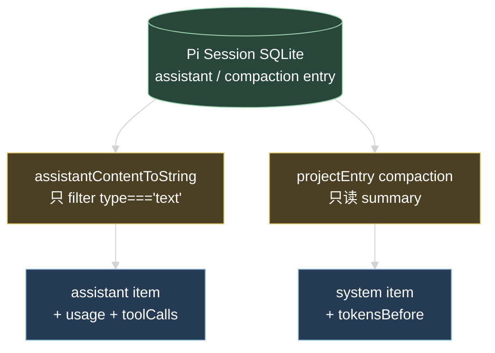

# 技术设计

## 1. 改动边界

只动三层，且每层职责不变：

| 层 | 文件 | 改什么 | 不改什么 |
| --- | --- | --- | --- |
| 契约 | `packages/contracts/src/ai.ts` | 加 2 个事件类型、加 optional 字段、加 snapshot schema | 不删字段、不改已有字段类型 |
| Run owner | `apps/api/src/modules/ai/run/run.service.ts` | 累积活跃快照、映射新事件 | 不改终态顺序、不改 registry 协议 |
| 投影 | `session.presenter.ts` / `pi-event-mapper.ts` | 补已持久化字段 | 不改 entry 写入格式 |

`active-run-registry.ts` 不动。`ActiveRunHandle` 保持只有 `runId/sessionId/lane/controls`，快照挂在 Run Service 自己的 `RunContext` 上。

`ai-gateway.ts:94` 的 2048 clamp 不动，那是 `/api/ai/test` 的一次性测试路径。

## 2. 活跃快照的数据流

关键点：快照由 Run Service 在 push 事件的同一处累积，不新增数据来源。



原来 `pumpExecutorEvents` 只做 `events.push(event)`。改成 push 之前先过一次 `foldRunSnapshot`。`run.service.ts` 里所有 `events.push(...)` 调用点都要走同一个封装，包括 `run.started` 和 terminal event，否则快照会漏掉首尾状态。

### 快照生命周期



`GET /runs/{runId}` 的行为：

- `registry.get(runId)` 命中且 Run 非终态 → 返回 `liveSnapshot`
- 未命中（终态、或进程重启后）→ `liveSnapshot: null`，客户端回落到 transcript

这样不需要持久化快照，进程重启后 transcript 已经有完整历史（assistant message 在 `message_end` 时已 append）。

## 3. 快照 schema

放在 `packages/contracts/src/ai.ts`，字段刻意和 admin `HarnessStreamState` 对齐：

```ts
export const agentRunLiveSnapshotSchema = z.strictObject({
  runId: uuidSchema,
  lane: agentLaneSchema,
  lastSequence: z.number().int().min(0),
  model: strictAiModelRefSchema.nullable(),
  turn: z.number().int().min(0),
  maxTurns: z.number().int().min(1).max(32),
  messages: z.array(z.strictObject({
    messageId: uuidSchema,
    content: z.string(),
    completed: z.boolean(),
  })).max(64),
  tools: z.array(z.strictObject({
    toolCallId: z.string().min(1).max(240),
    name: z.string().min(1).max(240),
    status: z.union([agentToolStatusSchema, z.literal('running')]),
    safeSummary: z.string().max(1000).nullable(),
  })).max(64),
})
```

`AgentRun` 加 `liveSnapshot: agentRunLiveSnapshotSchema.nullable()`。

`agentRunSchema` 有 `.superRefine`，新增字段要放在 `strictObject` 里再 refine，不能在 refine 之后 extend。

`messages` / `tools` 都设 `.max(64)`，避免长 Run 的快照无界增长。折叠时超限丢最旧的。

## 4. 两个新事件

```ts
// turn 边界
harnessTurnStartedEventSchema   // data: { turn: number }
harnessTurnCompletedEventSchema // data: { turn: number, toolCallCount: number }

// compaction
harnessContextCompactedEventSchema // data: { entryId: string, tokensBefore: number, summaryChars: number }
```

三个都加进 `harnessEventSchema` 的 discriminated union。

### turn 事件来源

`pi-event-mapper.ts` 的 `map()` 里 `turn_start` / `turn_end` 两个 case 现在是 `return []`，改成产出对应事件。turn 计数器放 mapper 实例上（和 `pendingTools` 同级）。

`turn_end` 的 `toolCallCount` 从 `event.toolResults.length` 取。

### compaction 事件来源

`compactIfNeeded` 在 `agent-executor.ts` 里，它拿不到 `events` 队列。走回调：`compactIfNeeded` 的 input 加 `onCompacted?: (info) => void`，executor 在 `transformContext` 里把回调接到 mapper 的事件产出上。

注意 `compactIfNeeded` 成功路径已经有 `input.transcript.push(entry)`，`entry.id` 和 `tokensBefore` 都在手上，不需要额外读库。

## 5. 数据投影补齐

三处都是加 optional 字段，presenter 从已有 entry 读。



### usage

`AssistantMessage.usage` 是必填字段（`packages/ai/src/types.ts:436`），`sanitizeAssistantMessage` 保留了它。`agent-executor.ts` 已有 `toAiUsage` / `toAiCost` 两个转换函数，直接复用，不重写。

加在两处：`agentTranscriptAssistantMessageSchema` 的 optional `usage`，和 `message.completed` 事件 data 的 optional `usage`。

`aiCostSchema` 有 `currency: z.literal('USD')`，`toAiCost` 在任一字段为 null 时返回 null，保持原逻辑。

### toolCalls

`assistantContentToString` 只保留 text block，toolCall block 被丢掉。加一个并行函数抽 toolCall：

```ts
function assistantToolCalls(content) {
  return content
    .filter(block => block.type === 'toolCall')
    .map(block => ({ toolCallId: block.id, name: block.name }))
}
```

只取 `id` 和 `name`。**不取 `arguments`** —— 入参脱敏是 P3 范围，这次不碰。

### tokensBefore

`CompactionEntry.tokensBefore` 是必填字段，`projectEntry` 的 compaction 分支加一行即可。

## 6. maxTokens

```diff
- maxTokens: Math.min(model.maxTokens, 2048),
+ maxTokens: model.maxTokens,
```

只改 `pi-native-stream.ts:210`。

单轮输出成本上界由 `AgentDefinitionConfig.maxTurns`（1-32，已有校验）乘以模型单轮上限兜住，不引入新配置项。

`pi-native-stream.test.ts` 的 fake model `maxTokens: 1024`，改后断言值从 1024 变成 1024（`Math.min(1024, 2048)` 本来就是 1024），测试不受影响。真正受影响的是 `model.maxTokens > 2048` 的真实模型。

## 7. 兼容性

| 消费方 | 影响 | 处理 |
| --- | --- | --- |
| admin `stream-reducer.ts` | 新事件走 `default` 分支，只更新 `lastSequence` | 不改也能跑；补 case 才能显示 |
| admin `AgentSessions.tsx` | transcript 新字段是 optional | 不改也能跑 |
| admin `harness.api.ts` | SSE 事件类型 union 变宽 | Zod 校验通过，无需改 |
| 已存 Pi entry | 只读不写，字段本来就在 | 无迁移 |
| 已存 `ai_agent_runs` | 不加列 | 无 migration |

**不需要 db migration**。快照只在内存，新字段都从 Pi entry 读。

## 8. 回滚点

按提交粒度切，每个都能独立 revert：

1. maxTokens（1 行）
2. contracts 新增（纯加法）
3. turn + compaction 事件（mapper + executor）
4. 快照（run.service + openapi + presenter）
5. 数据投影（session.presenter）
6. tool.progress 决策（契约删除或接通）

第 4 项依赖第 2 项，第 3 项依赖第 2 项，其余互相独立。

## 9. 不做

- 事件持久化：快照方案已覆盖断线场景，不引入事件表
- `AgentHarness` 迁移：`agent-harness.ts` 有 28 处 `HarnessNotImplemented`，Pi 自己的 coding-agent 也在用低层 `Agent`
- thinking 上公开协议：要改 `ai-system-design.md` 4.2 节约束 + transcript 结构，单独评估
- 工具结构化 details：要改 `AiToolResult` 契约和脱敏边界，单独评估
- transcript `content: string` 改 `blocks[]`：破坏性变更，等 thinking 一起做
