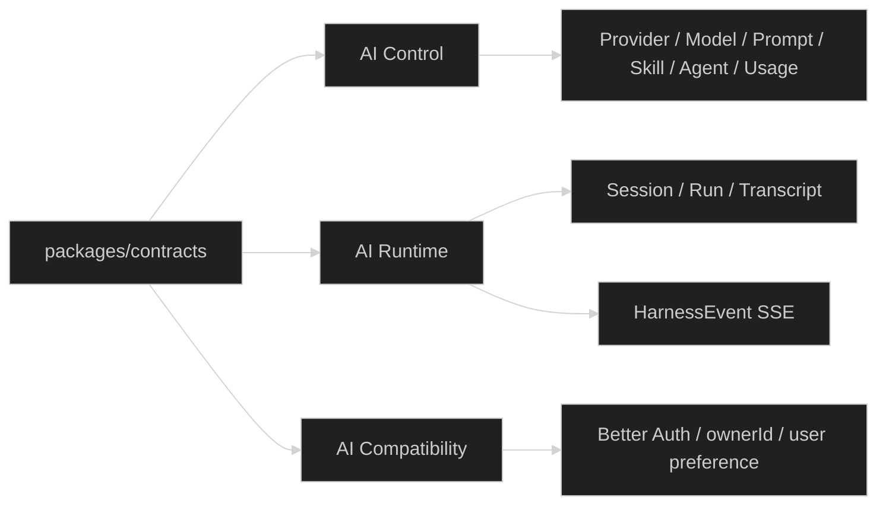

# 冻结 AI 公共协议与 API 面划分

## Design

- Route 文件负责路径、校验、调用 service、返回 envelope；不能在 route 内实现协议第二套 reducer。
- contracts 负责 schema、DTO、错误码和事件联合；不依赖数据库、Pi 或 Admin。
- OpenAPI 只是接口描述，不能把 OpenAPI 类型当成运行时数据来源。

## Contract Freeze Checklist

- 记录每个事件的 `type -> data -> producer -> persisted fact -> recovery source`。
- 记录终态事件只有 `run.completed/run.failed/run.aborted`，普通事件不能在终态后继续发布。
- 记录 `GET run` 的 `live` 仅覆盖 starting/running，终态必须没有 live。
- 记录 Transcript page 使用 raw Pi entry sequence，不能按投影后 item 数量构造 cursor。
- 记录 `AdminAiProvider/AdminAiModel` 只属于控制面；`AiUserModel/AiUserPreference` 属于 Starter 兼容接口。

## Compatibility

保留现有 URL 和 Cookie 认证，新增 tags 和文档分类。后续身份任务只增加 adapter，不把 Starter 字段复制进所有 contracts。
