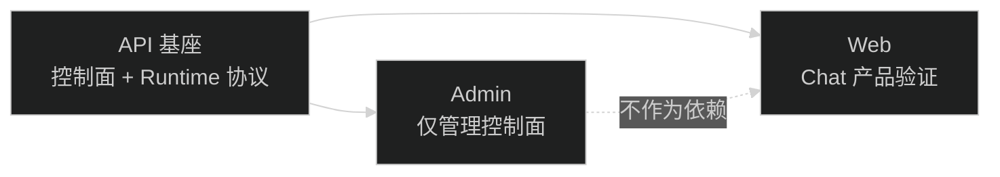

# AI 基座任务地图

本父任务只保留审查结论、架构决策和子任务关系，不直接实现产品代码。

## 子任务顺序

1. `08-21-ai-api-foundation-boundary`
   - 包：`api`
   - 先稳定控制面/runtime 面边界、公开 Harness 协议、Run/Transcript 恢复规则和 Tool contract。
2. `08-21-admin-ai-control-plane-only`
   - 包：`admin`
   - 依赖 API 基座协议；移除 Agent Sessions 聊天入口，只保留 AI 管理控制面。
3. `08-21-web-ai-chat-consumer-validation`
   - 包：`web`
   - 依赖 API 基座协议；用 Web 自己的 Chat 页面验证产品接入，不复用 Admin UI。

## 依赖关系

## 总验收

- API、Admin、Web 三个入口之间没有源码反向依赖。
- Admin 只使用管理接口；Web 只使用运行接口。
- Web Chat 不导入 Admin 页面、组件、API 函数或 Harness reducer。
- HarnessEvent 是独立运行协议，能支持聊天和未来其他产品界面。
- 任何产品 Tool 扩展都经过可信服务端注册和平台安全治理。

## 当前状态

三个子任务全部完成并归档：

| 子任务 | 结果 | 提交 |
| --- | --- | --- |
| `08-21-ai-api-foundation-boundary` | 完成 | `ccc38cc` feat(api): establish scoped ai runtime foundation |
| `08-21-admin-ai-control-plane-only` | 完成 | `b54db6e` / `2009d76` / `130157f` |
| `08-21-web-ai-chat-consumer-validation` | 完成 | `739c7b0` / `84e1e98` / `1cd422e` |

总验收的实测结果：

- `apps/api/src` 不引用 `apps/admin` 和 `apps/web` 源码，唯一命中是 `run-live-snapshot.test.ts` 注释里指向 Web 同构测试的说明。
- `apps/admin` 不再调用 `sessions`、`runs`、`transcript` 任何运行面接口，只保留管理控制面（Provider、模型、Prompt、Skill、Agent、Tool、应用凭据、用量）。
- `apps/web` 不调用 `/api/ai/admin/*`，也没有 `@admin` 或 `apps/admin` 的导入。
- HarnessEvent 作为独立运行协议同时支撑两侧折叠：API 的 `run.live-snapshot.ts` 和 Web 的 `lib/ai/chat-events.ts` 用 `test-fixtures/harness-timeline-isomorphism.json` 双向校验。
- Tool 仍只由 API 进程内 `AiToolRegistry` 注册，浏览器不能提交 handler。

未做（本任务 Out of Scope，需要新任务）：多租户实现、认证替换、SDK、Webhook、队列、独立数据库、远程 Tool 协议、React Flow 与工作流编排。
