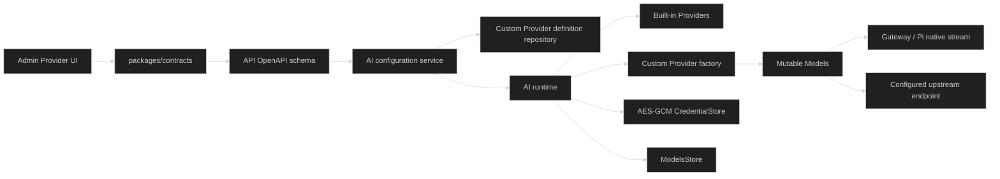

# 技术设计

## 1. 设计目标

自定义 Provider 是“受约束的配置数据”，不是“动态代码”。所有 Provider 最终都必须转换为 `pi-ai` 的 `Provider`，并进入现有 `Models` 集合，使 `AiGateway`、`PiNativeStream`、模型测试、Agent Run 和审计不感知 Provider 来源。

## 2. 组件边界



职责分配：

- `packages/contracts`：定义跨层 schema 和 DTO，不导入 `pi-ai` 类型。
- `apps/api/src/modules/ai`：请求校验、权限、业务状态、引用检查和响应投影。
- `apps/api/src/infra/ai`：`pi-ai` 类型、Provider 工厂、模型/认证/请求适配和 secret 读取。
- `apps/admin`：只调用 API，不知道数据库字段，不保存 secret 副本。
- `ai_provider_configs`：继续保存凭据和运行状态。
- 新增 `ai_custom_providers`：只保存 Provider 定义和非 secret 配置。
- `ai_model_catalogs`：可复用保存自定义 Provider 的模型目录；手工模型也可写入同一目录，但要有来源标记或由定义表保存静态模型，避免把管理员输入误认为远程缓存。

## 3. 数据模型

建议新增 `ai_custom_providers`：

- `provider_id`：主键，使用现有 Provider ID 规则。
- `name`：显示名。
- `protocol`：`openai-completions | openai-responses | anthropic-messages`。
- `base_url`：规范化后的 endpoint 根地址。
- `config_json`：协议兼容参数和非 secret 请求设置，使用 `json_valid` 约束。
- `models_json`：手工模型列表，使用 `json_valid` 约束；或拆成模型表，首版优先 JSON 以减少表数量。
- `created_by`、`updated_by`、`created_at`、`updated_at`。
- `revision`：定义修改版本，用于热加载和并发冲突。

现有 `ai_provider_configs` 继续以 `provider_id` 为主键，二者通过同名 ID 关联。是否增加 SQLite 外键取决于既有 migration 对内置 Provider 行的处理；删除自定义 Provider 时由 repository 事务先清理 config、catalog、enabled model、default model，再删除 definition。

模型字段至少包括：

- `modelId`、`name`。
- `contextWindow`、`maxOutputTokens`。
- `supportsImageInput`、`supportsReasoning`、`supportsTools`。
- `inputCost`、`outputCost`、`cacheReadCost`、`cacheWriteCost`。
- 协议相关 `compat` 的白名单字段，不接受任意 JSON key。

## 4. 协议到 pi-ai API 映射

| contracts protocol | pi-ai API implementation | 关键配置 |
|---|---|---|
| `openai-completions` | `openAICompletionsApi()` | `compat`、max tokens 字段、developer role、reasoning、usage、tool strict mode |
| `openai-responses` | `openAIResponsesApi()` | store、reasoning、tool 参数、Responses endpoint 行为 |
| `anthropic-messages` | `anthropicMessagesApi()` | anthropic 版本兼容、thinking、tool schema、system message 行为 |

Provider 工厂只允许这三个固定 implementation。协议和 implementation 映射必须是代码中的穷举 switch，不能从数据库加载模块路径。

Provider auth 首版使用已有 API Key credential store；keyless Provider 使用固定的 `auth` resolver，不接受用户提交的 resolver。认证检查应调用 `models.getAuth(providerId)`，协议请求应继续传入 runtime 解密后的 settings。

## 5. Runtime 生命周期

启动：

1. 构造内置 Provider。
2. 查询全部自定义 definition。
3. 校验 definition；无效记录标记错误并不注册，不能阻断 API 启动。
4. 从 `ai_provider_configs` 恢复 credential store 和 settings。
5. 使用 `createProvider()` 构造并 `models.setProvider()`。
6. `models.refresh({ allowNetwork: false })` 恢复已持久化目录。
7. 清理已经不存在的自定义模型引用。

创建/更新：

1. repository 在事务内校验 ID 不冲突并写 definition。
2. 写 config 时递增 config revision、停用 Provider、清除认证状态。
3. runtime 删除旧 Provider，构造新 Provider 并 setProvider。
4. 返回不含 secret 的 Admin DTO。

删除：

1. 检查 Provider 为自定义且当前 disabled。
2. 检查 Agent Definition 是否引用该 Provider；有引用时返回稳定冲突错误。
3. 事务内删除 global default、enabled models、catalog、provider config、definition。
4. runtime `deleteProvider(providerId)`，清理内存中的 Provider。
5. 已启动的 Run 使用已有 model snapshot/模型对象继续完成；后续新请求找不到该 Provider。

## 6. URL 和 SSRF 策略

- 生产只允许 HTTPS 公网地址，或命中 API 环境变量配置的 CIDR allowlist 的私网地址；Admin 不能修改 allowlist。
- 开发模式额外允许 `http://localhost`、`http://127.0.0.1`、`http://[::1]`。
- 默认阻止 loopback、link-local、IPv6 unique-local、云 metadata 地址和未命中的 RFC1918/私网地址。
- DNS 解析后还要校验最终 IP，不能只校验 hostname 文本。
- 重定向默认禁止或每一跳重新执行同一检查。
- 认证检查、模型刷新和实际 Provider 请求使用同一个 outbound URL guard；不能只在保存时校验。
- 请求超时、响应体大小、模型条目数量和 JSON 深度都必须有上限。

实现采用生产 CIDR allowlist 策略：

- API 环境变量提供允许的私网 CIDR 列表，API 启动时解析并拒绝非法 CIDR。
- Admin 只提交 Base URL，不能提交或覆盖网络 allowlist。
- URL 保存、认证检查、模型刷新和实际请求都执行解析后 IP 校验；重定向每一跳重新校验。

## 7. API 设计

建议资源接口：

```text
GET    /api/ai/admin/custom-providers
POST   /api/ai/admin/custom-providers
GET    /api/ai/admin/custom-providers/{providerId}
PUT    /api/ai/admin/custom-providers/{providerId}
DELETE /api/ai/admin/custom-providers/{providerId}
POST   /api/ai/admin/custom-providers/{providerId}/check
PUT    /api/ai/admin/custom-providers/{providerId}/credential
DELETE /api/ai/admin/custom-providers/{providerId}/credential
PUT    /api/ai/admin/custom-providers/{providerId}/state
PUT    /api/ai/admin/custom-providers/{providerId}/models
```

也可以让现有 `/api/ai/admin/providers` 返回 built-in + custom 的统一列表；推荐保留统一读取接口，在 DTO 增加 `kind: built_in | custom`，写操作使用 custom 专用路径，避免让内置 Provider 误走 definition CRUD。

错误码复用已有 AI 错误码，并新增必要的稳定错误：

- `AI.CUSTOM_PROVIDER_EXISTS`
- `AI.CUSTOM_PROVIDER_ID_CONFLICT`
- `AI.CUSTOM_PROVIDER_IN_USE`
- `AI.CUSTOM_PROVIDER_URL_INVALID`
- `AI.CUSTOM_PROVIDER_PROTOCOL_INVALID`
- `AI.CUSTOM_PROVIDER_MODEL_INVALID`
- `AI.CUSTOM_PROVIDER_CHECK_FAILED`

如果项目已有错误码命名约束，应在 contracts 中统一定义，不能在 route 内拼字符串。

## 8. Admin 设计

`AiProviders.tsx` 保持 Provider 列表和模型白名单主页面，增加：

- “新建自定义 Provider”按钮，仅在 `AI_CONFIG_MANAGE` 下显示。
- 自定义 Provider 行的 `kind` 标识、协议和模型数量。
- 创建/编辑 Drawer 或页面：基础信息、Base URL、协议选择、协议兼容项、凭据、模型列表。
- 模型编辑使用稳定的表格/表单行，不在页面内直接拼接 API payload。
- 删除必须二次确认，并在 API 返回引用冲突时展示关联资源提示。
- 更新后显示“需要重新检查”，不自动启用。
- 覆盖 loading、error、empty、mutation pending、认证失败、模型校验失败和窄视口布局。

API/query 放在 `apps/admin/src/api/ai/`，contracts 类型作为唯一表单输入来源；表单层只做空值转换和显示格式转换。

## 9. 兼容性和迁移

- 内置 Provider 的数据库行和当前 API 行为不变。
- `AdminAiProvider` 增加字段必须保持已有页面可读；新字段用明确的 nullable/enum 默认值。
- 旧 `/api/ai/admin/providers` 继续返回内置 Provider，并可扩展为合并列表；不要让旧客户端因新增字段失败，Zod response 使用兼容扩展。
- migration 必须只新增自定义表和必要索引，不修改 Pi Session 数据库。
- 删除自定义 Provider 是破坏性操作，只允许在 disabled 且无 Agent 引用时执行。

## 10. 测试设计

API：

- contracts 对三种协议、compat 白名单、模型边界、URL 和 secret 输入做 schema 测试。
- repository 覆盖创建、revision、CAS、删除事务和引用清理。
- runtime 覆盖三种 API implementation 映射、重启恢复、热替换、deleteProvider、keyless、auth failure 和 catalog restore。
- fake upstream 覆盖 completion、responses、anthropic stream、timeout、abort、redirect、SSRF、过大响应和非法模型。
- route 覆盖权限、错误码、DTO secret 过滤和 OpenAPI 响应。
- integration 覆盖模型白名单、默认模型、Agent resolve、模型测试 SSE、Agent Run 审计。

Admin：

- query/mutation cache invalidation。
- 创建、编辑、保存凭据、check、启停、模型保存、删除和冲突错误。
- 权限隐藏、loading/error/empty/pending。
- 关键表单转换纯函数测试，避免依赖 Ant Design 内部行为。

## 11. 回滚

- migration 只新增表，回滚可停用自定义 Provider 并删除新增表；不删除已有 Provider 数据。
- runtime 发现定义无效时跳过该 Provider并保留数据库记录，管理员可通过修复接口恢复。
- 任何自定义 Provider 调用失败不能影响内置 Provider 的注册和调用。
- 删除动作在单事务内完成，失败时不调用 runtime delete。
