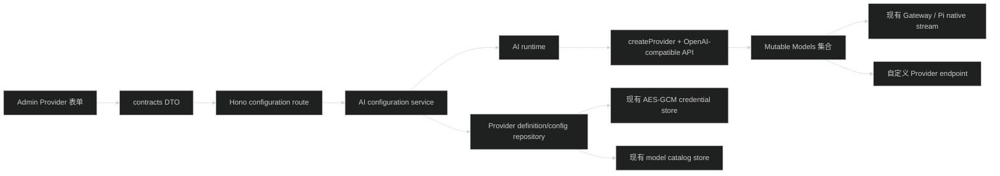

# AI Provider 自定义技术调研

## 调研目标

评估在现有 `apps/api` AI runtime 和 `apps/admin` Provider 页面中增加自定义 Provider 的实现方式、边界和风险。

## 当前代码事实

- Provider 运行时位于 `apps/api/src/infra/ai/`。
- `ai-provider-registry.ts` 通过 `@earendil-works/pi-ai/providers/all` 构造内置 Provider 定义，Admin 只能看到 registry 中的 Provider。
- `ai-runtime.ts` 使用 `builtinModels({ credentials, modelsStore })` 创建 `Models` 集合，模型查询、认证、刷新和流式调用都经过这一个集合。
- `ai-credential-store.ts` 已实现按 Provider 保存凭据、AES-256-GCM 加密、串行写入和 CAS 冲突保护。
- `ai-model-catalogs` 已保存 Provider 的模型目录；`ai-provider-configs` 已保存启用状态、加密 payload、认证检查状态、配置 revision。
- `packages/contracts/src/ai.ts` 已有 `AiModelRef`、Provider DTO、Provider 配置字段 DTO 和 Provider 配置请求 DTO。
- Admin 已有 `/ai/providers` 页面，支持保存 API Key、Provider settings、认证检查、启停、模型目录刷新、模型白名单和全局默认模型。
- 当前 Provider 配置接口是按已存在的 `providerId` 更新，不支持创建和删除 Provider 定义。
- 现有 Provider 改配置后会递增 `configRevision`、停用 Provider、要求重新检查认证；该状态机应继续保留。

## 第三方库事实

项目当前使用 `@earendil-works/pi-ai` 0.84.1，Node 要求为 `>=22.19.0`。该版本提供：

- `createModels()` 和 `MutableModels.setProvider()`，支持运行时注册 Provider。
- `createProvider()`，可由 `id`、名称、认证、模型列表、动态 `fetchModels` 和 API implementation 构造 Provider。
- `openAICompletionsApi()`，支持 OpenAI-compatible endpoint。
- `fetchModels` 动态目录和 `ModelsStore` 持久化。
- `compat` 字段，可控制 developer role、reasoning、usage、tool strict mode、max tokens 字段等兼容差异。
- Provider 可以使用静态模型目录，也可以通过 `fetchModels` 从远端获取目录。
- 任意协议仍需 API implementation；`createProvider()` 不会把任意 HTTP JSON 自动转换成统一模型调用。

参考来源：

- 本地依赖 `apps/api/node_modules/@earendil-works/pi-ai/README.md` 的 `Custom Providers`、`Dynamic Providers`、`OpenAI Compatibility Settings` 章节。
- 本地依赖 `apps/api/node_modules/@earendil-works/pi-ai/dist/models.d.ts` 的 `Provider`、`CreateProviderOptions`、`MutableModels` 定义。
- 官方 AI SDK 自定义 OpenAI-compatible Provider 文档：`https://ai-sdk.dev/providers/openai-compatible-providers/custom-providers`。
- LiteLLM 官方 Proxy model access 文档：`https://docs.litellm.ai/docs/proxy/model_access_guide`。

## 方案比较

### 方案 A：配置驱动的 OpenAI-compatible Provider，推荐 MVP

Admin 创建 Provider，填写：

- Provider ID 和显示名称。
- Base URL，仅允许 `https`；本地开发可明确允许 `http://localhost`、内网地址按部署策略处理。
- API Key 或 keyless 模式。
- 模型目录：先支持 Admin 手工添加/编辑模型，模型字段包括 model ID、名称、上下文窗口、最大输出、能力、价格和兼容参数。
- 可选动态模型目录 URL 或固定 `/models` 刷新策略，建议放到后续阶段。

API 将配置转换为 `createProvider()` + `openAICompletionsApi()`，使用一个独立的动态 Provider ID 注册到现有 `Models` 集合。凭据仍走已有 `AiCredentialStore`，模型仍走 `AiModelsStore`，调用仍走现有 Gateway 和 Pi native stream。

优点：改动范围可控，复用现有调用、审计、权限、模型白名单和 Admin 页面；不执行管理员提交的代码。

限制：只覆盖 OpenAI Chat Completions 兼容协议；不覆盖 Anthropic、Gemini、OAuth、特殊签名、任意自定义响应格式。

### 方案 B：配置驱动的多协议 Provider

在数据库中增加协议类型，例如 `openai-completions`、`anthropic-messages`、`openai-responses`，API 根据协议选择 `pi-ai` 已有 API implementation，并为每种协议定义兼容参数和字段。

优点：覆盖更多兼容网关和厂商。

代价：Admin 表单、模型 schema、认证方式、错误测试和兼容参数明显增加；不同协议的 endpoint、header、tool、thinking 和 usage 行为需要分别测试。适合作为 MVP 后续扩展，不建议首轮直接做全量。

### 方案 C：插件/脚本 Provider，不推荐

允许 Admin 上传或填写 JS/TS Provider 代码，由 API 动态加载。

不采用原因：这等同于给管理员提供 API 进程代码执行能力；需要沙箱、依赖隔离、网络访问控制、生命周期管理、版本回滚和审计，远超当前需求，也会破坏 `apps/api/src/infra/ai/` 的安全边界。

## 推荐架构

建议把“Provider 定义”和“Provider 凭据/运行状态”分开：

- `ai_custom_providers`：非 secret 的定义、协议、base URL、兼容参数、模型目录策略、创建/更新信息。
- `ai_provider_configs`：继续保存同一 Provider ID 的启用状态、加密凭据、认证检查状态和 revision。
- `ai_model_catalogs`：继续保存动态模型目录。
- `ai_enabled_models`：继续保存白名单。

内置 Provider 仍来自 `pi-ai` registry；自定义 Provider 由数据库定义生成，最终合并进入一个 `Models` 集合。自定义 Provider ID 必须与内置 ID 冲突校验，且不能覆盖内置 Provider。

## 必须明确的安全边界

- Provider ID、名称、协议和兼容参数必须用 Zod 校验。
- Base URL 必须限制协议和地址策略，禁止 `file:`、`data:`、`javascript:` 等 scheme；是否允许私有网段需要按部署环境决定。若 API 可被公网访问，必须防 SSRF。
- API Key 只能进入加密 payload，不能返回给 Admin DTO、日志、模型目录、Run snapshot 或事件。
- 自定义 models endpoint 若支持，必须使用 Provider 自己的已校验 base URL 或明确白名单，不能接受任意每次请求 URL。
- 动态模型返回内容必须通过统一模型 schema 校验，并限制数量、ID、名称、上下文和价格范围。
- Provider 配置、凭据和模型能力发生变化时必须停用并递增 revision，认证检查成功后才能启用。
- 自定义 Provider 的请求、认证检查、模型刷新和 Agent Run 都必须复用现有 timeout、AbortSignal、错误归一化和审计路径。
- 不允许 Admin 提交代码、npm 包地址或任意请求 header 模板。

## 实现评估

### MVP 工作量

中等，涉及 API、contracts、数据库 migration、Admin API/query/page/test，但不需要重写 Gateway 或 Agent executor。

主要改动区域：

- `apps/api/src/infra/ai/ai-provider-registry.ts`：增加持久化 Provider definition 合并逻辑。
- `apps/api/src/infra/ai/ai-runtime.ts`：由 `builtinModels()` 改为可追加自定义 Provider 的 `createModels()`，启动和配置变更时同步注册/删除。
- `apps/api/src/infra/ai/ai-models-store.ts`、`ai-credential-store.ts`：复用现有接口，必要时补充自定义 Provider catalog 的模型校验。
- `apps/api/src/modules/ai/ai.schema.ts` 和 migration：增加 custom provider definition 表。
- `configuration.repository/service/openapi/presenter`：新增创建、更新、删除和测试自定义 Provider 的接口，或将现有 config 接口扩展为 definition + config 两步。
- `packages/contracts/src/ai.ts`：新增 custom provider definition、model input、协议和兼容参数 schema。
- `apps/admin/src/features/ai/pages/AiProviders.tsx`：增加“新建自定义 Provider”入口、协议/base URL/模型管理表单，并区分内置与自定义 Provider。
- Admin API/query 与 AI Provider 测试。

### 推荐分期

1. Phase 1：静态模型 + OpenAI-compatible + API Key/keyless + Admin CRUD + 连接测试。
2. Phase 2：自定义 Provider 的 `/models` 动态刷新和模型能力映射。
3. Phase 3：增加 Anthropic-compatible / OpenAI Responses 等已知协议，并为每个协议独立兼容配置和测试。
4. 暂不做：OAuth 自定义流程、任意协议脚本、用户自行创建 Provider、任意 URL 请求模板。

## 关键风险

- `pi-ai` 的 `Model` 类型允许较宽的 `api` 和能力字段，但数据库 JSON 反序列化必须由项目自己做严格 schema 校验，不能直接信任 Admin 输入。
- 自定义 Provider 动态注册后必须处理删除、重启恢复、Provider ID 冲突和当前模型白名单/全局默认引用清理。
- Admin 现有页面把 Provider 全部视为内置 Provider，新增创建/删除状态需要更新空态、错误态、pending 状态、权限和确认流程。
- 如果允许公网配置私有 endpoint，模型刷新和认证检查会引入 SSRF 风险；该项必须在需求中明确部署策略。

## 结论

建议首轮实现“数据库定义的 OpenAI-compatible 自定义 Provider”，通过 `pi-ai` 官方 `createProvider()` 注册到已有 runtime；模型先由 Admin 手工维护，动态目录刷新作为第二阶段。这样能覆盖自建 OpenAI 兼容网关、Ollama、vLLM、LM Studio、企业代理和多数统一网关，同时保留现有认证、模型白名单、Agent Run、SSE、审计和 Admin 权限体系。
