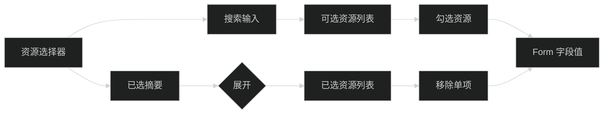

# 技术设计

## 组件边界

在 `apps/admin/src/features/ai/pages/Agents.tsx` 内增加页面私有的资源选择器组件，分别服务技能和工具字段。组件只负责展示、搜索、勾选和移除，表单仍由 Ant Design `Form.Item` 管理。

## 交互结构

- 资源列表采用固定高度、可滚动区域，避免长列表撑开 Drawer。
- 选项使用 checkbox 和两行信息：主名称、辅助描述；工具显示 `name@version` 和 scope。
- 搜索同时匹配名称、版本、描述和 scope。
- 已选区域默认折叠，标题显示数量；展开后提供移除按钮。
- 选项 disabled 逻辑只保留当前数据过滤规则，不在组件层改变业务数据。

## 数据流

- 技能选中值继续为 `string[]`。
- 工具选中值继续为由 `toolRefKey` 生成的 `string[]`，保存前仍调用 `parseToolRefKey`。
- 资源加载错误、加载状态和空数据由页面传入或通过现有 query 状态控制；组件不发请求。
- 同名不同版本工具冲突仍由 `submit` 统一校验，避免重复业务规则。

## 兼容性与回滚

- 不改变 contracts、API 和 mutation 调用。
- 变更集中在 Agents 页面及其测试，回滚时删除私有选择器并恢复 Form.Item 内 Select 即可。
