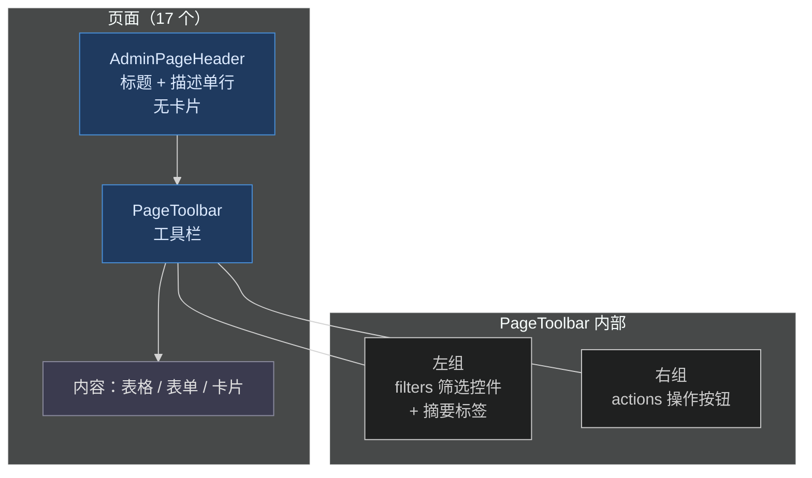

# design — admin 页面头部重构

## 边界与范围

只改 admin 前端展示层：

- 重写公共组件 `AdminPageHeader`（去掉卡片视觉）
- 新增公共组件 `PageToolbar`（统一工具栏）
- 迁移 17 个页面的 header 用法

不改路由、数据获取、i18n 键、API 契约、全局布局（AppHeader / Sidebar / TabBar）。

## 组件契约

### AdminPageHeader（重写）

位置：`apps/admin/src/components/common/AdminPageHeader.tsx`

```ts
interface AdminPageHeaderProps {
  title: ReactNode
  description?: string
  onBack?: () => void
  backLabel?: string
}
```

- 删除 `actions` 和 `summaryItems` props，这两个能力移交给 `PageToolbar`。
- 渲染：无卡片无背景的单行容器 `flex min-w-0 flex-wrap items-baseline gap-x-3 gap-y-1`。
- 有 `onBack` 时标题前渲染 text 返回按钮。
- `h1` 字号 `text-lg font-semibold tracking-tight sm:text-xl`（比原卡片内字号降一档）。
- 描述渲染为 `h1` 后的 `text-fg-muted text-sm truncate`，与标题基线对齐、同行。

### PageToolbar（新增）

位置：`apps/admin/src/components/common/PageToolbar.tsx`，并在 `components/common/index.ts` 导出。

```ts
interface PageToolbarSummaryItem {
  label: string
  value: ReactNode
}

interface PageToolbarProps {
  actions?: ReactNode
  filters?: ReactNode
  summaryItems?: PageToolbarSummaryItem[]
}
```

- 三个 prop 全部为空时返回 `null`，避免空工具栏。
- 渲染：外层 `flex flex-wrap items-center justify-between gap-2`。
- 左组：`flex flex-wrap items-center gap-2`，顺序为 `filters` + 摘要标签。
- 右组：`flex flex-wrap items-center gap-2`，放 `actions`。
- 摘要标签样式沿用旧 `AdminPageHeader` 的 span 样式：`rounded-full border px-2.5 py-1 text-xs` + `border-border-subtle bg-overlay-0/16`，label 用 `text-fg-muted`，value 用 `text-fg font-medium`。
- 窄屏下 flex-wrap 自然换行，右侧 actions 换到下一行，不溢出。

## 结构图



旧版是「卡片页头（标题/描述/摘要/按钮四块堆叠）→ 内容」；新版是「单行页头 → 单条工具栏 → 内容」，垂直占位从约 120px+ 压到约两行。

## 页面迁移映射

| 页面 | 现状 actions | 现状 summaryItems | 现状筛选行 | 迁移后 |
| --- | --- | --- | --- | --- |
| Home | 无 | 2（账号、框架） | 无 | toolbar 左侧放摘要标签 |
| LogViewer | 无 | 1（总数） | 有（requestId + 级别下拉） | toolbar 左筛选+摘要标签 |
| AiSettings | 无 | 无 | 无 | 仅页头，不渲染 toolbar |
| AiUsageAudit | 无 | 1（总数） | 有（用户/Provider/模型 ID + 结果） | toolbar 左筛选+摘要标签 |
| Agents | 新建按钮 | 2（总数、启用） | 无 | toolbar 左摘要、右新建 |
| SystemPrompts | 新建按钮 | 无 | 无 | toolbar 右新建 |
| AiApplications | 新建按钮 | 2（总数、启用） | 无 | toolbar 左摘要、右新建 |
| PromptTemplates | 新建按钮 | 无 | 无 | toolbar 右新建 |
| Skills | 新建按钮 | 无 | 无 | toolbar 右新建 |
| AiProviders | 新建按钮 | 2（总数、启用） | 无 | toolbar 左摘要、右新建 |
| EnvExample | 刷新按钮 | 1（环境） | 无 | toolbar 左摘要、右刷新 |
| UiShowcase | 无 | 2（状态、更新时间） | 无 | toolbar 左侧放摘要标签 |
| UserManagement | 无 | 1（总数，与分页 showTotal 重复） | 搜索 + 角色下拉 + 清除 | 摘要删除；筛选进 toolbar 左侧 |
| FileList | 上传按钮 | 2（总数、当前结果） | 搜索 + 清除 | toolbar 左筛选+摘要、右上传 |
| ProfileSettings | 无 | 2（登录方式、更新时间） | 无 | toolbar 左侧放摘要标签 |
| AuthorizationAudit | 无 | 1（总数） | 有（动作下拉 + 操作者/目标 ID） | toolbar 左筛选+摘要标签 |
| AuthorizationSettings | 无 | 3（用户、角色、权限数） | 无 | toolbar 左侧放摘要标签 |

页面顶层容器间距：`gap-6` / `space-y-6` 统一收紧为 `gap-4` / `space-y-4`，页头与 toolbar 之间 `gap-2`。

## 兼容性

- i18n 键全部复用，不新增、不删除。
- `AdminPageHeader` 的调用方全部迁移，无兼容层；旧 props（actions / summaryItems）直接删除，TS 编译期兜底。
- 测试不直接引用 `AdminPageHeader`，断言基于文案和按钮，布局调整不影响。
- 无持久化数据、无 API 变更，无迁移问题。

## 回滚

- 单次 git 提交覆盖全部改动；回滚即 revert 该提交。
- 风险点：17 个页面手工迁移量大，容易漏改或改错。缓解：以「先组件后页面」的顺序实施，每改一组页面跑一次类型检查，最后统一跑 check + test + 视觉抽查。
