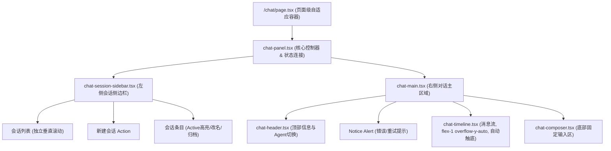
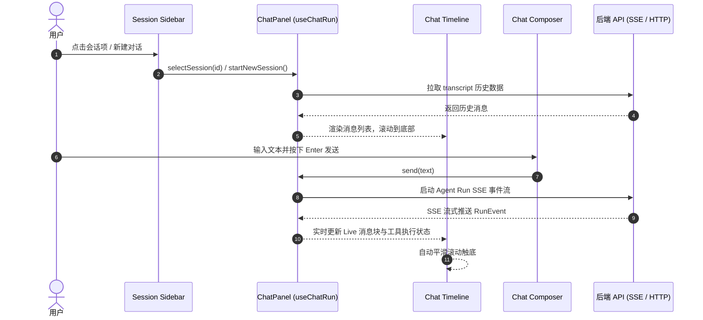

# Web Chat 左右布局技术设计

## 架构与组件划分

本次改造对 `apps/web/app/(site)/_components/chat/` 下的组件结构与交互关系进行清晰解耦与重组。

## 数据流与状态流转

## 关键技术细节与实现设计

### 1. 自适应视口高度控制
- 页面外层容器计算可用视口高度：
  在 `apps/web/app/(site)/chat/page.tsx` 中使用 `h-[calc(100dvh-6.5rem)] min-h-[560px]` 限制高度，避免由于外层 footer 等元素拉长页面产生全屏纵向滚动条。
- 主容器采用 `border border-border bg-card/60 backdrop-blur-sm shadow-sm overflow-hidden flex flex-col md:flex-row` 结构，将左侧侧边栏和右侧对话区完全包裹。

### 2. 左侧侧边栏 (Session Sidebar)
- 桌面端：`w-72 lg:w-80 shrink-0 border-r border-border flex flex-col bg-surface-muted/30`。
- 移动端：提供可折叠侧边栏（使用移动端 Sheet/抽屉或 Overlay 浮层），点击顶部菜单按钮即可滑出。
- 会话条目设计：
  - 选中态：`bg-surface-elevated text-foreground border-l-2 border-primary`，未选中态 `hover:bg-surface-muted/60 text-muted-foreground hover:text-foreground`。
  - 快捷操作按钮（重命名、归档）在 Hover 或选中时显示，避免干扰视线。
  - 重命名表单与归档确认内嵌在当前条目中，体验平滑自然。

### 3. 右侧对话主区域与自动触底
- 主区结构：`flex-1 flex flex-col min-w-0 bg-surface/40 h-full`。
- 时间线滚动容器：`flex-1 overflow-y-auto p-4 md:p-6 space-y-4`。
- 触底机制（Auto-Scroll）：
  - 使用 `messagesEndRef = useRef<HTMLDivElement>(null)`。
  - 在 `history`、`timeline`、`pendingUserText` 发生变更时，自动调用 `scrollIntoView({ behavior: 'smooth', block: 'end' })`。
  - 当用户主动向上翻阅历史消息时，避免生硬强制拉到底部（通过监听用户滚动位置判断是否贴底）。

### 4. 底部输入区 (Composer)
- 结构：`border-t border-border bg-surface/90 backdrop-blur-md p-4 shrink-0`。
- 输入框使用自适应高度 Textarea，支持 Enter 快捷发送与 Shift+Enter 换行。
- 按钮布局与状态反馈：
  - 发送按钮带微动效反馈。
  - 运行中展示「停止生成」红色/描边高亮按钮。
  - Agent 选择器可在顶部 Header 或 Composer 底部工具栏便捷切换。

### 5. 视觉美化规范（参考 Radix Themes 风格）
- 调色与质感：使用 Rosé Pine 的 Surface 分层（`bg-surface`, `bg-surface-muted`, `bg-surface-elevated`）搭配 Subtle Border。
- 消息气泡美化：
  - 用户气泡：右对齐或带 Accent 边框的简洁卡片，清晰呈现提问内容。
  - 助手气泡：结构清晰，头部带 Agent 头像与名称标签，支持 Markdown 段落与代码块。
  - 思考折叠区（Thinking Block）：半透明背景 + 精致收折指示器。
  - 工具调用区（Tool Activity）：胶囊式卡片，根据运行状态（执行中/成功/失败）展现不同徽章色。
