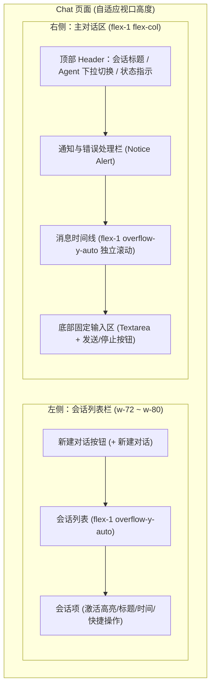

# Web Chat 左右布局改造与美化

## 目标与价值

将 Web 端的 Chat 页面从目前的纵向堆叠布局重构为现代 AI 产品主流的左右分栏布局：
- 左侧会话侧边栏（Session Sidebar）：支持新建对话、会话列表独立滚动、快速切换、重命名与归档。
- 右侧主对话区（Chat Main Area）：顶部展示当前会话与 Agent 选择，中部消息时间线独立内部滚动并支持自动滚动触底，底部固定输入区。
- 视觉与体验美化：基于 Tailwind CSS v4 与 Rosé Pine 语义 Token，深度参考 Radix Themes 设计规范，提升整体层次感、动效与响应式体验。

## 现状与技术约束

1. 路由与文件结构：
   - 页面入口：[page.tsx](file:///Users/wuwanzhu/Code/xdd/starter/apps/web/app/(site)/chat/page.tsx)
   - 核心容器组件：[chat-panel.tsx](file:///Users/wuwanzhu/Code/xdd/starter/apps/web/app/(site)/_components/chat/chat-panel.tsx)
   - 会话栏组件：[chat-session-bar.tsx](file:///Users/wuwanzhu/Code/xdd/starter/apps/web/app/(site)/_components/chat/chat-session-bar.tsx)
   - 时间线组件：[chat-timeline.tsx](file:///Users/wuwanzhu/Code/xdd/starter/apps/web/app/(site)/_components/chat/chat-timeline.tsx)
   - 输入框组件：[chat-composer.tsx](file:///Users/wuwanzhu/Code/xdd/starter/apps/web/app/(site)/_components/chat/chat-composer.tsx)
   - 状态管理 Hook：[use-chat-run.ts](file:///Users/wuwanzhu/Code/xdd/starter/apps/web/hooks/use-chat-run.ts)
2. 设计系统选型已确认：
   - 沿用现有 Tailwind CSS v4 + `@starter/theme`（Rosé Pine Dawn/Moon 主题 Token）+ Radix Primitives / shadcn UI 体系。
   - 布局采用沉浸式视口自适应布局（`h-[calc(100dvh-6rem)]`），左右分栏各自独立滚动，输入框固定吸底。

## 架构与布局设计

## 功能与需求规范

### 1. 整体容器与响应式布局
- 桌面端（md 及以上）：左右双栏排布，左侧边栏固定宽度（280px ~ 320px），右侧对话区自适应拉伸。
- 移动端（窄屏）：左侧会话栏支持抽屉/折叠展开，或者移动端标签页切换视图，保障小屏可用性。
- 容器外层锁高 `h-[calc(100dvh-6.5rem)]`，内部滚动互不干扰，禁止页面外层产生双重纵向滚动条。

### 2. 左侧会话侧边栏 (Session Sidebar)
- 顶部醒目的「+ 新建对话」按钮。
- 会话列表独立滚动区，显示当前会话标题与时间。
- 选中会话高亮（背景色 `bg-surface-muted`、文字高亮、激活边框指示）。
- 悬停/选中项提供快捷改名（Pencil）和归档（Archive）入口。
- 内联表单支持改名校验与提交，二次确认支持安全归档。

### 3. 右侧主对话区 (Chat Main Area)
- **Header 顶部栏**：
  - 显示当前会话标题与当前 Agent 状态。
  - Agent 选择器与快捷信息展示。
  - 移动端下提供打开会话侧边栏的触发按钮。
- **Timeline 消息时间线**：
  - 消息列表 `overflow-y-auto` 独立纵向滚动。
  - 自动滚动机制：在发送新提问、流式接收 Token 时平滑滚动到底部。
  - 区分用户气泡与助手气泡排版：用户消息靠右或右侧强调，助手消息结构化呈现。
  - 优化 Thinking 思考折叠过程、Tool 运行状态（执行中、成功、失败）与历史压缩提示。
  - 空会话时提供精美引导视图（Empty State 与预设提问）。
- **Composer 底部输入区**：
  - 固定吸附在对话区底部。
  - 支持多行文本自适应输入，Enter 发送，Shift+Enter 换行。
  - 运行状态时输入禁用，提供醒目的「停止生成」按钮。

### 4. 视觉打磨与主题适配
- 参考 Radix Themes 的细致边框、半透明毛玻璃背景、精致圆角与按键反馈。
- 全面适配 Dawn（浅色）和 Moon（深色）模式，确保语义对比度和视觉舒适度。

## 验收标准

- [ ] 页面在桌面端呈左右分栏，左侧为会话列表，右侧为主对话区。
- [ ] 右侧对话消息区具备内部独立滚动，流式输出及新消息发送时自动向下滚动，底部输入区稳定吸底。
- [ ] 会话的新建、切换、重命名、归档等既有逻辑在左侧列表完整可用。
- [ ] Agent 切换、发送提问、停止生成、流式事件折叠展示等既有功能完整正常运作。
- [ ] 移动端支持优雅折叠/展开会话列表，界面自适应良好。
- [ ] 通过 JS/TS Quality Gate 检查（`pnpm check-types`, `pnpm lint`, `pnpm format:check` 零错误）。
