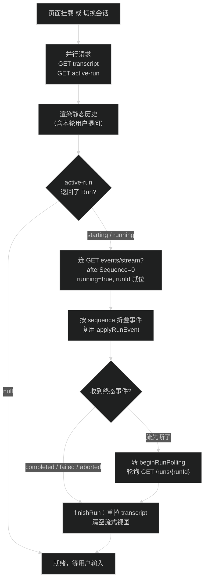
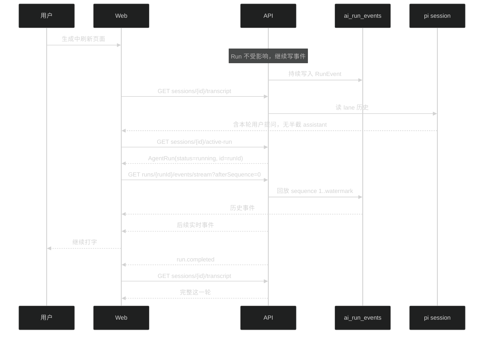

# 技术设计：刷新后恢复进行中的 Run

## 改动清单

| 包 | 文件 | 改动 |
| --- | --- | --- |
| contracts | `packages/contracts/src/ai.ts` | 新增 `activeAgentRunQuerySchema`（只有 `lane`，默认 `main`） |
| api | `apps/api/src/modules/ai/run/run.repository.ts` | 新增 `findActiveInScope(sessionId, lane, access)` |
| api | `apps/api/src/modules/ai/run/run.service.ts` | 新增 `activeRun(access, sessionId, lane)`，返回 `AgentRun \| null` |
| api | `apps/api/src/modules/ai/run/run.openapi.ts` | 新增 `getActiveAgentRunRoute` |
| api | `apps/api/src/modules/ai/run/run.route.ts` | 注册新路由 |
| web | `apps/web/lib/api/ai-chat.api.ts` | 新增 `getActiveAgentRun(sessionId)` |
| web | `apps/web/lib/ai/run-event-stream.ts` | 新增 `resumeRunStream`，与 `startRunStream` 共用帧解析 |
| web | `apps/web/hooks/use-chat-run.ts` | 事件消费改为接收事件源；挂载和切换会话时尝试恢复 |
| api | `apps/api/src/test/run-event-recovery.test.ts` | 新增恢复查询与 transcript 中间态断言 |
| web | `apps/web/test/run-event-stream.test.ts` | 新增恢复流的帧解析用例 |

## 新增接口

```
GET /api/ai/sessions/{sessionId}/active-run?lane=main
```

- 响应 `200`：`{ ok: true, data: AgentRun | null, meta }`。`data` 为 null 表示这个 session 的该 lane 没有 Run 在跑。
- 只返回 `starting` 和 `running` 的 Run。`interrupted` 是进程重启后的落地状态（`run.service.ts:657` 的 `recoverInterrupted`），不返回，前端因此不会去恢复一条已经没人在跑的 Run。
- `data` 用现成的 `toAgentRun(record, live)`（`run.presenter.ts:17`），字段与 `GET /runs/{runId}` 完全一致，前端不需要第二套解析。
- 权限沿用 `requireActiveSession` + `sessionRepository.findInScope`，session 不在 scope 内或已归档返回 404。
- 路径用 `active-run` 而不是 `runs/active`：后者会和 `runs/{runId}` 的 uuid 参数校验抢匹配，多一层不必要的顺序依赖。

repository 查询：`sessionId = ? AND lane = ? AND status IN ('starting','running')`，按 `createdAt` 倒序取一条。同一 session 同一 lane 同时只可能有一条在跑（`ActiveRunRegistry.reserve` 保证，`active-run-registry.ts:60`），倒序取一条只是防御。

## 恢复流程



## 时序



## 前端状态处理

`use-chat-run.ts` 现在的 `consumeRunStream` 把「发起 POST 流」和「折叠事件 + 终态处理」焊在一起（`use-chat-run.ts:236`）。恢复要复用后半段，所以把事件来源抽成参数：

```ts
consumeRunEvents(sessionId: string, events: AsyncIterable<RunEvent>, controller: AbortController, mode: 'start' | 'resume')
```

两种模式只有「一个事件都没收到」时不一样：

- `start`：一个事件都没收到 = 启动失败，抛错让 `send` 走 `handleRequestError`。
- `resume`：`afterSequence=0` 正常至少回放出 `run.started`，收不到事件说明流没建起来，转 `beginRunPolling`，不报启动失败。

恢复入口 `resumeActiveRun(sessionId)`：

- 拿到 `AgentRun` 后设 `running=true`、`runId=run.id`、`runState=createChatRunState()`，`pendingUserText` 保持 null——用户提问已经在 transcript 里（`pi-event-mapper.ts:311` 在 pi 的 prompt 消息 `message_end` 就落盘，`agent-loop.js:52` 在进模型调用前发出这对事件）。
- 复用 `streamRef` 存 controller，切换会话、卸载、点停止时的 abort 逻辑不用改。
- 不加额外提示条：界面进入生成中状态本身就是反馈，多一条 notice 反而会盖掉真正需要看的失败提示。

调用点两处，都在拉完 transcript 之后：boot effect（`use-chat-run.ts:96`）和 `selectSession`（`use-chat-run.ts:321`）。boot 里 transcript 和 active-run 并行请求，少一个往返。两处都受已有的失效令牌保护（`selectTokenRef`、boot 的 `active` 标志），晚到的响应不会写进已经切走的会话。

## 竞态与边界

- 查到 running 但连流时 Run 已终态：`subscribe` 会把持久事件全量回放，终态事件也在里面（`run.service.ts:531`），前端照常走 `finishRun`，用户看到的是「瞬间出完整结果」。
- 查询返回 null 但 Run 其实刚开始：只会发生在用户手动切走又切回的极窄窗口内，下次刷新或切换会补上；不做额外补偿。
- 进程重启：`recoverInterrupted` 已把非终态 Run 落成 `interrupted`，查询返回 null，前端保持静态历史。transcript 里那一轮只有用户提问，没有回复。
- 多标签页：SSE 支持多订阅者，两个页面各自恢复同一条 Run，互不影响，不加互斥。
- 停止按钮：`abort` 只要 sessionId + runId，恢复态同样可用（`use-chat-run.ts:290`）。

## 取舍

- 恢复用 `afterSequence=0` 全量回放，不用 `live` 快照打底再接增量。全量回放走的是和首次发送同一条折叠路径，行为一致；实测长文约 200 条事件，一次回放的成本可以接受。`live` 只有当前进程持有 Run 时才有，且 timeline 上限 128 条会丢最旧的，用它打底反而要处理截断。
- 活跃 Run 用单独接口查，不给 `AgentSession` 加 `activeRun` 字段。列表里的字段在切换会话时已经可能过期，最终还是要实时查一次，加字段等于多维护一处。
- 不新增 `GET /sessions/{id}/runs` 列表接口。当前只需要「哪条在跑」，列表和分页现在没有使用方。

## 回滚

改动都是新增：删掉新路由、新 repository 方法、前端 `resumeActiveRun` 调用点，`consumeRunEvents` 退回只服务 `send`，即可回到当前行为。没有数据库 migration，没有协议破坏性变更。
