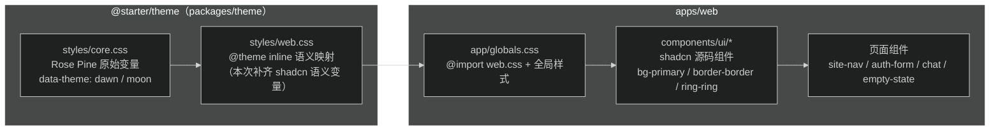

# 设计：给 web 引入 shadcn/ui 并美化模板

## 架构与边界

组件不建共享包（文章的 `packages/ui` 方案不适用：admin 用 Ant Design，无第二个消费者）。shadcn 源码组件落在 `apps/web/components/ui/`，`cn` 工具放 `apps/web/lib/utils.ts`，别名沿用 `@web/*`。

样式数据流：

## token 映射方案

`styles/web.css` 的 `@theme inline` 已有 `--color-background/foreground/primary/border/ring/surface/muted-foreground` 等 shadcn 风格命名。本次补齐缺失语义，全部映射到既有 Rose Pine 变量，不新增色值：

| 新增 `--color-*` | 映射到 | 说明 |
| --- | --- | --- |
| `card` / `card-foreground` | `var(--theme-surface-0)` / `var(--theme-text)` | 卡片底 |
| `popover` / `popover-foreground` | `var(--theme-surface-1)` / `var(--theme-text)` | 浮层底（预留） |
| `secondary` / `secondary-foreground` | `var(--theme-base-muted)` / `var(--theme-text)` | 次级按钮 |
| `accent` / `accent-foreground` | `var(--theme-base-muted)` / `var(--theme-text)` | hover 底色 |
| `destructive` | `var(--theme-danger)` | 危险操作 |
| `input` | `color-mix(in srgb, var(--theme-overlay-0) 58%, transparent)` | 输入框边（同 border） |
| `muted` | `var(--theme-base-muted)` | 静默底 |

亮暗切换由 `data-theme` 属性驱动，组件自动跟随，无需 `dark:` 变体。改 `web.css` 不影响 admin（`admin.css` 只 import `core.css`，自成映射）。

## 依赖（进 catalog，`apps/web` 以 `catalog:` 引用）

- `class-variance-authority` — 组件变体
- `tailwind-merge` — 类名冲突收敛（与已有 `clsx` 组合成 `cn`）
- `@radix-ui/react-slot` — Button `asChild`
- `@radix-ui/react-label` — Label
- `@radix-ui/react-separator` — Separator

不引入 `tw-animate-css`（首批组件无 `animate-in` 需求，Skeleton 用内置 `animate-pulse`）。不引入 Radix Select/Dialog 等重组件。

## 接入方式

手动接入，不跑 `shadcn init`（CLI 会直写 `package.json` 破坏 catalog 约定、且可能覆盖现有 globals.css）：

1. `components.json` 手写（aliases 指向 `@web/*`，css 指向 `app/globals.css`，baseColor neutral，cssVariables true），保证后续 `shadcn add` 可用
2. 组件源码按 shadcn 官方 new-york 风格（data-slot 写法）拷入后，样式类替换为上述语义 token

## 首批组件（apps/web/components/ui/）

| 组件 | 要点 |
| --- | --- |
| `button.tsx` | cva：variant `default/secondary/outline/ghost/destructive/link`，size `default/sm/lg/icon`；`asChild`；无圆角、focus ring、hover 过渡 |
| `card.tsx` | Card/Header/Title/Description/Content/Footer 组合式，无圆角、border-border-subtle、shadow |
| `input.tsx` | 无圆角，focus ring（`ring-ring`） |
| `textarea.tsx` | chat composer 用，同 Input 视觉 |
| `label.tsx` | Radix Label |
| `separator.tsx` | Radix Separator |
| `badge.tsx` | variant `default/secondary/outline`，eyebrow 标签用 |
| `skeleton.tsx` | `animate-pulse`，loading 态用 |

chat 的 agent 选择器保持原生 `<select>`（不重构交互），仅统一样式类。

## 视觉精致化方向（已定：Rose Pine 色板不变，直角锋利风）

- 圆角体系：全站无圆角，控件和卡片统一 `rounded-none`（或直接不写圆角类），与现有 Rose Pine 直角气质一致；存量代码中的 `rounded-sm` 一并移除
- 层次：卡片 `shadow-sm` + hover `shadow-md` 过渡；导航保留毛玻璃
- 交互：按钮 hover 亮度/位移微动效，focus-visible 统一 ring（保留现有可访问性基线）
- 版式不动：页面结构、栅格、文案、路由一律不改

## 页面改造清单（样式统一，逻辑/交互不变）

- 门面：`(site)/page.tsx`（sections 卡片化）、`site-nav.tsx`、`site-footer.tsx`、`session-home.tsx`
- 认证：`auth-form.tsx`（Card + Button，消除 GitHub/Google 两段重复 class）、`(auth)/layout.tsx`
- 通用：`empty-state.tsx`、`not-found.tsx`、`error.tsx`、`loading.tsx`、`theme-toggle.tsx`
- 内页：`writing/page.tsx`、`writing/[slug]/page.tsx`、`projects/page.tsx`、`profiles/page.tsx`、`profiles/[userId]/page.tsx`、`search/page.tsx`
- chat 四件套：`chat-composer.tsx`（Button/Textarea/Label）、`chat-session-bar.tsx`、`chat-timeline.tsx`、`chat-panel.tsx` — 只换 class，事件流、状态、hooks 不动

## 兼容与回滚

- theme 包仅改 `styles/web.css`，admin 不 import 该文件；改完跑 `pnpm --filter @starter/theme check` + admin/web type-check 双验证
- web 的 vitest 三个用例全部是纯逻辑测试（`test/chat-*.test.ts`、`run-event-stream.test.ts`），不渲染组件，不受影响
- 回滚单位：依赖 + `components/ui/` + `web.css` 增量 + 页面 class 替换，git revert 即可整体回收
