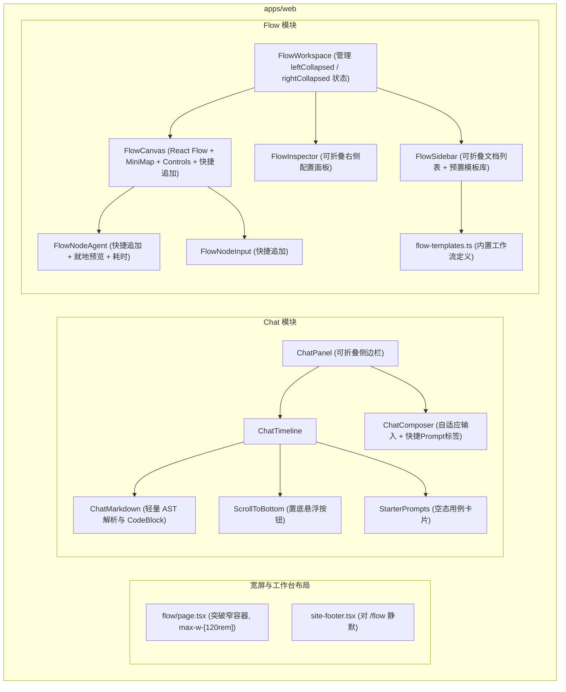
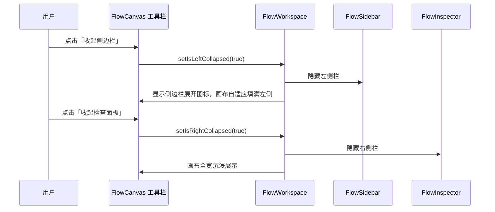

# 技术设计: Web Chat 与 Flow UI 交互优化

## 1. 模块架构与数据流

## 2. 宽屏与折叠架构设计

### 2.1 布局容器改造
- 将 `app/(site)/flow/page.tsx` 和 `app/(site)/chat/page.tsx` 的外层容器由 `site-container`（最大 1216px）调整为 `w-full max-w-[120rem] mx-auto px-4 md:px-6 lg:px-8`。
- 修改 `SiteFooter`，在 `pathname.startsWith('/flow')` 时同样返回 `null`，确保全屏工作台不产生外层多余纵向滚动条。

### 2.2 响应式双向折叠面板
- `FlowWorkspace` 维护 `isLeftCollapsed` 和 `isRightCollapsed` 两个布尔状态；
- 左侧折叠时，侧边栏缩为 0px 并隐藏，工具栏左侧显示「展开文档列表」图标按钮；
- 右侧折叠时，Inspector 缩为 0px，工具栏右侧显示「展开检查面板」图标按钮；
- 两侧均可折叠时，画布可视宽度在 1920px 屏幕下由约 500px 扩大至 1800px+。

## 3. Flow 核心交互设计

### 3.1 快捷追加节点 (`Quick Add Next`)
- 在 `FlowNodeInput` 和 `FlowNodeAgent` 右侧 Handle 旁放置浮动「+」按钮；
- 点击后计算相对偏移位置：`{ x: currentNode.x + 360, y: currentNode.y }`；
- 自动生成新 Agent 节点并创建从当前节点指向新节点的 Edge；
- 更新 `FlowDocument` 并自动聚焦选中新节点。

### 3.2 运行流光动效与耗时记录
- `useFlowRun` 在每个步骤开始时记录时间戳，完成/失败时计算 `durationMs` 并写入步骤状态；
- 当某步骤状态为 `running` 时，将入边设置为 `animated: true`；
- `FlowNodeAgent` 在完成后展示耗时徽章（如 `1.4s`）。

### 3.3 预置模板库 (`flow-templates.ts`)
- 包含三组典型 Agent 编排：
  1. 文章要点提炼与多语言翻译；
  2. 代码缺陷审查与重构测试流水线；
  3. 灵感发散与结构化方案大纲；
- 在 `FlowSidebar` 顶部提供「载入示例」菜单，用户一键将模板深拷贝为本地新文档。

## 4. Chat 核心交互设计

- **`ChatMarkdown`**：轻量安全的 Tokenizer/Parser，纯 React DOM 构建，解析 Markdown 语法，代码块附带语言标签和一键复制反馈；
- **`ChatComposer`**：输入框支持自适应伸缩（min-h-20 至 max-h-56），顶部增加快捷 Prompt 插入 Chip（润色、提炼、代码审查、翻译等）；
- **`ScrollToBottom`**：监听滚动距离，距离底部大于 120px 时淡入悬浮置底按钮；
- **空态示例卡片**：提供 3 组开箱即用的 Prompt 用例，点击一键填入。
