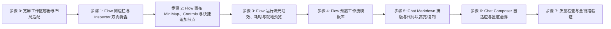

# 实施计划: Web Chat 与 Flow UI 交互优化

## 实施步骤清单

### 步骤 0：宽屏工作区容器与布局适配
- [ ] 修改 `apps/web/app/(site)/flow/page.tsx` 与 `apps/web/app/(site)/chat/page.tsx`：突破 1216px 限制，改为 `w-full max-w-[120rem]`；
- [ ] 修改 `apps/web/app/(site)/_components/site/site-footer.tsx`：对 `/flow` 页面静默。

### 步骤 1：Flow 侧边栏与 Inspector 双向折叠
- [ ] 在 `FlowWorkspace` 引入 `isLeftCollapsed` 与 `isRightCollapsed` 状态管理；
- [ ] 在 `FlowCanvas` 工具栏增加面板折叠/展开切换按钮，让画布自由伸展。

### 步骤 2：Flow 画布 MiniMap、Controls 与快捷追加节点
- [ ] 在 `FlowCanvas` 集成 `@xyflow/react` 的 `MiniMap` 与 `Controls` 组件；
- [ ] 修改 `FlowNodeInput` 与 `FlowNodeAgent`：右侧增加浮动快捷追加「+」按钮，点击自动在右侧生成新节点并完成连线。

### 步骤 3：Flow 运行流光动效、耗时与就地预览
- [ ] 修改 `useFlowRun`：记录每个步骤运行耗时（`durationMs`）；
- [ ] 修改 `FlowCanvas`：当目标节点处于 `running` 时入边呈现 `animated: true`；
- [ ] 修改 `FlowNodeAgent`：展示执行耗时徽章与就地展开产出预览。

### 步骤 4：Flow 预置工作流模板库
- [ ] 创建 `apps/web/lib/flow/flow-templates.ts`：定义 3 套经典工作流；
- [ ] 在 `FlowSidebar` 增加「载入示例模板」功能。

### 步骤 5：Chat Markdown 排版与代码块高亮/复制
- [ ] 创建 `apps/web/app/(site)/_components/chat/chat-markdown.tsx`：实现安全轻量的 Markdown 与 CodeBlock 组件；
- [ ] 修改 `apps/web/app/(site)/_components/chat/chat-timeline.tsx`：接入 `ChatMarkdown`，并支持单条消息一键复制。

### 步骤 6：Chat Composer 自适应与置底悬浮
- [ ] 修改 `ChatComposer`：支持自适应高度、快捷 Prompt 标签与一键清空；
- [ ] 在 `ChatTimeline` 增加向上滚动时的「回到底部」浮动按钮与空态用例卡片。

### 步骤 7：质量检查与综合验证
- [ ] 运行 `pnpm check-types` 验证类型安全；
- [ ] 运行 `pnpm lint` 验证代码规范；
- [ ] 运行 `pnpm format:check` 验证代码格式；
- [ ] 在不同视口宽度（1280px、1440px、1920px）下验证全套交互。
