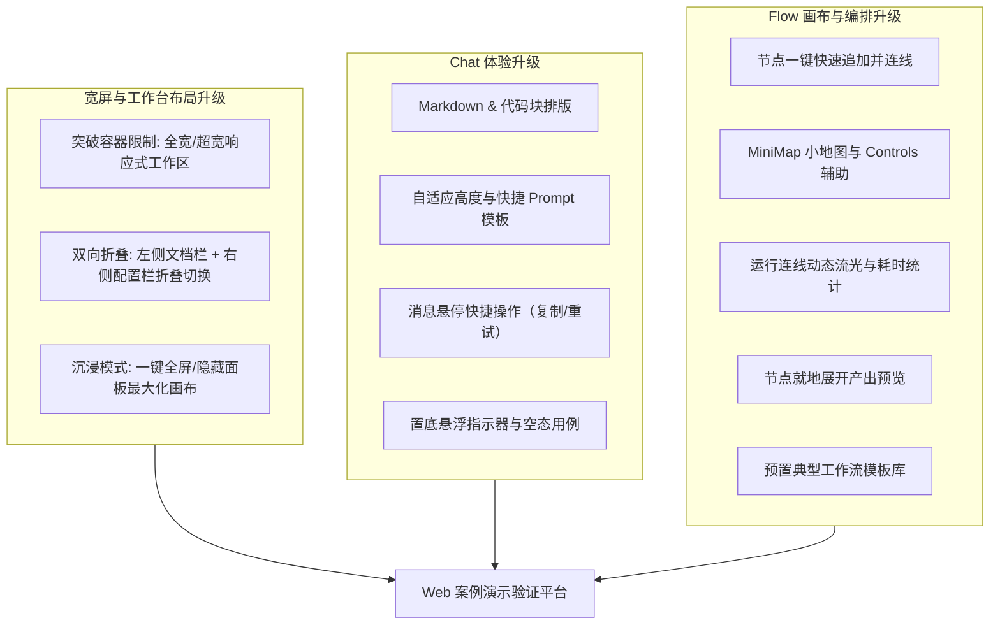

# PRD: Web Chat 与 Flow UI 交互优化

## 1. 目标与背景

公开站点 `apps/web` 作为前后端能力的案例示例与交互演示平台，当前已具备基础的 Chat 和 Flow 功能。

现有主要痛点：
1. **Flow 画布操作区过窄**：受限于全局 `.site-container` 的固定最大宽度（1216px），在左侧文档栏（288px）和右侧检查器（320px）固定展开时，中间画布仅剩约 500px，在桌面宽屏下极为局促；
2. **面板不可折叠**：无法根据用户需要收起左侧列表或右侧配置以释放画布空间；
3. **交互与排版粗糙**：缺乏 Markdown/代码块高亮与复制、节点快捷追加连线、运行流光动效与预置工作流模板。

## 2. 需求范围

### 2.1 宽屏适配与工作区布局
1. **宽屏全宽工作区**：
   - Flow 和 Chat 页面脱离 1216px 窄容器限制，采用 `w-full max-w-[120rem]` 及响应式内边距，充分利用 1440px / 1920px / 2K 屏幕空间；
   - `SiteFooter` 对 `/flow` 与 `/chat` 均保持静默，消除外部多余滚动条。
2. **两侧面板双向折叠（Collapsible Panels）**：
   - **左侧边栏**：提供一键收起/展开切换，收起后以紧凑图标或浮动按钮保留呼出能力，瞬间为中间区域释放约 288px；
   - **右侧 Inspector**：提供一键收起/展开切换，配置完成后可收起，为画布释放约 320px；
   - 当双侧折叠时，画布可占据 95% 以上屏幕宽度。

### 2.2 Chat 对话交互
1. **Markdown 与代码排版渲染**：
   - 支持解析并格式化渲染标题、粗体、行内代码、无序/有序列表、引用块；
   - 代码块带语言标签与「一键复制」按钮，复制后给出反馈提示；
   - 保持 SSE 流式吐字平滑。
2. **Composer 与快捷操作**：
   - 输入框根据内容自适应高度（min-h-20 至 max-h-56）；
   - 顶部提供快捷 Prompt 标签（润色、提炼重点、代码审查、翻译等）；
   - 消息悬停支持一键复制全文；向上滚动时提供置底悬浮按钮；
   - 空状态增加 3 组常用任务示例卡片。

### 2.3 Flow 画布与编排交互
1. **快捷连线与节点追加（Quick Add Next）**：
   - 节点右侧提供快捷「+」按钮，一键在右侧生成新 Agent 节点并自动建立连线与分配链序号。
2. **画布控制与辅助工具**：
   - 集成 MiniMap 小地图与 Controls 缩放控制；
   - 工具栏支持一键自适应居中（Fit View）。
3. **运行态反馈与动态流光**：
   - 运行中的步骤其入边具备动态脉冲动画（Animated Edge）；
   - 步骤完成后展示耗时（如 `0.8s`）。
4. **节点就地预览与折叠**：
   - Agent 节点支持就地展开/折叠产出预览。
5. **预置示例模板库**：
   - 内置三套可一键载入的典型工作流（文章提炼翻译、代码审查重构、头脑风暴大纲）。

## 3. 验收标准

1. [ ] Flow 页面在 1440px+ 宽屏下能自适应拉宽，画布不再局限在 500px 狭窄区域；
2. [ ] Flow 左侧边栏和右侧配置面板均支持一键折叠与展开；
3. [ ] Chat 支持 Markdown 排版、代码高亮与复制、Composer 快捷 Prompt、悬浮置底；
4. [ ] Flow 支持快捷追加节点自动连线、MiniMap、运行流光动效与耗时显示；
5. [ ] Flow 支持一键载入内置示例模板；
6. [ ] `pnpm check-types`、`pnpm lint`、`pnpm format:check` 全部通过。
