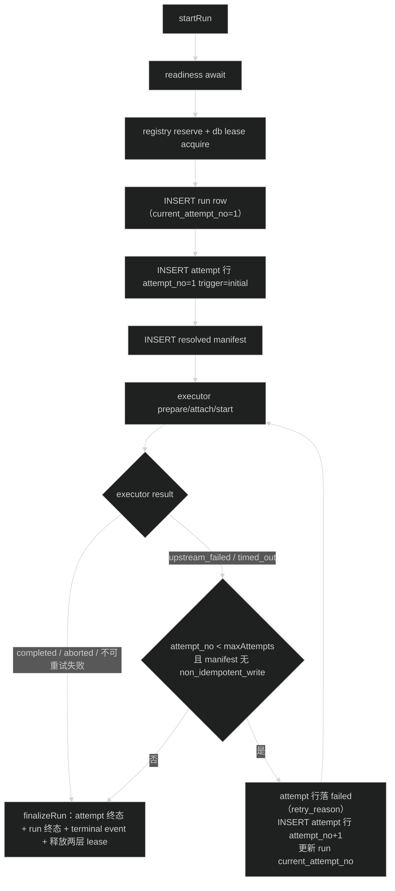
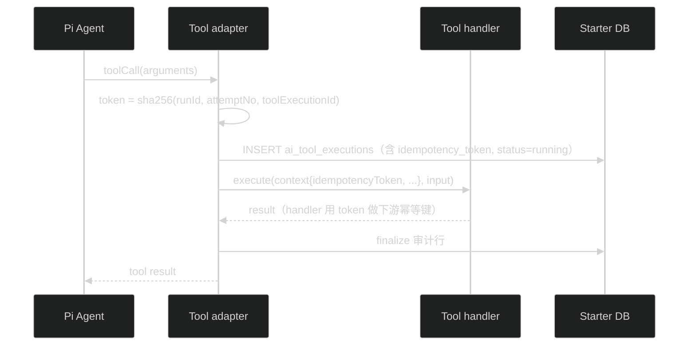

# 阶段C技术设计：logical Run、Attempt、Step 与副作用策略

## 1. 决策总览

| 问题                | 决策                                                                                                                                                                      |
| ------------------- | ------------------------------------------------------------------------------------------------------------------------------------------------------------------------- |
| logical Run 载体    | 复用`ai_agent_runs`，不新增表不迁移引用（幂等键、SSE、timeline、webhook、前端全部已按 runId 消费）                                                                      |
| Attempt 存储        | 新表`ai_run_attempts`，一行一次执行尝试；Run 行加 `current_attempt_no` 快速读当前值                                                                                   |
| auto retry 执行模型 | 原始请求内同步链式：不 finalize、不释放 lease、不发布 terminal event，直接创建下一 Attempt 重建 executor。无后台调度器、无新 Run 状态                                     |
| 重试判定            | 错误类别（`upstream_failed` / `timed_out`）+ `retryPolicy.maxAttempts` + manifest 副作用门禁，三者同时满足才重试                                                    |
| 副作用门禁          | resolved manifest 含任何`non_idempotent_write` Tool 时 auto retry 整体禁用（无法证明重跑不重复外部写）                                                                  |
| idempotencyToken    | `sha256Hex(canonicalJson({ runId, attemptNo, toolExecutionId }))`，持久到 `ai_tool_executions`，经 `AiToolExecutionContext` 传给 handler，由 handler/下游做幂等去重 |
| sideEffect 声明     | `AiToolDefinitionInput` 必填（类型强制，无默认值），进 `AiToolSummary` 与 manifest tools，进 manifestHash 输入                                                        |
| 非幂等写不确定结果  | 不引入人工判断状态：禁 auto retry + 超时 modelText 声明外部状态未知                                                                                                       |
| Step 范围           | 每 Attempt 一条顶层`kind='agent'` Step + 现有 turn 内 Step 关联 `attempt_no`；`parentStepId` / `branchId` / `inputRef` / `outputRef` 留阶段 E                 |
| durable resume      | 不做。中断 Run 仍标`interrupted`，恢复扫描不触发 auto retry                                                                                                             |

## 2. 表结构

```sql
-- 一次 Run 的一次执行尝试。Attempt 1 在 startRun 创建；auto retry 在原请求内追加。
CREATE TABLE ai_run_attempts (
  id TEXT PRIMARY KEY,
  run_id TEXT NOT NULL REFERENCES ai_agent_runs(id) ON DELETE CASCADE,
  attempt_no INTEGER NOT NULL,             -- 从 1 递增
  status TEXT NOT NULL,                    -- running | succeeded | failed | aborted | interrupted
  trigger TEXT NOT NULL,                   -- initial | auto_retry
  retry_reason TEXT,                       -- auto_retry 时记录触发错误码，initial 为 NULL
  owner_id TEXT NOT NULL,                  -- APP_INSTANCE_ID
  fencing_token INTEGER NOT NULL,          -- acquire lease 时拿到的 token
  error_code TEXT,
  started_at TEXT NOT NULL,
  finished_at TEXT,
  UNIQUE (run_id, attempt_no)
);
```

主表与关联表变更：

- `ai_agent_runs` + `current_attempt_no INTEGER NOT NULL DEFAULT 1`。
- `ai_run_steps` + `attempt_no INTEGER NOT NULL DEFAULT 1`（存量回填 1）；`turn_id` 放开为 nullable（顶层 `agent` Step 不属于任何 turn）。
- `ai_run_turns` + `attempt_no INTEGER NOT NULL DEFAULT 1`。
- `ai_tool_executions` + `idempotency_token TEXT`（存量 NULL）。

## 3. RunEvent 与契约变更

`packages/contracts/src/ai.ts`：

- `aiToolSideEffectSchema = z.enum(['read_only', 'idempotent_write', 'non_idempotent_write'])`。
- `agentRetryPolicySchema = z.strictObject({ maxAttempts: z.number().int().min(1).max(4) })`；`agentDefinitionConfigSchema` 加可选 `retryPolicy`（不加字段不破坏存量 config JSON，`schemaVersion` 保持 2；缺省语义为 `{ maxAttempts: 1 }` 不重试）。内联 config 与预设 Agent 共用同一 schema。
- `AiToolSummary` + `sideEffect`；`aiRunResolvedManifestSchema` 的 tools 元素 + `sideEffect`（manifestHash 输入随之包含该字段，新 Run hash 变化、旧 Run 不受影响）。
- RunEvent 顶层加可选 `attemptNo`（缺省视为 1）。发布器从当前 Attempt 上下文取值；旧客户端 parser 忽略未知字段，不受影响。不新增事件类型（attempt 边界通过事件 `attemptNo` 变化可观测）。
- `runTraceSchema` + `attempts` 数组（attemptNo、trigger、status、errorCode、startedAt、finishedAt）。

## 4. 启动与自动重试流程



要点：

- Attempt 2 起点的 executor 重建复用现有 prepare/attach 路径（新 `agent` Step、新事件流在既有 RunEventPublisher 上继续）。SSE 订阅者不断流，只是事件 `attemptNo` 变化。
- lease 不释放不重取：续租定时器在重试期间持续工作；若期间被接管，既有终态事务 fencing 校验把旧 owner 提交强制落 `interrupted`——这就是「旧 owner 不能提交新 Attempt 结果」的实现，复用阶段 A 机制。
- manifest 写入失败、Attempt 1 创建失败仍走现有 starting 失败收尾。
- 重试判定错误集合是代码常量（`upstream_failed`、`timed_out`），不开放配置；`auth_failed`、参数错误、用户 abort、存储失败均不重试。

## 5. 副作用声明与幂等 token



- token 在 adapter 创建审计行时生成并写入，handler 经 `AiToolExecutionContext.idempotencyToken` 拿到；平台不维护 token→结果映射，去重由 handler 或下游系统按 token 实现（如作为下游 API 的 Idempotency-Key）。
- 相同 `(runId, attemptNo, toolExecutionId)` 重算 token 相同（canonicalJson + SHA-256，纯函数）；同一 Attempt 内 toolExecutionId 唯一，token 全局不碰撞。
- 超时 modelText 按 sideEffect 分类：`non_idempotent_write` 声明「操作可能已在外部执行，结果未知」，其余维持现有带 timeout 毫秒数的措辞。

## 6. Step 关联

- executor 每次启动（含 Attempt 2+）创建 `kind='agent'` 顶层 Step：`turnId=NULL`、`attempt_no=N`、outcome 与 Attempt 终态一致（succeeded / failed / aborted / interrupted）。
- 现有 turn 内 Step（assistant / compaction / branch_summary）与 turn 均带 `attempt_no`；`RunExecutionContext.beginStep / beginTurn` 的 attempt 参数改传当前 `attempt_no`。
- 恢复扫描收尾 running Step 时沿用 `listRunning`，`interrupted` outcome 对 Step / Attempt 同步落库。

## 7. 影响面

| 位置                                                            | 改动                                                                           |
| --------------------------------------------------------------- | ------------------------------------------------------------------------------ |
| `apps/api/src/modules/ai/ai.schema.ts`                        | `ai_run_attempts` 新表 + 四处新列                                            |
| `packages/contracts/src/ai.ts`                                | sideEffect、retryPolicy、attemptNo、trace attempts                             |
| `apps/api/src/modules/ai/run/run-attempt.repository.ts`（新） | attempt 行 CRUD 与终态条件更新                                                 |
| `apps/api/src/modules/ai/run/run.service.ts`                  | attempt 循环、auto retry 判定、fencing 联动、trace attempts                    |
| `apps/api/src/modules/ai/tool/tool-registry.ts`               | sideEffect 必填、manifestHash 输入                                             |
| `apps/api/src/infra/agent/pi-tool-adapter.ts`                 | token 生成与持久、超时措辞、context 传递                                       |
| `apps/api/src/infra/agent/run-execution-context.ts`           | beginStep/beginTurn 的 attempt_no、agent Step                                  |
| `apps/api/src/modules/ai/run/run-trace.repository.ts`         | attempts 列表                                                                  |
| 内置 tool 与测试                                                | `read_skill` 补 `sideEffect: 'read_only'`；全部测试 tool 定义补 sideEffect |

## 8. 风险与已知边界

- **Attempt 边界的 transcript 痕迹**：Attempt 2 会向同一 lane 再写一条用户输入 entry，模型上下文含 Attempt 1 的失败痕迹。同步链式重试的固有行为，不做 transcript 清理；接受重复输入，模型按执行历史理解。
- **manifestHash 漂移**：tools 元素加 sideEffect 后，同一 Agent 定义的新 Run hash 与旧 Run 不同。属定义变化的正确行为（hash 反映当前事实），历史 Run 的 manifest 不重算。
- **auto retry 放大调用**：maxAttempts 上限 4（契约层限制），重试期间 lease 续租保持，不会叠加 lane 排他。
- **回滚**：先停 auto retry（retryPolicy 判定短路）再回滚 attempt 调度；已产生的 Attempt / Step / token 是只增事实，回滚后无需清理。
