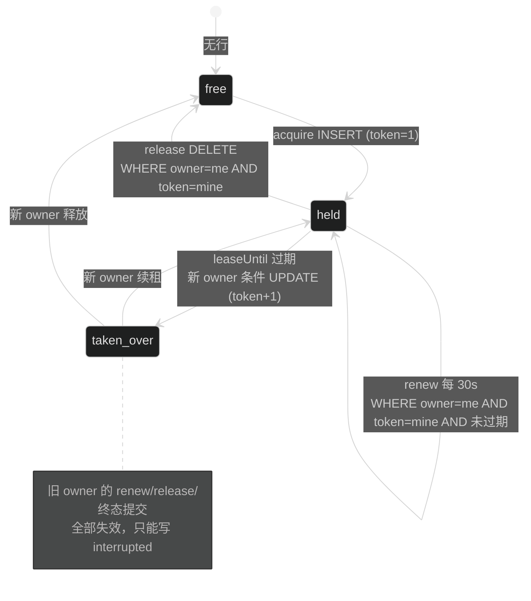
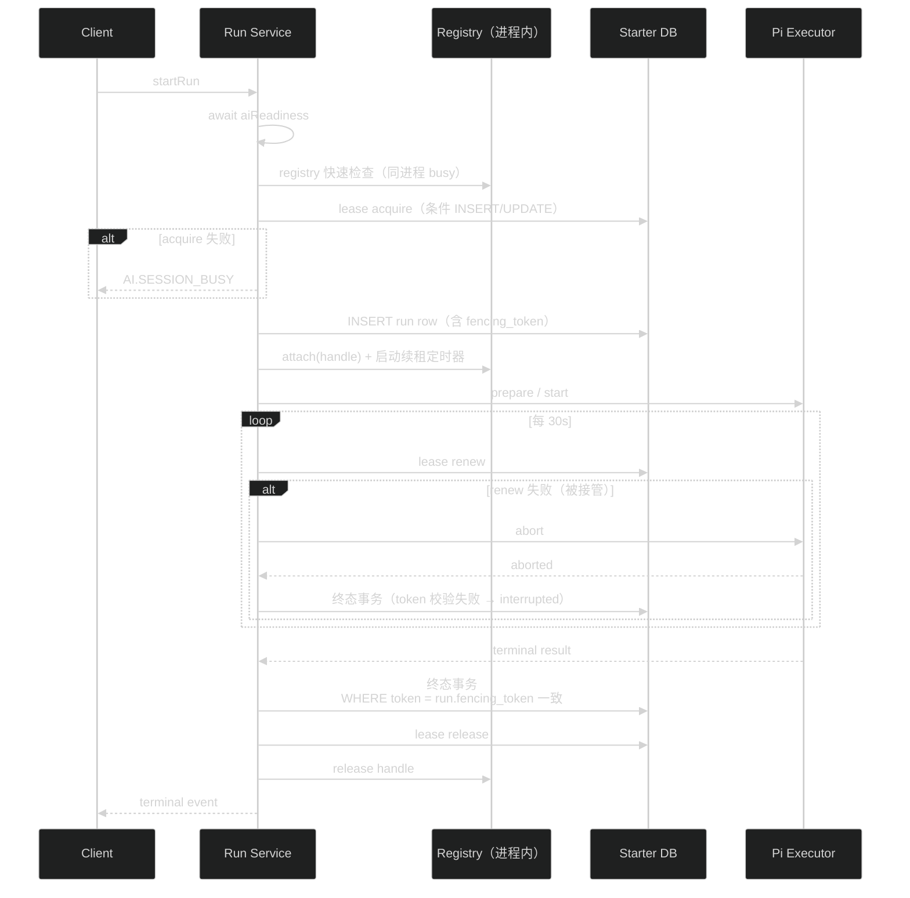

# 阶段A技术设计：持久执行所有权与启动门禁

## 1. 决策：部署模型

| 选项 | 评估 |
| --- | --- |
| 单实例部署 + 多实例规格的持久 lease（选定） | 数据模型一次到位（ownerId、fencing token、条件更新），部署不变；双实例互斥可以在集成测试里用两个 runtime 验证，不需要真实多实例环境 |
| session affinity | 需要负载均衡层配置，超出本仓库；且 affinity 只减少冲突概率，不提供 fencing |
| 独立 worker owner | 架构改动大，属于后续阶段；当前 Run 在 API 进程内同步执行的设计不变 |

`ownerId` 使用 `parseEnv` 的 `APP_INSTANCE_ID`（已有，默认 `local`）。多实例部署时各实例配置不同值；测试中给两个 runtime 传不同 env。

## 2. lease 表

```sql
CREATE TABLE ai_agent_lane_leases (
  session_id TEXT NOT NULL,
  lane TEXT NOT NULL,
  owner_id TEXT NOT NULL,
  fencing_token INTEGER NOT NULL,
  lease_until INTEGER NOT NULL,   -- epoch 毫秒
  heartbeat_at INTEGER NOT NULL,
  acquired_at INTEGER NOT NULL,
  PRIMARY KEY (session_id, lane)
);
```

- 一行代表一个 lane 的当前执行所有权。
- `fencing_token` 按 lane 单调递增，每次接管 +1。它回答"你是最后一次成功领取这个 lane 的 owner 吗"。
- 不建外键到 `ai_agent_sessions`：lease 生命周期与 session row 解耦，恢复清理用扫描而非级联。

## 3. 生命周期与并发语义



三个操作都是单条条件 SQL，better-sqlite3 同步执行，无嵌套事务：

**acquire（同一事务内先 INSERT 后条件 UPDATE）**

```sql
-- 1) lane 无行：直接插入
INSERT INTO ai_agent_lane_leases (...) VALUES (:session, :lane, :owner, 1, now+TTL, now, now);
-- 2) 冲突时尝试接管过期行
UPDATE ai_agent_lane_leases
   SET owner_id=:owner, fencing_token=fencing_token+1,
       lease_until=now+TTL, heartbeat_at=now, acquired_at=now
 WHERE session_id=:session AND lane=:lane AND lease_until < now;
```

两条都不命中 → `AI.SESSION_BUSY`。同 owner 未过期重复 acquire 也按 busy 拒绝：进程内已有 registry 快速路径，走到数据库层还撞上说明是异常重入。

**renew**

```sql
UPDATE ai_agent_lane_leases
   SET lease_until=now+TTL, heartbeat_at=now
 WHERE session_id=:session AND lane=:lane
   AND owner_id=:me AND fencing_token=:myToken AND lease_until > now;
```

受影响行数为 0 即失去所有权。

**release**

```sql
DELETE FROM ai_agent_lane_leases
 WHERE session_id=:session AND lane=:lane
   AND owner_id=:me AND fencing_token=:myToken;
```

晚到的 release（已被接管）删除 0 行，无副作用。

TTL 90s、续租 30s 为代码常量（`apps/api/src/modules/ai/run/lane-lease.ts`），schema 注释写明。Run deadline 默认 120s，续租间隔内至少两次机会，模型调用单次上限（AI_REQUEST_TIMEOUT_MS 默认 60s）小于 TTL。

## 4. Run 执行流改造



关键点：

1. **顺序不变**：仍是 lease → Run row → executor，与现有 `reserve → insert → start` 同构，只是 reserve 的权威从内存 Map 换成数据库行。
2. **终态 fencing 校验**：`ai_agent_runs` 增加 `execution_fencing_token` 列（acquire 时写入）。终态事务（现有 run.repository 与 Run row 同事务提交处）加一步：读取 lease 行，`owner_id + fencing_token` 与 Run row 不一致时，终态强制写 `AI.RUN_INTERRUPTED`，丢弃实际执行结果。正常路径 lease 一定匹配，只在被接管后触发。
3. **续租失败的中止**：renew 返回 0 行时调用现有 executor abort 路径，走 `AI.RUN_INTERRUPTED` 收尾。不发明新错误码。
4. **异常退出**：进程崩溃时 lease 停止续租，TTL 后自然过期；下次 readiness 扫描处理。

## 5. readiness 门禁

- `createAiServices` 中把 `void runService.recoverInterrupted()` 改为保存 Promise，`AiServices` 新增 `readiness: Promise<void>`。
- `recoverInterrupted` 扩展：现有"扫描非终态 Run → 投影或标 interrupted"之后，同事务删除这些 Run 对应 lane 的过期 lease。诊断型 orphan 检查（session 一致性）保持异步。
- Run 接收入口（`startRun`）第一行 `await readiness`。Promise 已 resolve 后 await 是微任务级开销，不引入每请求查询。
- 不改 `/health`：它是进程存活探针；AI readiness 是业务门禁，语义不同。
- 现有 `GET /active-run` 的行为自然正确：readiness 完成后 registry 为空，返回 `AI.RUN_NOT_ACTIVE`，与现状一致；区别只是不再有"刚启动时旧 running Run 尚未恢复"的窗口。

## 6. ActiveRunRegistry 降级

- `reserve`/`ActiveRunLease` 保留：同进程内先查内存再查数据库，减少无谓的 db 写。内存命中即返回 busy（语义与 db 一致：同进程 attach 过的 lane 一定持有未过期 lease）。
- 排他权威变为 db lease：内存 miss 时走 acquire，acquire 失败同样 `AI.SESSION_BUSY`。
- `attach`/`get`/`getBySessionLane`/`abort`/`steer`/`followUp`/`release` 不变——它们本来就是 controls 路由，不是排他依据。
- `run.service.ts` 中 `reserve` 调用点改为：内存检查 → db acquire → insert run row → attach。释放路径在终态事务成功后先 db release 再 registry release。

## 7. 测试设计

新增集成测试文件 `apps/api/src/test/ai-lane-lease.test.ts`，测试基建基于现有 harness（`ai-run-harness.ts` + 临时 SQLite）扩展一个"双 runtime 共享库"模式：

- 两个 `createTestApp` 传相同 `DATABASE_PATH`、`AGENT_SESSION_DATABASE_PATH`，不同 `APP_INSTANCE_ID`。
- 需要一个测试专用注入点绕过 readiness 等待的定时器（或 readiness 直接 resolve），避免测试慢。

用例：

1. 同 lane 双 runtime：A 成功启动，B 得 `AI.SESSION_BUSY`；A 终态后 B 可启动。
2. 不同 lane 不互斥。
3. 手工把 `lease_until` 改到过去：新 runtime acquire 成功且 `fencing_token` +1。
4. 旧 owner（持有旧 token）renew/release：0 行受影响。
5. 被接管后旧 owner 终态提交：Run = `interrupted`，非 succeeded。
6. 续租定时器失效（把 TTL 缩短到小于执行时长）：executor 中止，Run = `interrupted`。
7. readiness 门禁：恢复扫描未完成时 startRun 等待（可通过注入慢 readiness 验证 await 生效）。

现有 `active-run-registry.test.ts` 保留（registry 的 controls 语义仍被测试）；`ai-agent-runs.test.ts` 的单进程 lane busy 用例应原样通过。

## 8. 影响面

| 位置 | 改动 |
| --- | --- |
| `apps/api/src/modules/ai/ai.schema.ts` | 新表 + `ai_agent_runs.execution_fencing_token` |
| `apps/api/src/modules/ai/run/lane-lease.ts`（新） | acquire/renew/release 与常量 |
| `apps/api/src/modules/ai/run/run.service.ts` | startRun 接入 lease、readiness await、续租定时器、终态 fencing |
| `apps/api/src/modules/ai/run/run.repository.ts` | 终态事务加 token 校验 |
| `apps/api/src/modules/ai/ai.services.ts` | readiness Promise 暴露 |
| `apps/api/src/test/ai-lane-lease.test.ts`（新） | 双 runtime 用例 |
| `apps/api/src/test/ai-run-harness.ts` | 双 runtime 共享库支持 |

错误契约（`packages/contracts`）不需要改：`AI.SESSION_BUSY`、`AI.RUN_INTERRUPTED` 已存在。

## 9. 风险与回滚

- **同步 SQLite 事务变多**：acquire/renew/release 是三条单行条件 SQL，微秒级，WAL 下无长锁风险。
- **续租定时器泄漏**：终态、abort、异常路径都要 clear 定时器；统一放在现有 finally 清理段。
- **测试双 runtime 复杂度**：Pi session db 单写者会在测试中真实生效；用例 1 中 B 被 Starter lease 挡住，不会走到 Pi open，测试不需模拟 Pi 层错误。
- **回滚**：删除 lease 表 migration 与 `lane-lease.ts`，`run.service.ts` 还原为纯 registry reserve。不保留"内存和数据库都能决定执行权"的双路径——回滚必须整体退回单实例语义。
