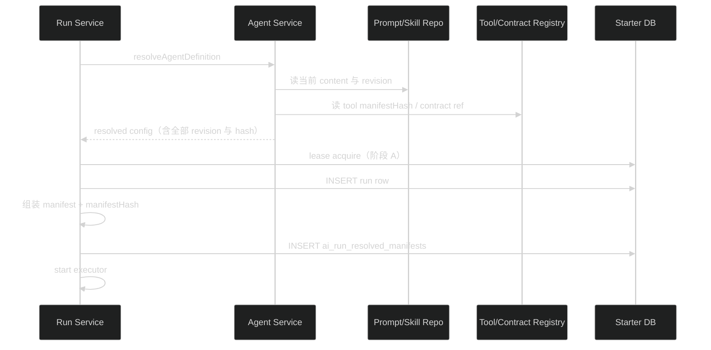

# 阶段B技术设计：不可变资源版本与 resolved manifest

## 1. 决策总览

| 问题 | 决策 |
| --- | --- |
| revision 存储模型 | 新增 append-only revision 表存全部版本（含当前）；主表 content 保留为当前值镜像，同事务更新 |
| Agent 与资源 revision 的联动 | 资源更新时传播：引用该资源的 Agent revision +1 并刷新其资源 revision 记录 |
| manifest 存储 | 新表 `ai_run_resolved_manifests`，Run 创建后 executor 启动前写入 |
| hash 算法 | SHA-256，输入为 canonical JSON（对象键排序后 `JSON.stringify`） |
| 内联 systemPrompt | manifest 只存 SHA-256 hash，不落全文（避免无限存储用户文本；hash 足够审计比对） |
| Tool manifest hash | 注册时对 `{ name, version, description, timeoutMs, inputSchema(JSON Schema) }` 计算 |
| Output Contract 快照 | 新表 `ai_output_contract_snapshots`，define 时 upsert 全量元数据 + schema JSON |
| PromptTemplate | 不做 revision（不进 Agent 执行链，超范围） |

## 2. 表结构

```sql
-- System Prompt 版本链；每行不可变。主表 content 始终等于 current_revision 指向的内容。
CREATE TABLE ai_system_prompt_revisions (
  id TEXT PRIMARY KEY,
  prompt_id TEXT NOT NULL REFERENCES ai_system_prompts(id) ON DELETE CASCADE,
  revision INTEGER NOT NULL,
  content TEXT NOT NULL,
  created_at TEXT NOT NULL,
  UNIQUE (prompt_id, revision)
);

CREATE TABLE ai_skill_revisions (
  id TEXT PRIMARY KEY,
  skill_id TEXT NOT NULL REFERENCES ai_skills(id) ON DELETE CASCADE,
  revision INTEGER NOT NULL,
  content TEXT NOT NULL,
  created_at TEXT NOT NULL,
  UNIQUE (skill_id, revision)
);

-- Run 启动时固化的解析事实；进入 executor 前写入。
CREATE TABLE ai_run_resolved_manifests (
  run_id TEXT PRIMARY KEY REFERENCES ai_agent_runs(id) ON DELETE CASCADE,
  manifest_hash TEXT NOT NULL,
  manifest TEXT NOT NULL,        -- 下节结构的 JSON
  created_at TEXT NOT NULL
);

-- Output Contract 的版本快照；define 时 upsert，历史读取与阶段 D presenter 共用。
CREATE TABLE ai_output_contract_snapshots (
  name TEXT NOT NULL,
  version TEXT NOT NULL,
  description TEXT NOT NULL,
  schema_json TEXT NOT NULL,
  render_kind TEXT NOT NULL,
  visibility TEXT NOT NULL,
  mode TEXT NOT NULL,
  first_seen_at TEXT NOT NULL,
  PRIMARY KEY (name, version)
);
```

主表变更：

- `ai_system_prompts`、`ai_skills` 增加 `current_revision INTEGER NOT NULL DEFAULT 1`。
- `ai_agent_definitions`（结构以实际 schema 为准）增加资源 revision 记录列：`system_prompt_revision INTEGER`、`skill_revisions_json TEXT`（`{"<skillId>": <revision>}`）。
- `ai_structured_outputs` 增加 `visibility TEXT`、`mode TEXT`（nullable，存量行回填 NULL；读取时 NULL 回退当前 registry 定义，新 emit 写实际值）。

## 3. ResolvedRunManifest 结构

与调研任务 design.md 第 4 节一致，Zod schema 定义在 `packages/contracts`（`aiRunResolvedManifestSchema`），供 API 持久化与后续 presenter 复用：

```ts
{
  agentRevision: number | null          // 内联配置为 null
  agentId: string | null
  modelRef: string                      // providerId/modelId 规范化
  systemPrompt: {
    promptId: string | null
    revision: number | null
    contentHash: string                 // SHA-256(content)；内联时为 SHA-256(内联文本)
    inline: boolean                     // true = 内联，false = 预设引用，无 prompt = null 整体
  } | null
  skills: Array<{ skillId: string; revision: number; contentHash: string }>
  tools: Array<{ name: string; version: string; manifestHash: string }>
  outputContract: { name: string; version: string; schemaHash: string } | null
  manifestHash: string                  // 上述全部字段的 canonical JSON SHA-256
}
```

`manifestHash` 计算排除自身字段。对象键按字典序 canonical 化（复用一个 `canonicalJson` 工具函数，供 content/schema/manifest 三处使用）。

## 4. 写入路径



要点：

- manifest 写入失败 = Run 启动失败（进入现有错误收尾，释放 lease）。不存在"有 Run 无 manifest"的中间态。
- 内联配置 Run：`agentRevision`/`agentId`/`systemPrompt.promptId`/`revision` 为 null，`contentHash` 为内联文本 hash，`inline: true`。
- manifest 写入与 run row 创建不必同事务（run row 先落，manifest 紧随；失败时 Run 按 starting 失败收尾，manifest 行随 CASCADE 清理）。

## 5. 资源更新与 Agent revision 传播

不变量：**Agent revision 变化当且仅当其执行输入可能变化**（模型、Prompt 内容、Skill 内容、Tool 列表、Output Contract 引用、参数）。

实现（`prompt.service` / `skill.service` 的 update 路径，单事务）：

1. INSERT 新 revision 行（revision = current + 1）。
2. UPDATE 主表 content 与 current_revision。
3. 查引用该资源的 Agent（`ai_agent_definitions` 按 config 中 systemPromptId / skillIds 匹配；表数量小，全表扫描 JSON 提取即可）。
4. 对每个命中 Agent：revision + 1，刷新 `system_prompt_revision` / `skill_revisions_json`。

新增资源或 Agent 引用新资源时，Agent 自身 create/update 已有 revision 逻辑（现状 `configChanged → revision + 1`），同时把当前资源 revision 写入记录列。

验证重点（调研 implement.md 阶段 B）："相同 Agent revision 在不同时间解析出相同 manifest hash"由该传播保证：资源内容变 → 资源 revision 变 → Agent revision 变；Agent revision 不变 → 资源 revision 不变 → 内容 hash 不变。

## 6. Tool manifest hash 与 Output Contract 快照

- `tool-registry.ts`：`registerTool` 时计算 `manifestHash = sha256(canonicalJson({ name, version, description, timeoutMs, inputSchema: z.toJSONSchema(...) }))`，挂到 `RegisteredAiTool`。registry 启动装配后可整体列出。
- `output-contract-registry.ts`：`define` 时除现有 hash 外，把全量元数据 + schema JSON upsert 进 `ai_output_contract_snapshots`。registry 是进程内对象，upsert 需要 db——通过构造注入可选 `snapshotStore`；测试不注入则跳过。
- `toStructuredOutputContractRef` 改为优先读表内 `visibility`/`mode`（新数据），NULL 时回退 registry（存量兼容）。contract 从代码中移除后，历史输出仍可按快照渲染。

## 7. 只读 presenter（内部）

`agent.service` 增加 `describeResolvedManifest(runId)`：读 manifest 表，返回 `packages/contracts` 的 manifest DTO。内容天然无 secret、无 Prompt 正文、无 handler（manifest 只含 hash 与版本引用）。HTTP 暴露留给阶段 D。

## 8. migration 回填

- 每个存量 `ai_system_prompts` / `ai_skills` 行：INSERT revision 1 行（content 取当前值），主表 `current_revision = 1`。
- 每个存量 Agent 行：`system_prompt_revision` / `skill_revisions_json` 按当前引用资源的 revision 1 回填，避免存量 Agent 全部 bump。
- `ai_structured_outputs` 新列不回填（保持 NULL 走回退）。

## 9. 影响面

| 位置 | 改动 |
| --- | --- |
| `apps/api/src/modules/ai/ai.schema.ts` | 四张新表 + 三处主表列 |
| `packages/contracts/src/ai.ts` | `aiRunResolvedManifestSchema` 与 DTO |
| `apps/api/src/modules/ai/run/resolved-manifest.ts`（新） | 组装、canonicalJson、manifestHash |
| `apps/api/src/modules/ai/run/run.service.ts` | resolve 后组装 manifest 并持久化 |
| `apps/api/src/modules/ai/agent/agent.service.ts` | resolve 返回 revision 与 hash；资源 revision 记录列维护 |
| `apps/api/src/modules/ai/prompt/*`、`skill/*` | update 走 revision 链 + Agent 传播 |
| `apps/api/src/modules/ai/tool/tool-registry.ts` | manifestHash |
| `apps/api/src/modules/ai/output/*` | 快照 upsert + 读取回退改造 |
| 测试 | 新增 manifest 固化与资源变更传播用例；回归全量 |

## 10. 风险与回滚

- **传播扫描成本**：资源更新是低频管理操作，Agent 表全扫 JSON 提取可接受；不做反向索引表。
- **canonical JSON 稳定性**：Zod `toJSONSchema` 输出依赖 zod 版本；版本升级可能导致 hash 漂移。对策：Tool/Contract hash 的输入结构在快照与测试中固定断言，升级 zod 时跑 manifest 稳定性测试。
- **双列镜像**：主表 content 与 revision 行同事务更新，revision 表为事实源；读取当前值走主表不变。
- **回滚**：删除新表与列、还原 service 改动。已产生的 revision 与 manifest 数据是只增事实，回滚后无需清理（新代码不读旧列即可）。
