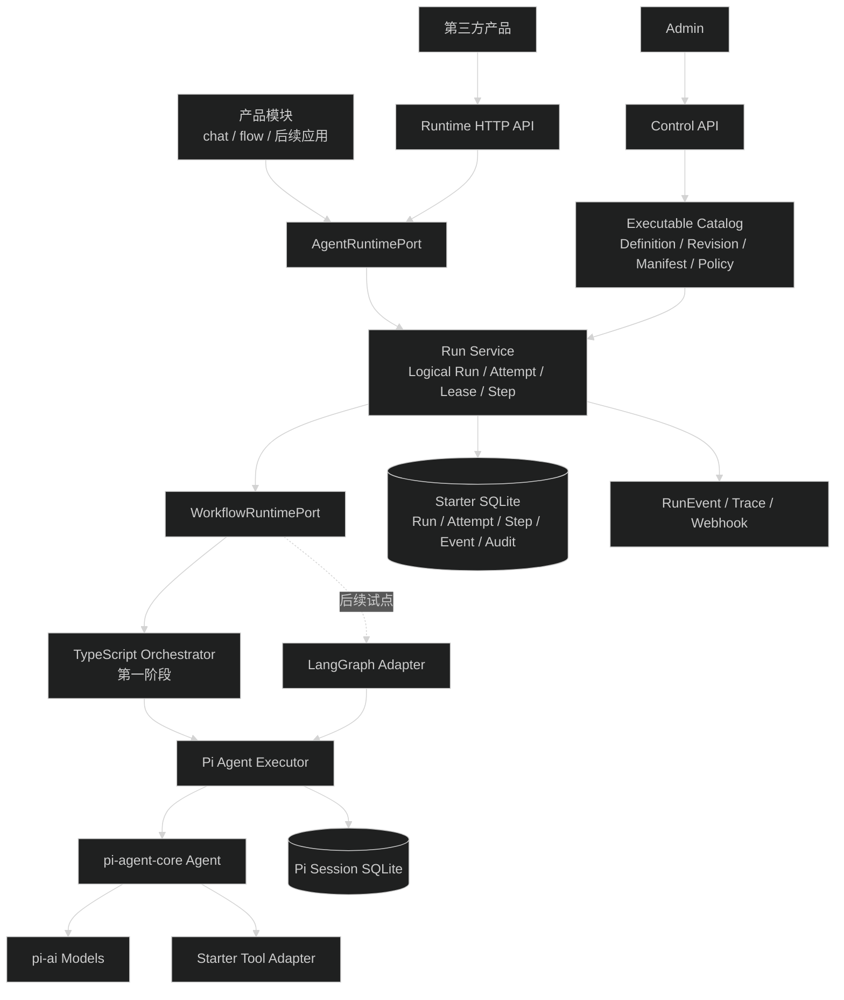
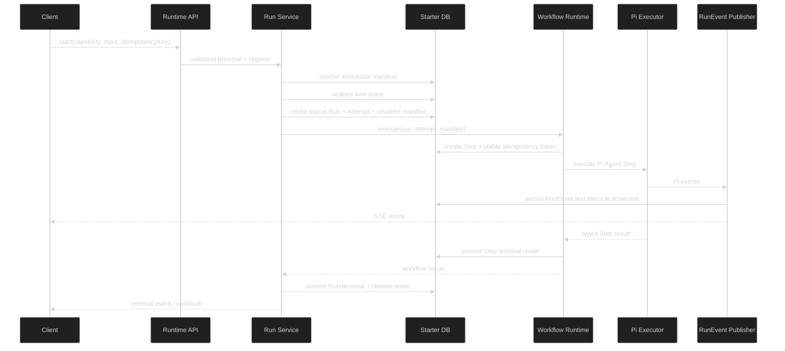
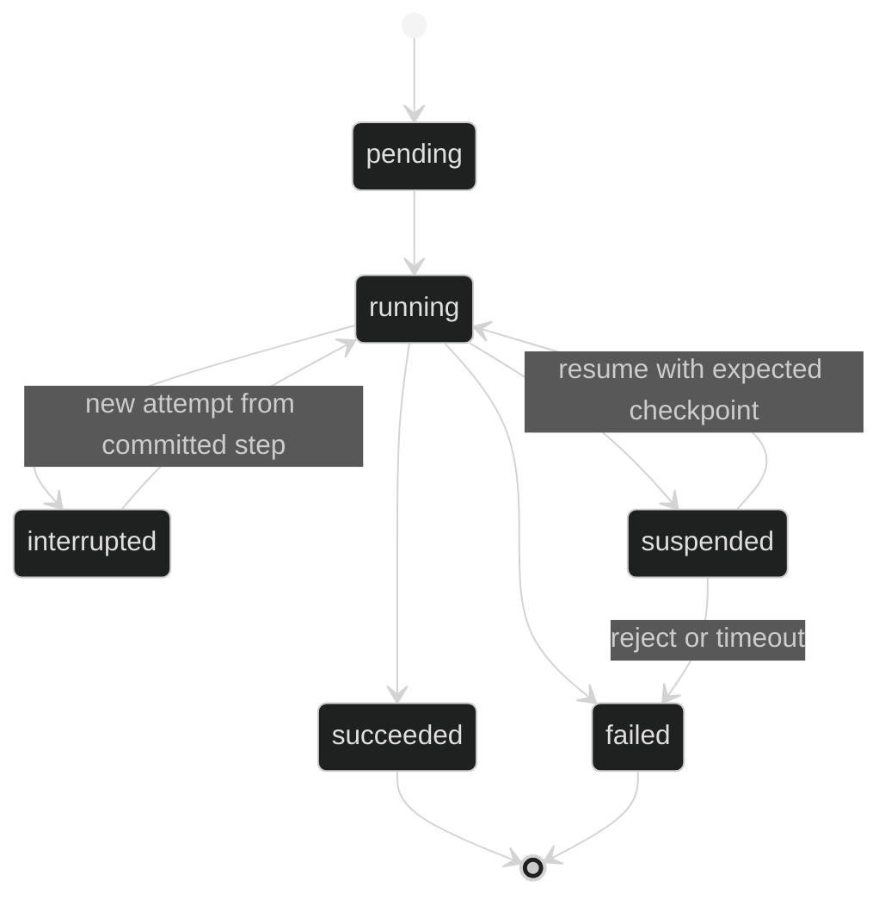

# api-ai Agent 架构优化设计

## 1. 结论

当前 `api-ai` 不缺一套新的 Agent loop。Pi `Agent`、Pi Session、Tool adapter、RunEvent 和第三方运行面已经组成可用的单 Agent Harness。下一步应把运行中隐含的边界变成稳定契约，再增加编排层。

推荐路线：

1. 继续让 Pi 负责单 Agent 内的模型与 Tool loop。
2. 先补持久执行 owner、不可变 resolved manifest、logical run/attempt 和原子 step。
3. 用窄的 `AgentRuntimePort` 与 executable manifest 给项目内产品和第三方接入。
4. 线性与有限分支先用 TypeScript 编排器。
5. 需要 checkpoint、人工暂停恢复或复杂多 Agent 图时，在 Pi executor 外层接 LangGraph JS。

不直接使用 Pi `AgentHarness`。当前实现仍不能执行、恢复或观察 Run。不用 Vercel AI SDK 或 Mastra 替换现有运行层，它们会和已完成的 Provider、Tool、Session、事件与权限体系重复。

## 2. 课程概念取舍

| 概念 | 决定 | 在 Starter 中的用法 |
| --- | --- | --- |
| StateGraph 的节点与边 | 采用概念，暂不引入框架 | 需要独立观测、重试或路由的动作才成为 Step |
| Reducer | 采用 | 并行分支必须按稳定 key 合并，不能按完成顺序覆盖 |
| 条件路由 | 采用 | 路由只读取已验证结果，不在路由函数中再次调用模型或数据库 |
| `Command` | 采用语义 | Step 可返回 `{ output, next }`，状态更新与出口保持一致 |
| `Send` / map-reduce | 延后到组合阶段 | 用于有界多 Agent、批量检索和文档处理 |
| Checkpointer | 延后到 LangGraph 试点 | 只保存已提交 Step 边界，不保存 token 流中间状态 |
| interrupt / HITL | 延后到 LangGraph 试点 | 增加 `suspended` 后才能对外承诺暂停恢复 |
| 子图 | 延后 | 重复使用且有独立输入输出时才拆，不把普通函数都变成子图 |
| ReAct Agent | 拒绝重复实现 | 继续使用 Pi `Agent` 的模型与 Tool loop |
| LangChain Tool | 不替换现有 Tool | 保留 Starter 的版本、权限、scope、timeout 和审计 |
| Supervisor | 组合阶段优先采用 | 总控只负责分解、选择、汇总和停止条件 |
| Handoff | 按产品需求增加 | 控制权必须持久记录 source、target、reason 和生效范围 |
| Swarm | 当前不采用 | 难以限制循环、预算、权限和恢复边界 |
| LangGraph Store 保存长期记忆 | 不采用 | 长期业务记忆仍由独立业务表和 repository 管理 |
| 框架原生事件直接给前端 | 不采用 | 所有内部事件都转换成现有 `RunEvent` 与 Trace |

## 3. 目标分层



### 3.1 控制面

控制面管理可执行资源，不参与正在运行的 loop：

- Agent Definition 与不可变 Revision。
- Prompt、Skill、Tool 和 Output Contract 的不可变版本。
- 无 secret 的 executable manifest。
- product app 能调用哪些 capability、版本、controls 和 Tool 类别。
- Admin 的启停、弃用与审计查询。

### 3.2 运行面

运行面负责：

- principal、tenant、project 与 subject scope。
- 请求幂等、Session lane、持久 lease 和启动 readiness。
- logical Run、Attempt、Step、事件与终态。
- resolved manifest 固定和 hash 校验。
- Pi executor 调用、取消、steer、follow-up 和错误转换。
- JSON、SSE、Timeline、Webhook 与后续事件订阅。

### 3.3 编排面

编排面只处理 Agent 之外的业务步骤：

- 顺序、条件、有限重试和有界并行。
- 子 Agent 调度、汇总和停止条件。
- 后续的 checkpoint、interrupt/resume 和 subgraph。

它不处理 Provider、模型消息格式、Pi transcript、Tool 权限或 HTTP 文案。

## 4. 核心契约

以下接口用于说明边界，字段最终应由 `packages/contracts` 的 Zod schema 定义。

```ts
type ExecutableKind = 'agent' | 'tool' | 'workflow'

type SideEffectKind =
  | 'read_only'
  | 'idempotent_write'
  | 'non_idempotent_write'

interface ExecutableManifest {
  id: string
  version: number
  kind: ExecutableKind
  inputSchema: JsonSchema
  outputSchema: JsonSchema | null
  eventProtocolVersion: number
  controls: Array<'abort' | 'steer' | 'follow_up'>
  sideEffect: SideEffectKind
  timeoutMs: number
  capabilityTags: string[]
  deprecatedAt: string | null
}

interface ResolvedRunManifest {
  agentRevision: number
  modelRef: string
  systemPromptRevision: string | null
  systemPromptHash: string | null
  skillRevisions: Array<{ id: string; revision: string; contentHash: string }>
  toolManifests: Array<{ name: string; version: string; manifestHash: string }>
  outputContract: { name: string; version: string; schemaHash: string } | null
  manifestHash: string
}

interface ExecutionStep {
  id: string
  runId: string
  parentStepId: string | null
  branchId: string | null
  executable: { id: string; version: number }
  status: 'pending' | 'running' | 'succeeded' | 'failed' | 'suspended'
  attempt: number
  inputRef: string
  outputRef: string | null
  idempotencyToken: string
  errorCode: string | null
}
```

第一阶段不需要公开任意 workflow JSON。`workflow` manifest 只用于代码内已审核流程。第三方先发现并调用管理员发布的 capability，不允许上传任意节点代码或绕过 Tool policy。

## 5. 状态归属

| 状态 | 唯一事实源 | 写入者 | 说明 |
| --- | --- | --- | --- |
| 对话消息、lane、compaction | Pi Session backend | `AgentSessionStore` adapter | 不用 LangGraph checkpoint 再保存一份 transcript |
| Agent、Prompt、Skill、Tool 版本 | Starter SQLite | 控制面 service | Run 启动后只引用不可变版本 |
| logical Run、Attempt、Step、lease | Starter SQLite | Run Service | 决定执行所有权、重试与终态 |
| resolved manifest | Starter SQLite | Run Service | Run 开始时固定，历史执行可验证 |
| 公开事件与 Timeline | `ai_run_events` | `RunEventPublisher` | 先持久化再广播，框架事件必须转换 |
| 实时 controls 与 subscriber | 进程内 registry | 当前 owner | 只是缓存，不能作为跨实例执行所有权 |
| 编排 checkpoint | 后续 LangGraph checkpointer | Workflow adapter | 只保存流程 state、next node 和已完成结果 |
| 长期业务记忆 | 业务模块数据库 | 对应业务 service | 不进入 Run snapshot 或 checkpoint |

## 6. 稳定运行流



必须满足：

- lease 在 Run row 之前或同一事务内取得，第二个实例不能同时拥有同一 lane。
- API readiness 在处理新 Run 前完成强制 lease recovery 与 Session 一致性检查。
- 相同调用幂等键指向同一个 logical Run；自动 retry 产生新的 Attempt，不产生无关联 Run。
- Step 只有在输入已固定、执行 owner 已记录后进入 `running`。
- 外部写 Tool 使用稳定 `idempotencyToken`。未声明幂等的写操作不自动重试。
- 终态事件继续由 `RunEventPublisher` 和 Run repository 事务产生，Workflow 框架不能另写一套公开终态。

## 7. 失败与恢复

### 7.1 第一阶段

第一阶段不承诺 durable resume：

- SSE 断开：按 sequence 回放，现有 Timeline 是事实源。
- 已产生 Pi terminal entry、主库未提交：启动恢复把终态投影回主库。
- 没有 terminal entry：Run 标为 `interrupted`，释放过期 lease，不自动重跑。
- 模型或只读 Tool 的临时错误：由明确 retry policy 创建新 Attempt。
- 非幂等写 Tool 的结果不确定：进入需要人工判断的错误，不自动重试。

### 7.2 LangGraph 试点后

只有试点通过后才增加 `suspended`、checkpoint 与 resume：



恢复从节点开头重新执行，不从 JavaScript 函数中间继续。Pi Agent 作为单个节点时，checkpoint 只能位于整个 Pi Run 前后；要获得 Tool 级恢复，必须先证明 Tool 幂等，再决定是否把 Tool 提升为外层 Step。

## 8. 组合策略

### 普通 TypeScript 编排器

适用于：

- 线性 2 到 5 步。
- 分支数量固定。
- 一次请求内完成。
- 失败后可以整步重试或结束。
- 不需要人工暂停和跨进程续跑。

编排器仍必须创建 Step、写事件、执行 Zod 校验并遵守超时、预算和 AbortSignal。

### LangGraph JS

出现以下任一可验收需求后使用：

- Run 需要等待人工或外部系统数小时后继续。
- API 进程重启后必须从已完成节点继续。
- 流程含可复用子图、动态扇出、并行 join 或多个回边。
- 多 Agent 有独立状态命名空间和可视化执行树。
- 副作用已经具备稳定幂等键，可以安全重放。

LangGraph 只实现 `WorkflowRuntimePort`。公开 API、RunEvent、Tool policy、Pi Session 和 principal scope 不依赖 LangGraph 类型。

## 9. 多 Agent 方向

第一种模式只做 Supervisor：

1. Supervisor 产生结构化任务计划。
2. 本地代码校验 Agent 是否存在、是否允许、数量、预算和 Tool scope。
3. 子 Agent 使用独立 child Run 与 Step，并关联 `parentRunId`、`parentStepId`、`branchId`。
4. 子 Agent 只获得完成任务所需的上下文和 Tool。
5. 汇总器按稳定 agent/task key 合并结果，明确部分失败策略。
6. 最多 Agent 数、并行数、轮数和总预算由代码执行，不依赖 Prompt 自律。

第二种模式是有界 map-reduce。Handoff 按具体产品需求增加。Swarm 不作为脚手架默认能力。

## 10. 第三方接入

第三方运行面分两级：

### 调用已发布 capability

- 读取无 secret 的 executable manifest。
- 创建 Session 与 Run。
- 使用 typed input，读取 typed output 与 Timeline。
- 使用 manifest 声明的 controls。
- 接收终态或允许类型的中间事件订阅。

### 受 policy 限制的组合

- app credential 指定允许的 capability 与版本范围。
- 只能使用管理员发布的 workflow template 或有限组合 DSL。
- 不能提交任意 system prompt、Provider 凭据、Tool handler 或网络地址。
- MCP/OpenAPI Tool adapter 放到后续阶段，先定义认证引用、URL policy、timeout、schema、side effect 和审计要求。

项目内产品通过同一 `AgentRuntimePort` 调用，不导入 repository、Pi 类型或整个 `AiServices`。

## 11. 主要风险

- 同时保留 Starter Run、Pi transcript 和 LangGraph checkpoint 会形成三个状态源。必须按本设计的状态归属执行。
- Pi SQLite backend 的 writer lease 是单 Session 单写者，不等于 Starter logical Run lease。多实例方案需要 session affinity 或专门 worker owner。
- resolved manifest 如果只保存 hash、却没有可按版本找回内容的存储，仍无法还原历史执行。
- 给所有 Tool 自动 retry 会重复外部副作用。副作用分类和稳定 token 必须早于 durable resume。
- 过早公开任意 graph DSL 会把权限、迁移和版本兼容问题交给第三方。先开放版本化 capability manifest。
- 把完整 Pi loop 包成 LangGraph 节点只能获得节点边界恢复，不应宣传为 Tool 级恢复。

## 12. 不采用的方案

- 不等待 Pi `AgentHarness` 完成，也不在 Starter 补完它。
- 不把现有 RunEvent 改名为 checkpoint。事件日志没有下一节点和执行游标。
- 不让 LangGraph message state 替代 Pi transcript。
- 不用 Mastra 一次性接管 Agent、memory、workflow、storage 和 Hono route。
- 不用 Vercel AI SDK Core 充当 graph engine；Workflow SDK 也不作为当前首选。
- 不先做 React Flow schema。可视化编辑器应在稳定 workflow contract 之后。

## 13. 回滚边界

每个阶段独立交付：

- lease/readiness 可单独回滚到单实例部署限制。
- resource revision 与 resolved manifest 是只增事实，不依赖 workflow。
- Step/Attempt 可以只用于现有单 Agent Run，不要求启用图。
- LangGraph 试点放在 feature flag 或独立内部 route 下，删除 adapter 后现有 Pi 主路径保持可用。
- 第三方 manifest 是只读接口，撤回组合权限不影响已有 Agent Run 读取。
