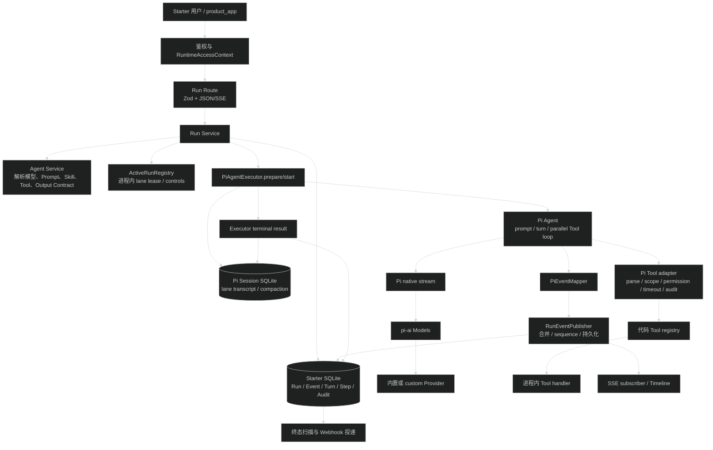

# API AI Agent 现状与缺口

## 调研范围

本文件检查了以下实现与测试：

- `apps/api/src/modules/ai/`：Agent、Session、Run、Tool、Structured Output、Usage Audit、Webhook 和第三方应用凭据。
- `apps/api/src/infra/ai/`：Provider registry、custom Provider、Gateway 和 Pi 原生模型流。
- `apps/api/src/infra/agent/`：Pi Agent executor、Session store、Tool adapter、事件映射和 active Run registry。该目录不在委托列出的两个主目录内，但它是当前 Agent Run 的实际执行核心，必须沿调用链检查。
- `packages/contracts/src/ai.ts`：Agent 配置、Run 输入、事件、Trace、Completion 和 Webhook 契约。
- `apps/api/src/test/` 与 `apps/api/src/infra/ai/*.test.ts`：现有行为的证明与未覆盖边界。

结论只描述当前代码。这里的“缺口”是相对于三个目标判断的：更小的可执行单元、进程故障后仍稳定的 Agent 流、第三方可以发现并组合能力。

## 结论

当前实现已经是完整的单 Agent Harness，不是简单的模型转发层。它具备持久 Session、单 Run 幂等、Pi Agent Tool loop、精确版本 Tool、结构化输出、持久 RunEvent、SSE 恢复、Trace、用量审计、第三方 Bearer scope 和终态 Webhook。

它目前的稳定边界是“单进程内执行一个 Agent Run，进程重启后保留历史并把未完成 Run 标为 interrupted”。它还不是可恢复的任务执行器，也不是可声明组合的 Agent workflow runtime：

1. 同 lane 排他、active controls、实时快照和订阅上下文都在进程内；数据库没有非终态 lane 唯一约束，多实例不能保证同 lane 只有一个 Run。
2. 重启恢复只读取 `starter.run` 终态记录；没有终态记录的 Run 直接变成 `interrupted`，不会从 turn、step 或 tool checkpoint 继续。
3. Run snapshot 只保存 Prompt/Skill ID 和 Tool ref，不保存解析后的 Prompt/Skill 内容；内联 `systemPrompt` 更不会进入 snapshot。Prompt 与 Skill 又可原地修改且没有 revision，因此无法按历史 Run 还原当时的实际执行输入。
4. AgentDefinition 是一份模型循环配置，不是由可寻址节点组成的流程。turn/step 表用于 Trace 和审计，不能独立调度、重试、恢复或作为另一个 Agent 的依赖。
5. 第三方 `product_app` 只能发现 Agent summary 并调用管理员预配置的 Agent；不能使用内联配置，也拿不到 Agent config、Tool schema 或输入/输出能力清单。
6. Tool 和 Output Contract 都是进程启动时的代码注册表。没有远程 Tool 协议、MCP/OpenAPI Tool adapter、第三方 Tool 注册或独立 worker 执行边界。

因此，继续在现有 `AgentDefinitionConfig` 上加更多字段不能解决主要问题。优先要把“持久执行所有权与 checkpoint”从进程内 Run 中独立出来，再定义可独立寻址、幂等和重试的执行单元；第三方 manifest 与远程 Tool adapter 应建立在这两个边界之上。

## 现有执行链

### 1. 启动与依赖装配

- `createRoutes` 创建一份 `AiServices`，AI、chat、flow 三组路由共用它；chat/flow 直接调用 `sessionService` 和 `runService`，没有通过内部 HTTP 绕行。证据：`apps/api/src/routes/index.ts:17-25`、`apps/api/src/modules/chat/chat.route.ts:107-135`、`apps/api/src/modules/flow/flow.route.ts:66-82`。
- `createAiServices` 在一个函数里装配 Provider 调用审计、Tool catalog、Agent service、Session service、Pi executor、Run service、Completion、附件和 Webhook。证据：`apps/api/src/modules/ai/ai.services.ts:67-213`。
- Session 一致性检查和 Run 恢复扫描都以 `void promise` 启动，不阻塞路由创建。证据：`apps/api/src/modules/ai/ai.services.ts:143-159`、`apps/api/src/modules/ai/ai.services.ts:214-224`。

### 2. Run 接收与配置解析

- `POST /api/ai/sessions/{sessionId}/runs` 先校验 principal scope，再调用 `startRun`；显式 JSON Accept 只返回 `runId`，其余情况建立 SSE。证据：`apps/api/src/modules/ai/run/run.route.ts:35-64`。
- 输入只有 `agentId | config`、`lane`、文本 `input`、`idempotencyKey` 和图片附件。`agentId` 与内联 `config` 互斥。证据：`packages/contracts/src/ai.ts:1132-1169`。
- Run Service 解析预设或内联 Agent，校验附件，执行幂等预检查，取得进程内 lane lease，创建 Run row，再 prepare/attach/start executor。证据：`apps/api/src/modules/ai/run/run.service.ts:188-225`、`apps/api/src/modules/ai/run/run.service.ts:227-358`、`apps/api/src/modules/ai/run/run.service.ts:358-460`。
- 预设 Agent 在每次 Run 启动时读取当前 Prompt、Skill、Tool 和 Output Contract。证据：`apps/api/src/modules/ai/agent/agent.service.ts:203-240`、`apps/api/src/modules/ai/agent/agent.service.ts:283-329`。

### 3. Pi Agent 与 Tool loop

- executor 先打开 Pi Session 并读取 lane transcript，再创建 Pi `Agent`。证据：`apps/api/src/infra/agent/agent-executor.ts:233-292`、`apps/api/src/infra/agent/agent-executor.ts:422-459`。
- Pi `Agent` 负责 prompt、并行 Tool 调用、steer、follow-up、上下文压缩和 maxTurns 收尾；业务层没有复制一套 Agent loop。证据：`apps/api/src/infra/agent/agent-executor.ts:422-505`、`apps/api/src/infra/agent/agent-executor.ts:544-579`。
- 模型调用走 Pi 原生 stream，显式设置 `maxRetries: 0`，并把模型调用事实写入事件与审计。证据：`apps/api/src/infra/ai/pi-native-stream.ts:300-338`。
- Tool adapter 在 handler 前执行参数大小检查、Zod parse、scope、权限、timeout 和审计；handler 能上报安全进度与来源。证据：`apps/api/src/infra/agent/pi-tool-adapter.ts:197-359`、`apps/api/src/infra/agent/pi-tool-adapter.ts:361-536`。
- Tool registry 按精确 `name@version` 查找，公开投影不包含 schema 或 handler。证据：`apps/api/src/modules/ai/tool/tool-registry.ts:69-123`。

### 4. 事件、终态与恢复

- `RunEventPublisher` 先持久化再广播，合并 text delta 和 Tool progress，终态由 Run repository 与 Run row 在同一 Starter SQLite 事务写入。证据：`apps/api/src/modules/ai/run/run-event.publisher.ts:53-105`、`apps/api/src/modules/ai/run/run.repository.ts:142-181`。
- SSE 订阅先建立实时队列，再按数据库 watermark 回放，避免“回放期间的新事件”丢失。证据：`apps/api/src/modules/ai/run/run.service.ts:543-613`。
- 正常终态顺序是：刷出增量、写 Pi `starter.run`、提交主库 Run 终态与 terminal event、关闭订阅、释放 registry。证据：`apps/api/src/modules/ai/run/run.service.ts:868-945`。
- 重启扫描只区分两种情况：存在唯一且身份匹配的 `starter.run` 时把终态投影回主库；否则标记 `AI.RUN_INTERRUPTED`。证据：`apps/api/src/modules/ai/run/run.service.ts:694-847`。

## 已具备能力

| 能力 | 当前实现 | 证据 |
| --- | --- | --- |
| Provider 适配 | `pi-ai` 内置 Provider，加 OpenAI Completions、OpenAI Responses、Anthropic Messages 三种 custom protocol；custom 出站请求走 URL guard | `packages/contracts/src/ai.ts:15-16`、`apps/api/src/infra/ai/custom-provider.factory.ts:19-57` |
| 模型控制 | Provider 状态、凭据、模型目录、模型 allowlist、默认模型与图片能力检查 | `apps/api/src/infra/ai/ai-runtime.ts:131-263` |
| Agent 配置 | 模型、System Prompt、Skill、精确 Tool ref、Output Contract、thinkingLevel、maxTurns、Agent revision | `packages/contracts/src/ai.ts:670-712` |
| Session | Starter 主库保存 principal scope 与索引，Pi SQLite 保存 transcript、lane、compaction；支持多 lane | `apps/api/src/modules/ai/ai.schema.ts:319-367`、`apps/api/src/infra/agent/pi-session-store.ts` |
| Run 接收幂等 | scope + idempotency key 唯一索引；同 key 重复请求返回原 Run，失败 Run 也不重跑 | `apps/api/src/modules/ai/ai.schema.ts:369-413`、`apps/api/src/test/ai-run-idempotency.test.ts:157-320` |
| Tool 安全边界 | 精确版本、Zod、scope、Starter 权限、timeout、AbortSignal、安全摘要、Tool 审计、进度、来源 | `apps/api/src/modules/ai/tool/tool-registry.ts:5-66`、`apps/api/src/infra/agent/pi-tool-adapter.ts:197-536` |
| Tool 失败处理 | 普通 Tool 失败和 Tool 自身超时返回模型，由 Pi 决定下一轮；Run deadline 与用户取消终止 Run | `apps/api/src/infra/agent/pi-tool-adapter.ts:420-524` |
| Structured Output | 代码注册 Zod contract，生成 hash，提供 required/optional、product/admin visibility、事件和持久读取 | `apps/api/src/modules/ai/output/output-contract-registry.ts:10-96`、`packages/contracts/src/ai.ts:634-668` |
| 事件协议 | Run、turn、step、model call、message、thinking、Tool、compaction、structured output、source 共用严格 envelope | `packages/contracts/src/ai.ts:1257-1437` |
| 事件恢复 | RunEvent 持久化、单 Run sequence、Timeline、Last-Event-ID、SSE watermark 回放 | `apps/api/src/modules/ai/run/run-event.repository.ts:24-88`、`apps/api/src/modules/ai/run/run.service.ts:516-613` |
| 可观测性 | Run/turn/step/model/tool ID 关联，生命周期表、Trace、usage/cost 审计和 telemetry span | `apps/api/src/infra/agent/run-execution-context.ts:33-190`、`apps/api/src/modules/ai/run/run-trace.repository.ts:20-158` |
| 第三方运行面 | Bearer app credential、tenant/project/external user/subject scope、Agent discovery、JSON/SSE Run、Transcript、Output、跨 scope 404 | `apps/api/src/modules/ai/application/application.guard.ts:14-41`、`apps/api/src/test/ai-third-party-access.test.ts:100-326` |
| 终态通知 | 按 app 投递签名 Webhook，持久 delivery、退避重试和 dead 状态 | `apps/api/src/modules/ai/webhook/webhook.dispatcher.ts:52-235`、`apps/api/src/test/ai-webhook.test.ts:507-663` |
| 无状态调用 | `/api/ai/completions` 支持白名单模型、文本/图片、JSON/SSE 和用量审计，不创建 Session/Run | `apps/api/src/modules/ai/completion/completion.openapi.ts:13-44`、`apps/api/src/modules/ai/completion/completion.service.ts:36-182` |

## 具体缺口

### P0：稳定执行所有权不在持久层

#### 1. 同 lane 排他只在单进程有效

事实：

- `ActiveRunRegistry` 用三个进程内 `Map` 和一个 `Set` 保存 lease 与 handle。证据：`apps/api/src/infra/agent/active-run-registry.ts:62-67`。
- Run Service 在创建 Run row 前只调用该 registry 的 `reserve`。证据：`apps/api/src/modules/ai/run/run.service.ts:227-239`。
- 数据库对 `(session_id, lane, status)` 只有普通索引；唯一约束只有 `(idempotency_scope, idempotency_key)`。证据：`apps/api/src/modules/ai/ai.schema.ts:397-404`。
- 并发测试使用同一个 registry 实例，只证明单进程行为。证据：`apps/api/src/test/ai-agent-runs.test.ts:577-647`、`apps/api/src/test/active-run-registry.test.ts:5-79`。

影响：两个 API 实例共享数据库时，可以各自 reserve 同一 `sessionId + lane`，各建一个非终态 Run，并同时写同一 Pi lane。当前 `AI.SESSION_BUSY` 不是集群级保证。

需要的边界：把执行所有权做成持久 lease，至少包含 `ownerId`、`leaseUntil`、心跳与条件更新；数据库必须能拒绝第二个非终态 lane owner。进程内 registry 可以保留为 controls 缓存，但不能继续作为唯一排他依据。

#### 2. 进程重启不能续跑，只能保留历史或标记 interrupted

事实：

- Run row 只有 `starting/running/...` 状态、snapshot 和终态字段，没有 worker owner、lease、checkpoint、next attempt 或可恢复输入位置。证据：`apps/api/src/modules/ai/ai.schema.ts:369-413`。
- turn/step 表保存 outcome 和时间，只用于生命周期与 Trace；没有 step input/output、依赖、checkpoint 或恢复游标。证据：`apps/api/src/modules/ai/ai.schema.ts:415-454`、`apps/api/src/modules/ai/run/run-lifecycle.repository.ts:8-99`。
- `recoverInterrupted` 只找 `starter.run` terminal entry；没有 entry 就调用 `markInterrupted`。证据：`apps/api/src/modules/ai/run/run.service.ts:694-847`。
- 现有“进程重启”测试覆盖的是已完成 Run 的 Timeline 读取，不是运行中 Run 的续跑。证据：`apps/api/src/test/run-event-recovery.test.ts:317-380`。

影响：Provider 已返回、Tool 已产生外部副作用、但 Tool result 或 `starter.run` 尚未落库时，重启后只能得到 interrupted。调用方不知道应继续、重试还是人工确认，Agent 流不能提供 at-least-once 或 effectively-once 语义。

需要的边界：把一次 Run 拆成持久 attempt/checkpoint。每个可恢复单元必须保存确定输入、状态、attempt、执行 owner、幂等 token 和结果引用。恢复器根据 checkpoint 重新领取，而不是把所有非终态 Run 统一结束。

#### 3. 恢复扫描没有成为启动门禁

事实：

- `createAiServices` 以 fire-and-forget 方式执行 Session consistency 和 `recoverInterrupted`。证据：`apps/api/src/modules/ai/ai.services.ts:143-159`、`apps/api/src/modules/ai/ai.services.ts:214-224`。
- `createApp` 注册路由后即可接收请求；进程入口只等待文件存储初始化。证据：`apps/api/src/bootstrap/create-app.ts:14-27`、`apps/api/src/index.ts:5-10`。

影响：服务刚启动时，旧 `running` Run 仍可能被 `GET /active-run` 返回；同时新的 registry 是空的，控制接口会返回 `AI.RUN_NOT_ACTIVE`。恢复扫描与新请求还可能同时观察、修改同一 Session lane。

需要的边界：AI runtime readiness 应明确等待 Provider 初始化、Run lease recovery 和 Session store 检查中的强制项。诊断型 orphan 检查可以异步，影响执行所有权的恢复不能异步放过。

### P0：Run 配置快照不能还原实际执行

#### 4. Prompt、Skill 与内联 Prompt 没有不可变版本

事实：

- Agent config 和 Run snapshot 只保存 `systemPromptId`、`skillIds`、`toolRefs`。证据：`packages/contracts/src/ai.ts:670-680`、`packages/contracts/src/ai.ts:987-1018`。
- `buildSnapshot` 不保存解析后的 `systemPrompt`、Skill description/content、Tool schema/timeout/permission；内联配置的 `systemPrompt` 解析后，snapshot 中 `systemPromptId` 为 null。证据：`apps/api/src/modules/ai/run/run.service.ts:1147-1160`、`apps/api/src/modules/ai/agent/agent.service.ts:243-276`。
- System Prompt 和 Skill 表没有 revision，repository 可以原地更新 content。证据：`apps/api/src/modules/ai/ai.schema.ts:159-214`、`apps/api/src/modules/ai/prompt/prompt.repository.ts:75-86`、`apps/api/src/modules/ai/skill/skill.repository.ts:57-68`。
- 每次启动都重新读取当前 Prompt 和 Skill。证据：`apps/api/src/modules/ai/agent/agent.service.ts:297-317`。

影响：同一个 Agent revision 在不同时间可能执行不同 Prompt/Skill 内容；历史 Run 不能证明模型当时看到的 system prompt。内联 Run 更无法从 snapshot 重建。精确 Tool version 只固定了引用，未固定 handler 构建产物。

需要的边界：Run 启动时生成可审计的 resolved manifest，保存 Prompt/Skill 内容 hash 与不可变 revision，保存 Tool manifest hash 和 Output Contract schema hash。是否保存全文可按敏感级别决定，但必须能按 hash 找回原版本。内联 Prompt 至少需要加密存储或不可逆 hash 加受控审计存储，不能只存在内存。

### P1：现有 Agent 不是可组合的原子执行单元

#### 5. AgentDefinition 只能描述一个 Pi Agent loop

事实：

- `AgentDefinitionConfig` 只有 model、Prompt、Skill、Tool、Output Contract、thinkingLevel 和 maxTurns。证据：`packages/contracts/src/ai.ts:670-680`。
- Run 输入只有一段文本和图片，没有 typed variables、node、edge、condition、child agent、handoff 或 per-step policy。证据：`packages/contracts/src/ai.ts:1132-1169`。
- executor 固定创建一个 Pi `Agent`，`toolExecution` 固定为 parallel；turn 与 step 由 Pi 事件生成。证据：`apps/api/src/infra/agent/agent-executor.ts:422-459`。
- Step kind 当前只有 `assistant | compaction | branch_summary`，不是用户定义的执行节点。证据：`apps/api/src/infra/agent/run-execution-context.ts:9-16`、`packages/contracts/src/ai.ts:1297-1315`。

影响：无法表达“检索 -> 审核 -> 生成 -> 人工确认 -> 发布”、条件分支、多个 Agent handoff、并行子任务和局部重试。当前 Tool call 虽然比整个 Run 更小，但它仍只能由模型临时选择，不能作为外部可寻址节点。

需要的边界：定义独立的 executable unit，例如 `model_step`、`tool_step`、`agent_step`、`wait_step`。每个 unit 有 typed input/output、attempt、timeout、retry policy、idempotency token 和持久状态；workflow 只负责依赖与条件，不复制 Pi Agent 内部 Tool loop。

#### 6. Tool handler 没有强制幂等或补偿契约

事实：

- Tool handler 收到 `toolExecutionId`、AbortSignal 和 scope，但定义中只有 `execute`，没有 `idempotencyKey`、`recover`、`compensate` 或副作用类别。证据：`apps/api/src/modules/ai/tool/tool-registry.ts:5-66`。
- adapter 的 timeout 通过 AbortSignal 与 Promise race 实现；handler 是否停止取决于它是否遵守 signal。证据：`apps/api/src/infra/agent/pi-tool-adapter.ts:361-427`、`apps/api/src/infra/agent/pi-tool-adapter.ts:739-747`。
- Tool 审计记录状态和 ID，但不保存参数或结果。证据：`apps/api/src/modules/ai/ai.schema.ts:569-601`。

影响：带外部写操作的 Tool 在“外部成功、进程在 result 持久化前退出”时无法自动判定是否重做。直接给 Run 增加自动重试会放大重复副作用风险。

需要的边界：Tool manifest 必须声明 `read_only | idempotent_write | non_idempotent_write`，写 Tool 必须接收稳定的 execution token。可恢复执行器只自动重试已声明可重试的 Tool；其余进入 `waiting_for_resolution`，不能假装成普通 failed。

#### 7. Retry 目前只是事件属性，不是执行策略

事实：

- Pi 原生模型流明确使用 `maxRetries: 0`。证据：`apps/api/src/infra/ai/pi-native-stream.ts:327-338`。
- Run error 事件有 `retryable`，step outcome 也允许 `retry`，但 start schema 和 Agent config 没有 retry policy。证据：`packages/contracts/src/ai.ts:1222-1239`、`packages/contracts/src/ai.ts:1132-1169`。
- 相同 idempotency key 命中 failed Run 时返回原 Run，不会创建新 attempt。证据：`apps/api/src/test/ai-run-idempotency.test.ts:302-320`。

影响：调用方能看到“可以重试”，但平台没有定义重试次数、退避、可重试错误、attempt 关联和最终失败规则。新请求换 key 会变成没有父子关系的另一个 Run。

需要的边界：区分 invocation idempotency 与 attempt retry。一个 logical run 可以有多个 attempt；原 idempotency key 始终指向 logical run，retry policy 决定是否创建下一 attempt。

### P1：第三方只能调用，不能发现并组合

#### 8. product_app 看不到可执行 manifest，也不能内联配置

事实：

- 公开 Agent API 返回 `AgentDefinitionSummary`，不含 config；detail 只在 admin API 返回。证据：`packages/contracts/src/ai.ts:696-712`、`apps/api/src/modules/ai/agent/agent.openapi.ts:34-61`。
- `/api/ai/tools` 只挂 Starter cookie `requireAuth`，没有挂 `requireRuntime`。证据：`apps/api/src/modules/ai/agent/agent.route.ts:32-47`。
- `product_app` 使用内联 Agent config 会返回 403。证据：`apps/api/src/modules/ai/agent/agent.service.ts:243-251`、`apps/api/src/test/ai-third-party-access.test.ts:601-653`。

影响：第三方只能由管理员告知一个 Agent ID，再提交自由文本。它无法在运行前判断输入结构、输出 contract、可用 Tool、模型能力或版本兼容性，也无法按自己的业务动态选择一组受允许的能力。

需要的边界：增加只读、无 secret 的 executable manifest：稳定版本、typed input schema、output contract、capability tags、允许的 controls、事件版本与弃用状态。是否允许第三方组合应由 app credential policy 控制，而不是全局禁止或全局放开内联 config。

#### 9. Tool 与 Output Contract 是代码内注册表

事实：

- Tool catalog 只组合 runtime 注入的 Tool 与内置 `read_skill`，没有动态或远程 adapter。证据：`apps/api/src/modules/ai/tool/tool-catalog.ts:5-17`、`apps/api/src/modules/ai/ai.services.ts:107-112`。
- custom Provider 只扩展模型协议，不扩展 Agent/Tool runtime；支持三种固定协议。证据：`packages/contracts/src/ai.ts:15-16`、`apps/api/src/infra/ai/custom-provider.factory.ts:19-34`。
- Output Contract registry 是进程内 Map；读取历史输出时，如果当前代码已移除 contract，该条输出直接跳过。证据：`apps/api/src/modules/ai/output/output-contract-registry.ts:62-96`、`apps/api/src/modules/ai/run/run.service.ts:470-503`。

影响：第三方不能通过 MCP、OpenAPI 或受控 webhook 把自己的能力接入 Agent。已持久的结构化结果又依赖当前部署仍注册同名版本，长期读取契约不稳定。

需要的边界：先定义统一 Tool execution port，再实现本地 Tool、MCP、OpenAPI/HTTP 三类 adapter。远程 Tool 的认证引用、超时、网络策略、输入输出 schema 和幂等声明都进入 manifest。Output Contract 的渲染元数据和 schema 必须按版本持久保存，历史读取不能依赖当前进程注册表。

#### 10. 外部事件出口只有 SSE 拉取和终态 Webhook

事实：

- Webhook dispatcher 不订阅 RunEvent，只扫描终态 Run。证据：`apps/api/src/modules/ai/webhook/webhook.dispatcher.ts:52-58`。
- Webhook payload 只有 app/run/session/lane/agent/status/error/time，不含结构化输出引用、最终消息、source、调用方 metadata 或事件 sequence。证据：`packages/contracts/src/ai.ts:1736-1754`。
- 完整中间事件只能通过 SSE/Timeline 获取。证据：`apps/api/src/modules/ai/run/run.route.ts:65-132`。

影响：第三方编排器不能可靠订阅 `tool.completed`、`structured_output.available` 或等待节点，也不能把自己的 correlation metadata 原样关联到终态通知。终态后必须再发请求读取结果。

需要的边界：提供持久 event subscription，允许按 event type 投递，并沿用现有 RunEvent envelope、delivery retry 和签名机制。Webhook payload 应带 `eventId/sequence` 与结果引用；调用方 metadata 需要严格大小限制和白名单字段。

### P2：协议与运行体验仍有明确限制

#### 11. SSE 过载通过静默关闭 transport 表达

- 每个 subscriber 队列上限 1024；满时 `AsyncEventQueue.end()`，不会产生 overflow event。证据：`apps/api/src/modules/ai/run/run.service.ts:55-56`、`apps/api/src/infra/agent/pi-event-mapper.ts:463-480`。
- SSE writer 遇到 iterator done 就结束。证据：`apps/api/src/modules/ai/run/run-sse.ts:15-52`。

调用方必须把“没有 terminal event 的 EOF”解释成需要重连或轮询，但 contracts 没有明确 resume hint。第三方 SDK 容易把它误判成成功结束。可增加 transport 级错误原因或标准 `retry:` 提示，仍以持久 Timeline 为事实来源。

#### 12. in-process 组合边界过宽，产品路由重复 transport 逻辑

- `AiServices` 导出整个 AI 模块的 concrete service return types。证据：`apps/api/src/modules/ai/ai.services.ts:46-60`。
- chat 与 flow 各自重复 JSON/SSE Accept 分流、subscribe 和控制路由。证据：`apps/api/src/modules/chat/chat.route.ts:107-158`、`apps/api/src/modules/flow/flow.route.ts:66-106`。

这不影响当前正确性，但说明项目内产品组合依赖整套 AI service，而不是一个稳定的 `AgentRuntimePort`。增加第三个产品时还会复制 transport 规则。应提取窄 port 和共享 route adapter；不要把 repository、Provider 或 Pi 类型导给产品模块。

## 测试覆盖与空白

### 已覆盖

- Agent config 严格 schema、Tool 精确版本、Agent CRUD/revision/status：`apps/api/src/test/ai-harness-contracts.test.ts:55-156`、`apps/api/src/test/ai-agent-definitions.test.ts:19-399`。
- 多轮 Tool、thinking、progress、compaction、maxTurns、结构化输出、生命周期关闭：`apps/api/src/test/pi-agent-executor.test.ts:92-1420`。
- Run 状态、单进程 lane busy、不同 lane、终态唯一性、恢复分类、live snapshot、结构化输出：`apps/api/src/test/ai-agent-runs.test.ts:244-2225`。
- scope 级幂等及 failed Run 重放：`apps/api/src/test/ai-run-idempotency.test.ts:157-398`。
- 第三方 Bearer、JSON/SSE、结构化输出、Transcript、跨 scope 和内联配置禁止：`apps/api/src/test/ai-third-party-access.test.ts:68-653`。
- 断线后 Run 继续、SSE 任意 chunk、已完成 Timeline 重启读取：`apps/api/src/test/ai-cross-product-runtime.test.ts:48-187`、`apps/api/src/test/run-event-recovery.test.ts:317-380`。
- custom Provider 协议、URL guard、认证与错误分类：`apps/api/src/infra/ai/custom-provider.integration.test.ts:96-285`、`apps/api/src/infra/ai/ai-runtime-custom-provider.test.ts:55-220`。

### 关键空白

1. 没有两个 runtime/进程同时对共享数据库与共享 Pi Session 启动同 lane Run 的测试。
2. 没有运行中进程退出后从 turn/step/tool checkpoint 续跑的测试；当前设计明确只标记 interrupted。
3. 没有“Agent revision 不变，但 Prompt/Skill 内容更新后历史 manifest 仍可还原”的测试。
4. 没有外部写 Tool 在“副作用成功、result 持久化前退出”后的幂等恢复测试。
5. 没有 product_app 能读取 executable manifest、Tool schema 或 Output Contract schema 的测试，因为当前没有这些接口。
6. 没有中间 RunEvent Webhook、投递 sequence 去重或第三方 correlation metadata 测试，因为当前 Webhook 只支持终态。
7. 没有 subscriber 队列 overflow 后第三方客户端自动恢复的端到端测试。

## 优先顺序

1. 先做持久执行 lease 与启动 readiness，补多实例同 lane 测试。这是现有行为在部署扩展时最直接的正确性风险。
2. 再定义 logical run、attempt、checkpoint 和 Tool 副作用策略，补进程退出恢复测试。没有这层，不应直接加自动 retry。
3. 把 resolved Agent manifest 做成不可变执行事实，版本化 Prompt、Skill、Tool manifest 与 Output Contract。
4. 在现有 Pi Agent executor 外增加 executable unit/workflow 调度层；Pi Agent loop 保持为一种 unit，不重写它的 Tool loop。
5. 最后开放第三方 manifest、受 policy 限制的组合、远程 Tool adapter 和持久事件订阅。第三方能力必须复用前面已经稳定的 lease、attempt、manifest 和事件语义。
