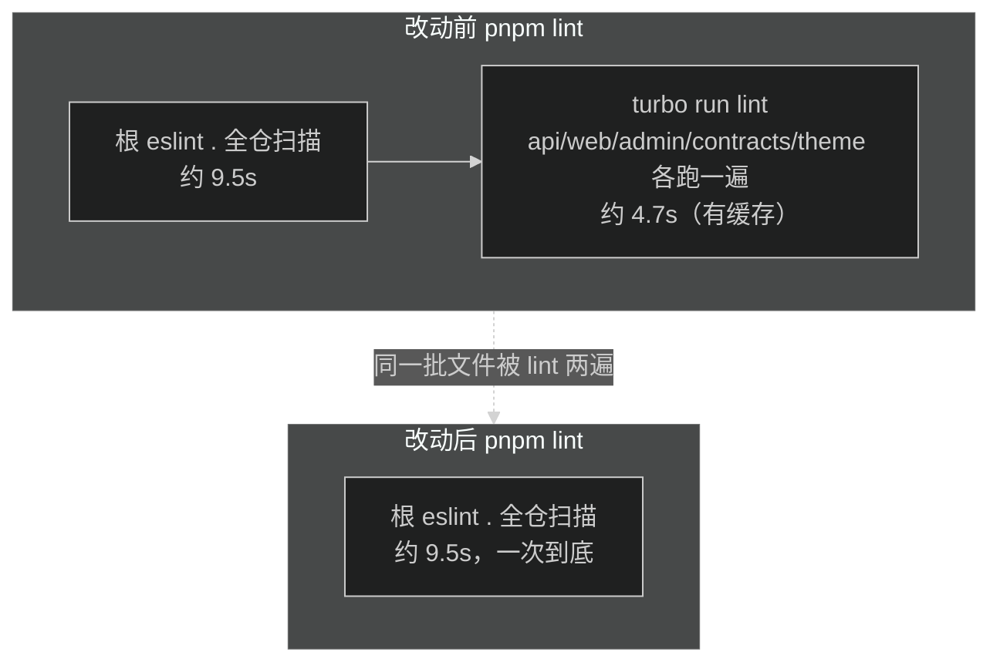

# 技术设计：Windows 兼容与全仓脚本优化

## 1. 方案选型

### 1.1 api build 的 NODE_OPTIONS（问题 A1）

| 方案 | 写法 | 评估 |
| --- | --- | --- |
| cross-env（选定） | `cross-env NODE_OPTIONS=--max-old-space-size=8192 tsup ...` | 十年标准解，内部 cross-spawn 处理 .cmd shim；加一个 devDep |
| node 直跑 tsup 入口 | `node --max-old-space-size=8192 node_modules/tsup/dist/cli-default.js ...` | 零依赖，但硬编码 tsup 内部路径（已确认当前是 `dist/cli-default.js`），升级可能断 |
| dotenv-cli + .env.build | `dotenv -e .env.build -- tsup ...` | 复用已有模式，但 `.env.*` 被 gitignore 排除，要加例外，链条更长 |

选 cross-env：语义自解释，不依赖包内部路径。cross-env 7.0.3 是最后正式版，功能单一无演进需求。

### 1.2 clean 脚本（问题 A2）

| 方案 | 写法 | 评估 |
| --- | --- | --- |
| rimraf（选定） | `rimraf dist` | 标准解；目标不存在时静默成功；6 个包各加 devDep（pnpm store 共享） |
| node -e rmSync | `node -e "require('node:fs').rmSync('dist',...)"` | 零依赖，但引号嵌套字符串在 6 个 package.json 里重复出现 |

### 1.3 行尾（问题 B3）

`.gitattributes` 追加 `* text=auto eol=lf`：

- `text=auto` 让 git 自动判断文本/二进制，二进制文件不会被误转换；
- `eol=lf` 强制所有平台检出 LF，覆盖 Windows 用户的 `core.autocrlf=true`；
- 仓库 index 中文件本来就是 LF，Mac 存量克隆零变化，无迁移成本；Windows 存量克隆下次 checkout 自动归一。

### 1.4 lint/format 收敛（问题 C7）

已验证的前提：

- 共享 ESLint 配置对 cwd 不敏感（`typescript: true` 显式、react/vue 未启用、`enableCatalogs` 走 `findUpSync` 找 `pnpm-workspace.yaml`），根目录跑一次 eslint 与 6 个包各跑一次结果完全一致；
- prettier 按文件就近解析 `prettier.config.js`，根目录跑一次覆盖包内文件时用的就是各包配置，包内跑是纯重复；
- `turbo run lint` / `turbo run format:check` 仅被根 package.json 调用，无 CI、无脚本引用。

结论：根脚本去掉 turbo 部分，单进程扫全仓。包内脚本保留（`pnpm --filter` 单包操作和包内 `check` 仍需要），turbo.json 删除两个死任务定义。

收敛前后对比（`pnpm lint` 的执行流程）：



`format:check` 同构：`prettier --check .`（4.4s）+ `turbo run format:check`（约 4s）收敛为单次 4.4s。

### 1.5 根 prettier 配置（问题 C8）

根目录新增 `prettier.config.js`，内容与各包一致：

```js
export { default } from '@starter/eslint-config/prettier'
```

影响面：根级文件此前按 prettier 默认配置（printWidth 80、双引号、`endOfLine: lf`）校验，切换后按共享配置（printWidth 120、单引号）校验，README.md、turbo.json、test-fixtures/*.json 等会被 `pnpm format` 重排。预期内变更，diff 应只出现在根级文件。

`.prettierignore` 已忽略 `.trellis`、`pnpm-lock.yaml` 等，不涉及。

## 2. 改动清单

| 文件 | 改动 |
| --- | --- |
| `.gitattributes` | 末尾追加 `* text=auto eol=lf` |
| `pnpm-workspace.yaml` | catalog 加 `cross-env`、`rimraf` |
| `apps/api/package.json` | build 换 cross-env；devDeps 加 cross-env、rimraf；clean 换 rimraf |
| `apps/web/package.json` | devDeps 加 rimraf；clean 换 rimraf |
| `apps/admin/package.json` | devDeps 加 rimraf；clean 换 rimraf |
| `packages/contracts/package.json` | devDeps 加 rimraf；clean 换 rimraf |
| `packages/theme/package.json` | devDeps 加 rimraf；clean 换 rimraf |
| `packages/eslint-config/package.json` | 删除 clean 脚本（无构建产物） |
| `package.json` | lint、format:check 去掉 turbo 部分 |
| `turbo.json` | 删除 lint、format:check 任务定义 |
| `prettier.config.js`（新建） | re-export 共享配置 |
| `apps/api/eslint.config.js`（新建） | `export { default } from '@starter/eslint-config'` |
| `apps/api/.env.example` | 密钥注释补 node 生成命令 |
| `README.md` | Windows 环境小节 |

## 3. 兼容性与回滚

- cross-env / rimraf 均为纯 devDependency，运行时不进入产物，回滚只需还原 package.json 与 lockfile。
- `.gitattributes` 对 Mac 开发零影响（index 已是 LF）；回滚删掉追加行即可。
- lint 收敛后若发现某包确需独立的 turbo 缓存 lint，恢复 `turbo.json` 任务定义和根脚本拼接即可，无数据迁移。
- 根 prettier 配置引入后的重排 diff 是一次性格式化，回滚配置即还原规则，但已重排文件建议保留（格式化变更无语义）。

## 4. 风险

| 风险 | 概率 | 缓解 |
| --- | --- | --- |
| 根级文件重排 diff 较大（README.md 等） | 确定 | 预期内；format 后逐文件检查 diff 只在根级 |
| Windows 实机行为无法在 Mac 验证 | 确定 | cross-env/rimraf/eol=lf 均为语法级跨平台保证；留实机验证清单给用户 |
| 包内 lint 与根 lint 未来分叉（配置漂移） | 低 | 共享配置单一来源；包内只是 re-export |
