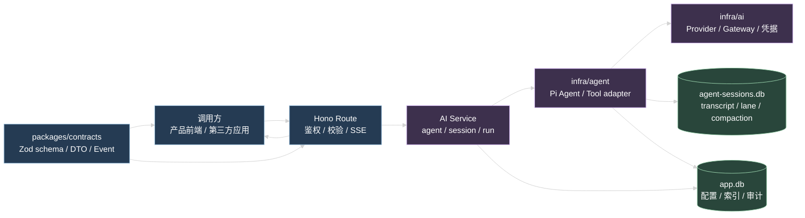
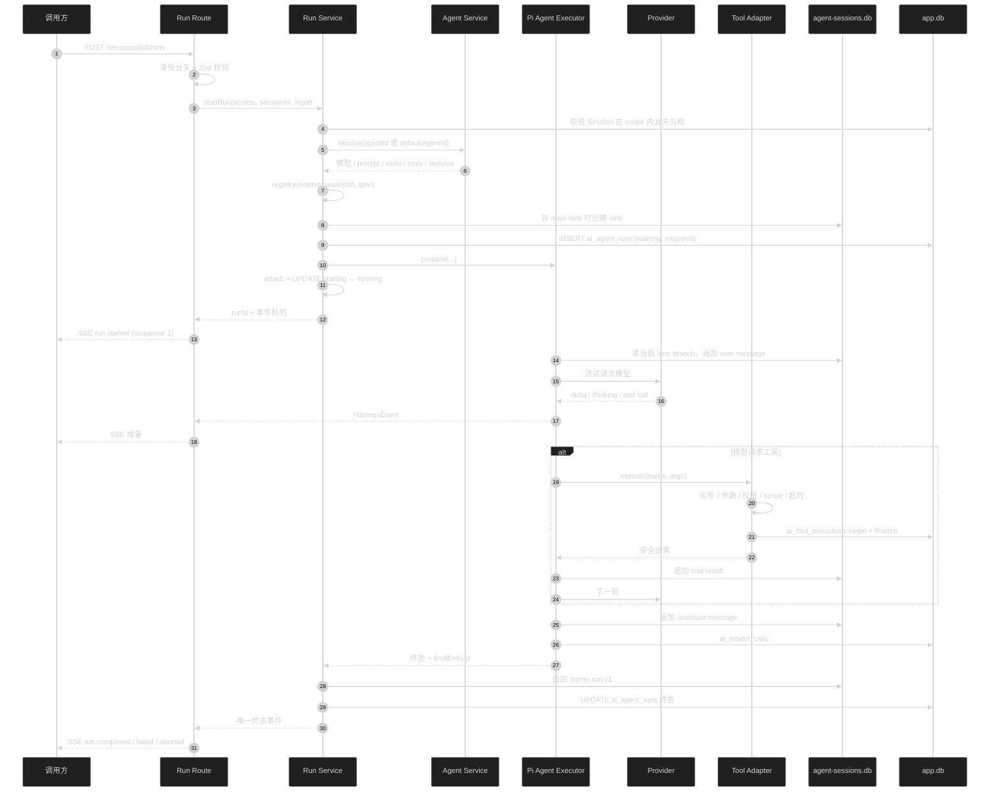
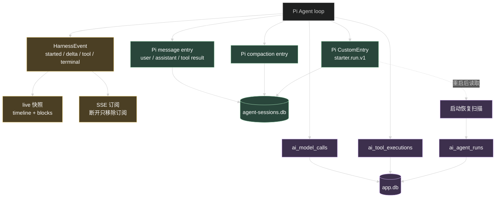
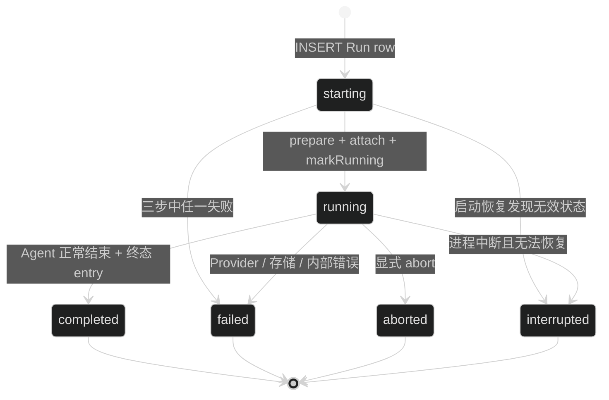
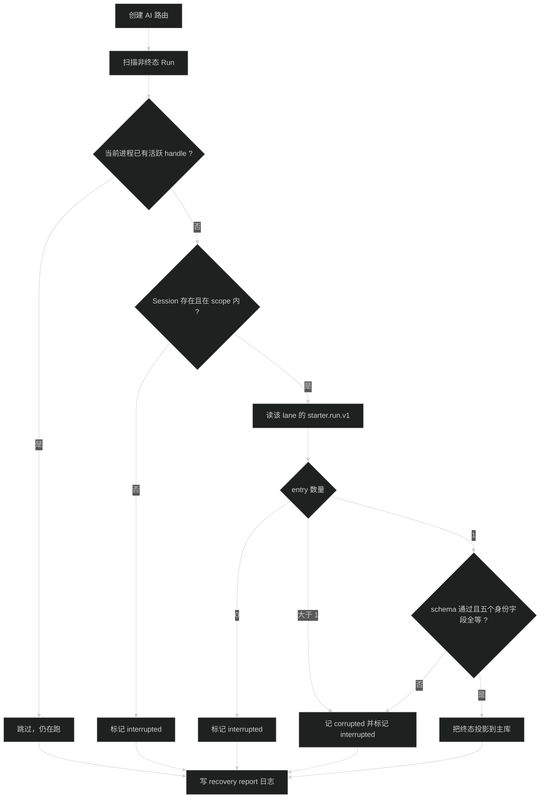

# AI 模块设计

这篇讲 `apps/api` 的 AI 模块怎么组织：谁负责什么、一次输入怎么变成最终输出、状态存在哪、失败时谁负责收尾。改代码前先看这里确认边界，再去 `.trellis/spec/api/backend/` 读对应的实现约束。

## 1. 系统提供两类调用

| 调用           | 入口                                     | 用到什么                                                | 不产生什么                           |
| -------------- | ---------------------------------------- | ------------------------------------------------------- | ------------------------------------ |
| 模型连通性测试 | `POST /api/ai/test`                      | Provider 配置、模型白名单、统一 Gateway                 | 不建 Session、不建 Run、不写 Pi 历史 |
| Agent 运行     | `POST /api/ai/sessions/{sessionId}/runs` | Pi Agent、Pi Session、Tool adapter、SSE、Run 记录、审计 | ——                                   |

下面主要讲第二类。它包含输入校验、模型循环、工具调用、流式事件、持久历史、主库索引、用量审计和进程重启恢复。

## 2. 分层

三条边界不能破：

1. `packages/contracts` 只定义跨端协议，不读数据库，不导入 Pi 类型。
2. 只有 `apps/api/src/infra/agent/` 和 `apps/api/src/infra/ai/` 能碰 Pi 类型、Pi SQLite 和原生模型流。业务 Service 拿到的是已经转好的事件和结果。
3. 前端只调 API 和消费 HarnessEvent，不直接读两个 SQLite，也不读进程内的活跃 Run。控制面在 `apps/admin`，运行面在产品自己的前端。

## 3. 子域职责

代码在 `apps/api/src/modules/ai/`，`ai.route.ts` 负责把它们装起来。

| 子域             | 负责                                                                                     | 不负责                                                      |
| ---------------- | ---------------------------------------------------------------------------------------- | ----------------------------------------------------------- |
| `agent/`         | Agent Definition 的增删改查、状态切换、`revision` 递增、Run 开始前把配置解析成可执行形态 | 不保存 Provider secret、Prompt 正文、Skill 正文和 Tool 实现 |
| `session/`       | Session 归属、标题、`defaultAgentId`、归档、双库创建补偿、transcript 投影                | 不保存历史正文，历史在 Pi 那边                              |
| `run/`           | Run 行、活跃登记、事件序号、对外事件、Pi 终态 entry、终态更新、启动恢复                  | 不跑模型循环，不直接读 Pi Session                           |
| `application/`   | 应用凭据的创建、轮换、撤销、认证和审计事件                                               | 不做频率限制，不限制凭据能用哪个 Agent                      |
| `configuration/` | Provider 配置、认证状态、模型目录与白名单、全局默认模型、用户模型偏好、模型连通性测试    | 不解密 secret，解密在 `infra/ai` 的凭据存储里               |
| `prompt/`        | System Prompt 和 Prompt Template 的维护与可用性判断                                      | 不决定某个 Agent 用哪条，那是 Agent config 的引用           |
| `skill/`         | Skill 文本维护，以及给模型用的 `read_skill` 工具                                         | 不把 Skill 正文塞进 system prompt                           |
| `tool/`          | Tool registry：注册、按名字查找、scope 判断                                              | 不执行工具，执行在 `infra/agent` 的 adapter 里              |
| `usage-audit/`   | 模型调用和工具执行的审计记录、用量查询、Gateway 调用包装                                 | 不作为 Run 状态来源                                         |

`principal.ts` 和 `principal.guard.ts` 是运行面的身份层：`principal.guard.ts` 按有没有 `Authorization: Bearer` 头分叉到应用凭据或 Better Auth，`principal.ts` 把身份转成 `RuntimeAccessContext`（`principal` + `scope`），所有 Session 和 Run 查询都带这个上下文。

Agent Definition 只存引用和执行参数：`schemaVersion: 2`、`providerId` + `modelId`、`systemPromptId`、`skillIds`、`toolRefs`（精确 `{ name, version }`）、`thinkingLevel`、`maxTurns`、`revision`、状态。Run 开始时解析当前可用配置（工具按精确版本解析成 `RegisteredAiTool[]` 直接交给 Executor），并把不含 secret 的 v2 快照写进 `ai_agent_runs.snapshot_json`，所以运行中改 Agent 不会影响已经在跑的 Run。

## 4. 一次 Run 的完整过程

### 4.1 输入阶段的顺序

Run Service 按固定顺序推进，顺序决定了失败时的清理责任：

1. 按 `RuntimeAccessContext` 查 Session，不在 scope 内或已归档都返回 404。
2. 取 `agentId`，请求没传就用 Session 的 `defaultAgentId`，两个都没有返回 400 `COMMON.INVALID_REQUEST`。
3. 解析 Agent：状态必须是 `enabled`（否则 409），模型、System Prompt、Skill 和 Tool 必须当前可用（否则 400 `AI.AGENT_CONFIG_INVALID`，`details.resource` 指出是哪一类）。Tool 还要过 scope 判断，绑定到别的 `tenantId` / `projectId` 的工具解析不到。
4. `registry.reserve(sessionId, lane)`。冲突在建 Run 行之前就返回 409 `AI.SESSION_BUSY`，不会留下垃圾行。
5. 非 `main` lane 先在 Pi 侧创建，失败要 release 已占的 lease 再报 500。
6. 建事件队列、序号发生器和 live 快照。
7. 插入 `starting` Run 行，带无 secret 快照。失败要 release lease。
8. `executor.prepare`、`registry.attach`、`markRunning` 三步任何一步失败，都走 `finalizeRun` 写 `failed` 终态并释放，不能只抛异常。
9. 正常路径发 sequence 1 的 `run.started`，然后异步启动执行。

### 4.2 模型循环

Pi Agent 读当前 lane 的 branch 构造上下文，完整历史来自 Pi Session，不在主库复制。Executor 通过原生流调 Provider，Provider 选择、认证和 AbortSignal 都在 infra 层。

对外可见的部分：

- 每轮发 `turn.started` 和 `turn.completed`，带 `turn` 和 `maxTurns`。撞上限时会追加一轮不带工具的收尾轮，所以收尾轮的 `turn` 会比 `maxTurns` 大 1，协议不做截断。
- 思考内容映射成 `thinking.started` / `thinking.delta` / `thinking.completed`，按 `blockIndex` 区分同一条消息里的多个思考块。`thinkingLevel` 为 `off` 时没有这类事件。
- 上下文压缩写入 Pi entry 成功后发 `context.compacted`，带 `entryId`、`tokensBefore` 和摘要。发事件失败不影响压缩结果，也不改 Run 终态。
- assistant message 的写入和 `message.completed` 用同一个 entry id。user、assistant 和 tool result 都带 `runId`，transcript 投影靠它把消息归到 Run。

SDK 的 partial message、Provider 原始负载和原始错误都不进公开协议。

### 4.3 工具阶段

Tool adapter 的实际顺序是：先 begin 审计（所以很早就已经有一条 running 记录），再查 Run 剩余时长、检查 abort、Zod 参数校验、scope 判断、权限检查，最后绑 timeout 和 AbortSignal 再进 handler。handler 拿到的上下文是已校验输入加 `principal`、`scope`、`userId`、`requestId`、`signal` 和 `reportProgress`。

工具入参、原始结果和 Provider 负载都不落库，公开事件最多带 `safeSummary`（上限 1000 字符）。工具自己可以通过 `reportProgress` 报进度，映射成 `tool.progress`，不喂给模型，也不产生额外审计。

工具失败（包括工具自己超时）不终止 Run：生成一份安全结果交回模型，由 Agent 决定下一轮。工具的实际超时是 `min(工具自己的 timeoutMs, Run 剩余时长)`。只有两种工具层情况会终止 Run：用户取消（`AI.REQUEST_ABORTED`），以及 Run 剩余时长已为 0 但模型还要调工具（`AI.TOOL_TIMED_OUT`）。每条 begin 过的审计都必须 finalize，不留悬空的 running 记录。

权限检查目前直接拿 `externalUserId` 去查 Starter 授权表，没有 principalKind 判据。结果是：应用凭据传的 id 在 Starter 里不存在时返回 `AI.TOOL_FORBIDDEN`，而它恰好等于某个 Starter 用户 id 时会拿到那个用户的权限。当前内置工具的 `requiredPermission` 都是 `null`，暂时没有可利用面；新增带权限的工具前先把这一层判据补上。

## 5. 四种产物

一次 Run 同时产生四类结果，用途不同，不能互相替代：

| 结果                | 用途                            | 存在哪              | 对外形态                      |
| ------------------- | ------------------------------- | ------------------- | ----------------------------- |
| HarnessEvent        | 实时展示                        | 进程内有界队列      | SSE                           |
| live 快照           | 断线重连后接回进行中的视图      | 进程内，按 runId 存 | `GET /runs/{runId}` 的 `live` |
| Pi transcript entry | Session 完整历史和 Run 终态事实 | `agent-sessions.db` | transcript 投影               |
| 主库记录            | 查询、归属、状态、审计          | `app.db`            | Run 和用量接口的白名单字段    |

### 5.1 事件

信封固定是 `version`、`eventId`、`sequence`、`sessionId`、`runId`、`lane`、`createdAt`、`type`、`data`。`sequence` 由单个 Run 的序号发生器分配，严格递增。SSE 的 `id` 是 `eventId`，`event` 是 `type`，`data` 是完整事件 JSON，心跳是 SSE 注释行不算事件。

事件只存在进程内的有界队列里，队列超限会关掉当前 transport。它不是历史日志：断线期间的事件拿不回来，持久事实看 transcript、Pi 终态 entry 和主库 Run 行。

SSE 断开不 abort Run。Route 只停止往这个连接写数据，Agent 继续跑、继续写 Pi 历史、继续写主库终态。

### 5.2 live 快照

`live` 解决的是「刷新页面后正在生成的内容消失」：assistant message 要等生成结束才写进 Pi DB，在那之前既不在事件队列历史里，也不在 transcript 里。

关键约束：

- 判据是 Run row 状态，不是活跃登记的 handle。`finalizeRun` 先更新主库终态、再 release 登记，按 handle 判断会在这个窗口返回「终态 + 非空快照」的非法组合。
- 折叠逻辑只有一处：`run/run.live-snapshot.ts`。产品前端自己折叠时按同一规则实现，用 `test-fixtures/harness-timeline-isomorphism.json` 双向校验。
- timeline 上限 128 条，单条 message 的块上限 64，超限丢最旧的，避免长 Run 内存无界增长。
- `message.completed` 到达时，消息里只有一个 text 块就用事件的 `content` 覆盖，一个都没有且 `content` 非空就追加，有多个 text 块则保留 delta 累积出的原始顺序。不能重排 thinking 块，也不能把多个 text 块合成一个。

### 5.3 两个 SQLite

`agent-sessions.db`（路径来自 `AGENT_SESSION_DATABASE_PATH`，默认 `./data/agent-sessions.db`）存 Session metadata、lane 树和 branch、user / assistant / tool result message、压缩 entry、`starter.run.v1` 终态 entry。它不存 Starter 用户归属、Provider secret、Agent 业务配置和主库 Run 索引。

`app.db`（`DATABASE_PATH`，默认 `./data/app.db`）存 AI 配置、业务索引和审计。表清单和禁止落库的字段见 [maintenance.md](./maintenance.md)。

读 transcript 必须从指定 lane 的叶子往回读 branch，不能把整棵 Session 树当成当前 lane 的历史。API 读 `limit + 1` 条，只有确实还有下一条时才返回 `nextCursor`。

## 6. Run 状态和唯一终态

终态写入顺序固定：

1. 等 Executor 的结果。
2. 往 Pi 写 `starter.run.v1`。
3. 条件更新 `ai_agent_runs`，只允许从非终态更新。
4. 主库更新成功才发唯一的终态事件。
5. 结束事件队列，删掉 live 快照，释放活跃登记和 lane lease。

两种偏离路径：

- Pi 终态 entry 写失败：主库改成 `failed` + `AI.SESSION_STORAGE_FAILED`，主库更新成功才发 `run.failed`。
- Pi entry 写成功但主库更新失败：不发终态事件，留给下一次启动恢复处理。

有两个超时会打断执行，别混起来：

| 超时            | 默认值    | 来源                                       | 打断谁                                                            |
| --------------- | --------- | ------------------------------------------ | ----------------------------------------------------------------- |
| 单次模型请求    | 60000 ms  | `AI_REQUEST_TIMEOUT_MS`                    | 这一次模型请求，Run 按失败收尾，错误码 `AI.UPSTREAM_TIMEOUT`      |
| 单个 Run 总时长 | 120000 ms | Executor 的 `maxRunMs`，当前没有接环境变量 | 整个 Run，abort 掉 Agent，终态写 `failed` + `AI.UPSTREAM_TIMEOUT` |

`aborted` 的 `errorCode` 一定是 `AI.REQUEST_ABORTED`，`interrupted` 一定是 `AI.RUN_INTERRUPTED`，这两条在协议 schema 里强校验。

## 7. 启动恢复

创建 AI 路由时会扫一遍非终态 Run：

合法的终态 entry 必须同时匹配 `runId`、`sessionId`、`lane`、`agentId`、`agentRevision`。结构合法但身份字段不匹配也算损坏，不能只按 `runId` 接受。

## 8. 鉴权与隔离

运行面的身份有两种，落到同一个 `RuntimeAccessContext`：

| 身份           | 来源                             | `tenantId` / `projectId` | `externalUserId`             | subject                                                          |
| -------------- | -------------------------------- | ------------------------ | ---------------------------- | ---------------------------------------------------------------- |
| `starter_user` | Better Auth Cookie               | 都是 `starter`           | Starter 用户 id              | 都是 `null`                                                      |
| `product_app`  | `Authorization: Bearer <secret>` | 来自应用凭据             | 来自 `X-AI-External-User-Id` | 来自 `X-AI-Subject-Type` / `X-AI-Subject-Id`，要么都给要么都不给 |

Session 查询条件按身份分两套：Starter 用户按 `principalKind` + `ownerId` + tenant + project；应用凭据按 `principalKind` + `appId` + tenant + project + `externalUserId` + subject 两个字段，全等才可见。Run 查询挂在 Session 上，跟着同一套条件。

资源不存在、属于别人和已归档统一返回 404，不泄露资源是否存在。

控制面走的是另一套：Better Auth 登录态，大部分端点再加权限点（`AI_CONFIG_READ`、`AI_CONFIG_MANAGE`、`AI_USAGE_READ`）。例外是 `POST /api/ai/test`、`GET /api/ai/skills`、`GET /api/ai/prompt-templates` 和兼容面的三个端点，它们只挂了 `requireAuth`，任何已登录用户都能调。应用凭据调控制面接口拿不到授权。

secret 只能由 `infra/ai` 的凭据存储解密。这些位置禁止出现 secret：Agent config、Run 快照、Session DTO、transcript、HarnessEvent、审计记录、日志和错误响应。应用凭据只存 sha256 哈希和前 12 位前缀，认证时按前缀查候选再做定长比较。

## 9. 设计约束

不要在这些地方开第二套实现：

- 不在业务 Service 里复制 Pi 的 Agent loop、Tool loop、压缩或 Session reducer。
- 不在 Route 里遍历 Executor 事件，也不在 Route 里直接读 Pi Session。
- 不在主库复制完整 transcript。
- 不把 HarnessEvent 当可靠历史，也不把 `ai_model_calls` 当 Run 状态来源。
- 不在前端用 localStorage 或本地缓存恢复业务状态。
- 不提前加分布式队列、跨节点活跃登记和多进程共享的 Run 注册表。当前活跃登记是单进程的。

## 10. 继续读

| 需求                                     | 去哪                                                         |
| ---------------------------------------- | ------------------------------------------------------------ |
| 改代码、加扩展点、跑验收、排查故障       | [maintenance.md](./maintenance.md)                           |
| 第三方应用接入                           | [integration.md](./integration.md)                           |
| Run API、并发、SSE、终态、恢复的实现约束 | `.trellis/spec/api/backend/agent-run-guidelines.md`          |
| Session 归属、双库补偿、cursor 语义      | `.trellis/spec/api/backend/agent-session-guidelines.md`      |
| Pi Agent、Tool adapter、压缩、执行审计   | `.trellis/spec/api/backend/pi-agent-execution-guidelines.md` |
| Provider、模型目录、凭据、Gateway、用量  | `.trellis/spec/api/backend/ai-integration-guidelines.md`     |
