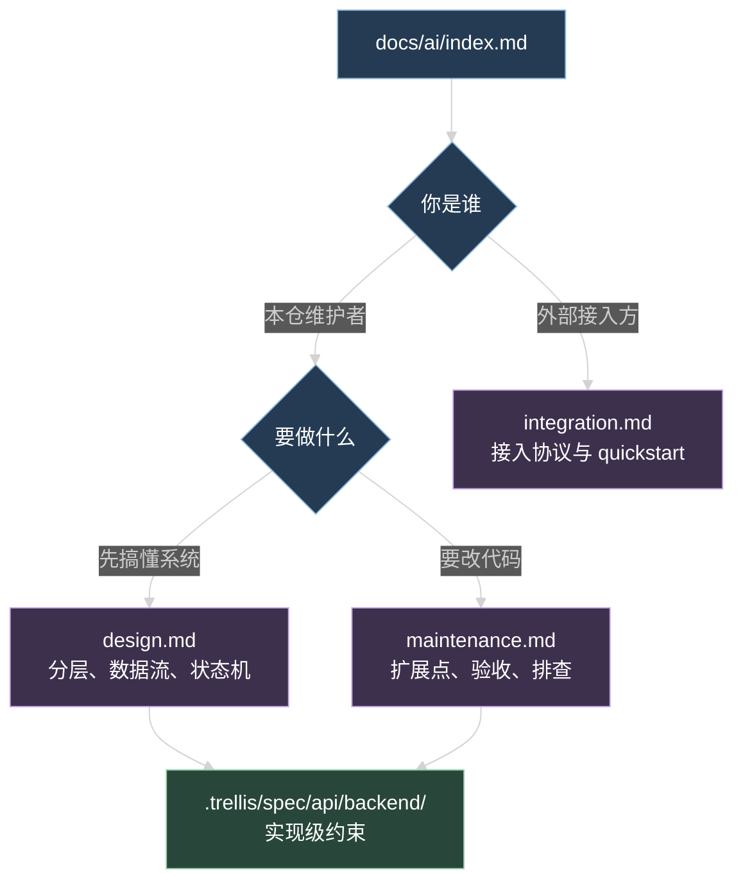

# AI 模块文档

这套 AI 能力做的事：管理员在 Admin 后台配好 Provider、模型白名单和 Agent，产品端用 Session 加 Run 跑对话，第三方应用拿一份应用凭据接同一套运行面接口。执行内核是 Pi Agent，模型流、工具循环和会话历史都由它负责，API 只做配置解析、归属校验、事件外发和审计。

代码在 `apps/api/src/modules/ai/`，跨端协议在 `packages/contracts/src/ai.ts`，管理界面在 `apps/admin`，运行面参考实现在 `apps/web` 的 chat 页面。

## 三份文档怎么选

- [design.md](./design.md)：模块分层、一次 Run 的完整数据流、Run 状态机、双库分工、鉴权与隔离模型。
- [maintenance.md](./maintenance.md)：新增 Provider、Tool、Skill、Prompt、Agent 或事件类型时改哪些文件，验收命令，运维动作，故障排查。
- [integration.md](./integration.md)：第三方应用接入协议，凭据、请求头、Runtime 接口、SSE 消费、错误码、当前限制。这篇自洽，不要求读过前两篇。

`.trellis/spec/api/backend/` 下的规范是给 AI 编码代理看的实现级约束，比这三篇更细也更死板。人读优先看这里，写代码前再去看规范。

## 术语

这三篇文档里同一概念只用一个称呼，先说清楚每个词指什么：

| 术语                            | 是什么                                                                                                                     | 不是什么                                                                         |
| ------------------------------- | -------------------------------------------------------------------------------------------------------------------------- | -------------------------------------------------------------------------------- |
| Agent Definition                | 可复用的执行配置：模型引用、System Prompt 引用、Skill 引用、Tool 名称白名单、`thinkingLevel`、`maxTurns`、`revision`、状态 | 不是运行实例，也不存 Provider secret、Prompt 正文和 Tool handler                 |
| Agent Session                   | 用户或应用拥有的持久上下文，`id` 同时是 Pi Session 的 id                                                                   | 不绑定单个 Agent，同一 Session 的不同 Run 可以换 Agent                           |
| Agent Run                       | 一个 Agent 在某个 Session 和 lane 上的一次执行，有 `starting`、`running` 和四种终态                                        | 不是一条消息，一次 Run 可能产生多轮模型调用和多次工具执行                        |
| lane                            | Session 内的分支名，默认 `main`，格式受 `agentLaneSchema` 限制                                                             | 不是聊天频道，也不是权限单位；同一 `sessionId + lane` 同时只能跑一个 Run         |
| Principal                       | 调用身份，两种：`starter_user`（Better Auth Cookie）和 `product_app`（应用凭据）                                           | 不是角色权限，控制面权限走 `PermissionKeys` 那套                                 |
| Scope                           | 数据可见范围，由 `tenantId`、`projectId`、`externalUserId`、`subjectType`、`subjectId` 组成                                | 不是租户隔离产品功能，只是查询条件；换一个 subject 就看不到原来的 Session        |
| HarnessEvent                    | 一次 Run 的实时事件，走 SSE 下发，`sequence` 在单个 Run 内递增                                                             | 不是历史日志，只存在进程内有界队列，断开重连拿不到已错过的事件                   |
| Transcript                      | Pi Session 持久历史的对外投影，按 lane 读，`items` 时间正序                                                                | 不在 Starter 主库，是另一个 SQLite 文件里的 Pi entry 投影出来的                  |
| live 快照                       | `AgentRun.live` 字段，Run 进行中的进程内视图，带 `timeline`                                                                | 不是持久事实，Run 进终态或 API 重启后就是 `null`                                 |
| Provider                        | 模型服务方的配置和认证状态，附一份启用模型白名单                                                                           | 不是模型本身，一个 Provider 下有多个模型                                         |
| System Prompt / Prompt Template | 存在主库的提示词正文，Agent 通过 `systemPromptId` 引用                                                                     | 不进 Agent config 快照，Run 开始时按引用解析当前正文                             |
| Skill                           | 存在主库的技能文本，模型用 `read_skill` 工具按名字读                                                                       | 不是 Tool，Skill 是内容，Tool 是可执行函数；可用技能清单当前不会自动进系统提示词 |
| Tool                            | 注册在 tool registry 里的函数，有 Zod 参数 schema、权限要求和超时                                                          | 不由 Agent Definition 定义实现，Agent 只给名称白名单                             |
| 用量审计                        | `ai_model_calls` 和 `ai_tool_executions` 两张表，存 Provider、模型、耗时、token、状态和错误码                              | 不存 prompt、响应正文、工具入参和工具结果                                        |

## 三个接口面

AI 路由现有 53 个端点，OpenAPI tag 分三面，别混着用：

| 面     | tag                | 端点范围                                                                                                   | 调用方                 | 认证                                     |
| ------ | ------------------ | ---------------------------------------------------------------------------------------------------------- | ---------------------- | ---------------------------------------- |
| 控制面 | `AI Control`       | Provider、模型目录与白名单、Prompt、Skill、Agent Definition、应用凭据、Tool 摘要、用量审计、模型连通性测试 | Admin 后台             | Better Auth Cookie，大部分端点再加权限点 |
| 运行面 | `AI Runtime`       | 可用 Agent 摘要、Session、Run、Transcript、HarnessEvent SSE                                                | 产品前端、第三方应用   | Cookie 或应用凭据                        |
| 兼容面 | `AI Compatibility` | `GET /api/ai/models`、`GET /api/ai/preferences`、`PUT /api/ai/preferences`                                 | Starter 自己的用户设置 | Better Auth Cookie                       |

兼容面依赖 Starter 用户模型和用户偏好表，不是跨产品运行协议，第三方不要接。

自有 JSON 接口统一返回 `{ ok, data, meta }` 或 `{ ok, error, meta }`。唯一例外是启动 Run，它直接返回 `text/event-stream`。

## 代码位置

| 关注点                 | 位置                                                                                                                                     |
| ---------------------- | ---------------------------------------------------------------------------------------------------------------------------------------- |
| 业务模块               | `apps/api/src/modules/ai/`，按子域分 `agent`、`application`、`configuration`、`prompt`、`run`、`session`、`skill`、`tool`、`usage-audit` |
| 模块组装               | `apps/api/src/modules/ai/ai.route.ts`                                                                                                    |
| 数据表定义             | `apps/api/src/modules/ai/ai.schema.ts`                                                                                                   |
| Pi Agent 执行          | `apps/api/src/infra/agent/`                                                                                                              |
| Provider 与 Gateway    | `apps/api/src/infra/ai/`                                                                                                                 |
| 跨端协议               | `packages/contracts/src/ai.ts`                                                                                                           |
| 管理界面               | `apps/admin/src/features/ai/`、`apps/admin/src/api/ai/`                                                                                  |
| 运行面参考实现         | `apps/web/lib/ai/`、`apps/web/hooks/use-chat-run.ts`、`apps/web/app/(site)/chat/`                                                        |
| API 测试               | `apps/api/src/test/ai-*.test.ts`                                                                                                         |
| 流式与历史同构 fixture | `test-fixtures/harness-timeline-isomorphism.json`                                                                                        |

## 实现级规范

改代码前按改动范围读对应的一份：

| 文件                                                         | 覆盖什么                                              |
| ------------------------------------------------------------ | ----------------------------------------------------- |
| `.trellis/spec/api/backend/ai-system-design.md`              | 系统总览、数据流、终态顺序、恢复扫描、设计约束        |
| `.trellis/spec/api/backend/agent-run-guidelines.md`          | Run API、并发、SSE、终态和启动恢复                    |
| `.trellis/spec/api/backend/agent-session-guidelines.md`      | Session 归属、双库创建补偿、transcript 投影和 cursor  |
| `.trellis/spec/api/backend/pi-agent-execution-guidelines.md` | Pi Agent、模型流、Tool adapter、compaction、执行审计  |
| `.trellis/spec/api/backend/ai-integration-guidelines.md`     | Provider、模型目录、凭据、Gateway、模型测试、用量审计 |
| `.trellis/spec/web/frontend/ai-runtime-consumer.md`          | 前端消费运行面协议的已验证做法                        |
