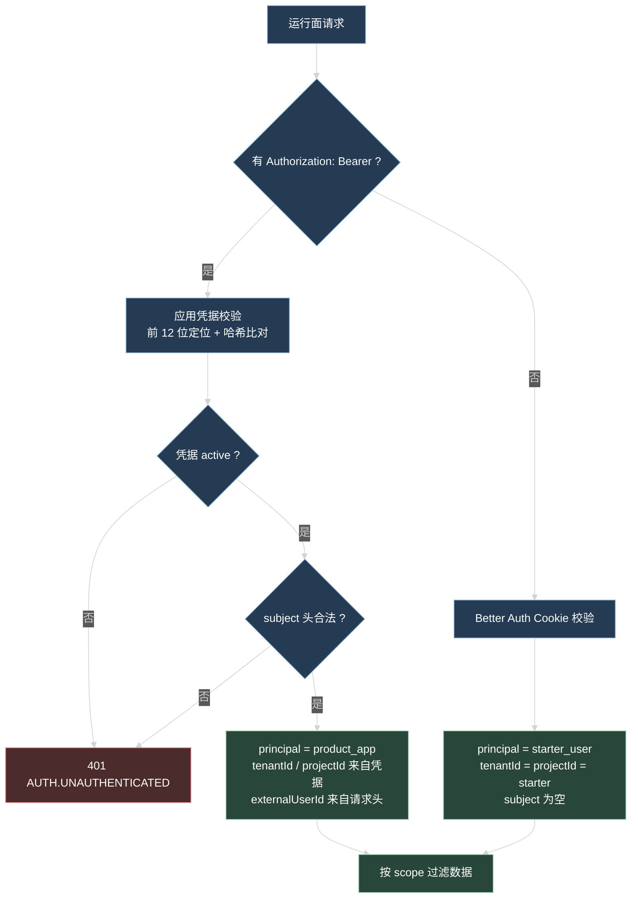
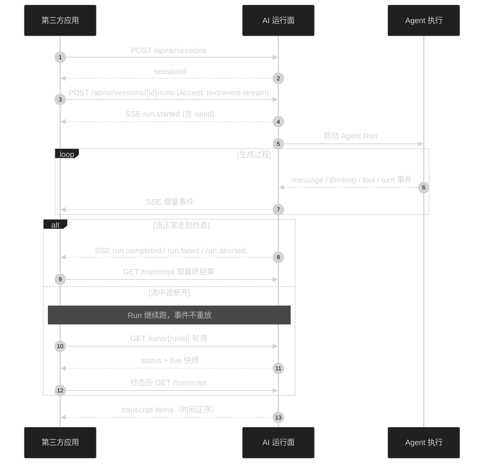

# 第三方应用接入 AI 运行面

这篇讲第三方应用怎么调用 AI 运行面：拿一份应用凭据，用自己的用户标识创建会话，启动一次 Agent 运行，读 SSE 拿增量输出，断线后接回结果。全文只涉及对外协议，不需要读 Starter 源码。

开发环境的 API 地址是 `http://localhost:7788`，下面的示例统一写成 `$API_BASE`。

## 1. 接入前提

需要平台方（Starter 管理员）给你三样东西：

| 东西            | 说明                                                                                                    |
| --------------- | ------------------------------------------------------------------------------------------------------- |
| 应用凭据 secret | 形如 `ai_` 开头的字符串，只在创建和轮换时返回一次，后台不再回显                                         |
| `agentId`       | 要用哪个 Agent。运行面的 Agent 列表接口目前只认浏览器登录态，应用凭据拉不到，所以这个 id 必须由管理员给 |
| API 地址        | 生产环境的 base URL                                                                                     |

凭据信息里还有 `tenantId` 和 `projectId`，它们在创建凭据时确定，之后不能改。你的所有数据都落在这两个值下面。

secret 一旦丢失只能轮换，拿不回原值。轮换后旧 secret 立即失效。

## 2. 鉴权

两种身份共用同一套运行面接口，按有没有 `Authorization: Bearer` 头分叉：



### 2.1 请求头

| 头                      | 必填 | 约束                                                                 |
| ----------------------- | ---- | -------------------------------------------------------------------- |
| `Authorization`         | 是   | `Bearer <secret>`，secret 前后不留空格                               |
| `X-AI-External-User-Id` | 是   | 你自己系统的用户标识，1 到 240 字符                                  |
| `X-AI-Subject-Type`     | 否   | 业务对象类型，小写字母开头，只能用字母、数字、`.`、`_`、`-`，最长 80 |
| `X-AI-Subject-Id`       | 否   | 业务对象标识，最长 240                                               |

`X-AI-Subject-Type` 和 `X-AI-Subject-Id` 必须同时给或同时不给，只给一个直接 401。头不合法和凭据不合法返回同一个 401 `AUTH.UNAUTHENTICATED`，不区分原因。

subject 这一对头的用途是把会话再切一层：同一个用户在不同工单、不同文档下的会话互相看不见。不需要这层就两个头都不传。

### 2.2 数据可见范围

应用凭据的每次查询都按下面六个值全等匹配，任意一个不同就查不到：

```
appId + tenantId + projectId + externalUserId + subjectType + subjectId
```

后果要提前想清楚：

- 换 subject 之后，之前创建的 Session 在列表里不出现，直接按 id 查也是 404。
- 同一个凭据下不同 `externalUserId` 的数据互不可见，不用担心串号。
- 凭据轮换不影响数据归属，`appId` 不变。
- 凭据被撤销后，这些数据仍在库里，但用新凭据（新 `appId`）访问不到。

## 3. quickstart

### 3.1 管理员创建应用凭据

正常在 Admin 后台点按钮完成。要用命令行，需要管理员登录态和 AI 配置管理权限：

```bash
curl -X POST "$API_BASE/api/ai/admin/applications" \
  -b cookie.txt \
  -H 'Content-Type: application/json' \
  -d '{"name":"工单助手","tenantId":"acme","projectId":"helpdesk"}'
```

```json
{
  "ok": true,
  "data": {
    "application": {
      "appId": "019...",
      "name": "工单助手",
      "tenantId": "acme",
      "projectId": "helpdesk",
      "status": "active",
      "secretPrefix": "ai_3Kf9QxTzP",
      "createdAt": "2026-08-23T02:10:00.000Z",
      "updatedAt": "2026-08-23T02:10:00.000Z",
      "lastUsedAt": null,
      "revokedAt": null
    },
    "secret": "ai_3Kf9QxTz..."
  },
  "meta": { "requestId": "...", "timestamp": "2026-08-23T02:10:00.000Z" }
}
```

`tenantId` 和 `projectId` 的格式是首字符为字母、数字或下划线，之后可以带 `.`、`:`、`-`，最长 120 字符。

轮换和撤销：

```bash
curl -X POST "$API_BASE/api/ai/admin/applications/$APP_ID/rotate" -b cookie.txt
curl -X POST "$API_BASE/api/ai/admin/applications/$APP_ID/revoke" -b cookie.txt
```

轮换返回结构和创建一样，带新的 `secret`。对已撤销的凭据轮换会返回 409 `AI.APP_CREDENTIAL_REVOKED`。

### 3.2 创建 Session

下面的命令重复用同一组头，先定一个 shell 函数：

```bash
ai() {
  curl -sS \
    -H "Authorization: Bearer $AI_SECRET" \
    -H 'X-AI-External-User-Id: u_1024' \
    -H 'X-AI-Subject-Type: ticket' \
    -H 'X-AI-Subject-Id: T-8899' \
    "$@"
}
```

```bash
ai -X POST "$API_BASE/api/ai/sessions" \
  -H 'Content-Type: application/json' \
  -d '{"title":"工单 T-8899","defaultAgentId":"019..."}'
```

`title` 省略时是「新会话」，最长 120 字符。`defaultAgentId` 省略时后面每次启动 Run 都要显式传 `agentId`。

响应里的 `data.id` 就是 `sessionId`，自己存下来，运行面没有「按 subject 查 Session」的接口，列表接口只能翻页找。

### 3.3 启动 Run 并读 SSE

```bash
ai -N -X POST "$API_BASE/api/ai/sessions/$SESSION_ID/runs" \
  -H 'Accept: text/event-stream' \
  -H 'Content-Type: application/json' \
  -d '{"input":"帮我总结这个工单的处理进度"}'
```

这个接口返回 `text/event-stream`，不是 `{ ok, data, meta }`。`-N` 关掉缓冲才能看到增量。

请求体三个字段：`input` 必填，去掉首尾空白后 1 到 100000 字符；`agentId` 可选，不传就用 Session 的 `defaultAgentId`，两个都没有返回 400；`lane` 可选，默认 `main`。

流的样子：

```text
id: 019a...
event: run.started
data: {"version":1,"eventId":"019a...","sequence":1,"sessionId":"019...","runId":"019...","lane":"main","createdAt":"...","type":"run.started","data":{"agentId":"019...","agentRevision":3,"model":{"providerId":"anthropic","modelId":"claude-sonnet-4-6"}}}

: heartbeat

id: 019b...
event: message.delta
data: {"version":1,...,"type":"message.delta","data":{"messageId":"019...","delta":"这个工单"}}
```

### 3.4 断流后轮询 Run 状态

SSE 断开不会中止 Run，服务端继续跑。重连拿不到已经错过的事件，改成轮询：

```bash
ai "$API_BASE/api/ai/sessions/$SESSION_ID/runs/$RUN_ID"
```

`data.status` 是 `starting` 或 `running` 时，`data.live` 带一份进行中的视图：`lastSequence`、`turn`、`maxTurns` 和一条 `timeline`。`timeline` 元素按 `kind` 分三种：`message`（内含有序 `blocks`，`text` 是正文，`thinking` 是思考内容）、`tool`、`compaction`。

Run 进终态后 `live` 是 `null`，这时读 transcript 拿最终结果。API 重启也会让 `live` 变成 `null`：如果 Run 已经把终态写进会话存储，重启后会恢复成真实终态（`completed` / `failed` / `aborted`）；只有恢复不回来的才变 `interrupted`。

### 3.5 读 transcript

```bash
ai "$API_BASE/api/ai/sessions/$SESSION_ID/transcript?lane=main&limit=50"
```

`items` 始终时间正序。默认 `direction=backward`，不带 `cursor` 就是最新一页，`nextCursor` 指向更早一页；`nextCursor` 为 `null` 表示没有更早的了。

四种 item：

| `type`              | 关键字段                                                                                                        |
| ------------------- | --------------------------------------------------------------------------------------------------------------- |
| `user_message`      | `runId`、`content`                                                                                              |
| `assistant_message` | `runId`、`content`、可选 `blocks`、`status`、`model`、`stopReason`、`errorCode`、可选 `usage`、可选 `toolCalls` |
| `tool_activity`     | `runId`、`toolCallId`、`name`、`status`、`errorCode`、`safeSummary`                                             |
| `system`            | `kind` 固定 `compaction`、`summary`、可选 `tokensBefore`                                                        |

`content` 只拼 `text` 块；要按原顺序展示思考内容和正文，用 `blocks`。

### 3.6 停止生成

```bash
ai -X POST "$API_BASE/api/ai/sessions/$SESSION_ID/runs/$RUN_ID/abort"
```

只有当前 API 进程仍持有这个 Run 时能 abort，否则 409 `AI.RUN_NOT_ACTIVE`。先 abort 接口、再断开自己的读流，顺序反了服务端会继续跑到底。

## 4. 一次完整接入的顺序



## 5. Runtime 接口

所有 JSON 接口返回 `{ ok, data, meta }` 或 `{ ok, error, meta }`，`meta.requestId` 建议记到你自己的日志里，排查时给平台方。

| 方法   | 路径                                                   | 请求                                                                                        | 响应                     | 应用凭据可用        |
| ------ | ------------------------------------------------------ | ------------------------------------------------------------------------------------------- | ------------------------ | ------------------- |
| GET    | `/api/ai/agents`                                       | `page`、`pageSize`（默认 1 / 20，`pageSize` 上限 100）                                      | 已启用 Agent 摘要分页    | 不可用，只认 Cookie |
| GET    | `/api/ai/agents/{agentId}`                             | 无                                                                                          | Agent 摘要               | 不可用，只认 Cookie |
| POST   | `/api/ai/sessions`                                     | `title?`、`defaultAgentId?`                                                                 | `AgentSession`           | 可用                |
| GET    | `/api/ai/sessions`                                     | `page`、`pageSize`                                                                          | Session 分页，不含已归档 | 可用                |
| GET    | `/api/ai/sessions/{sessionId}`                         | 无                                                                                          | `AgentSession`           | 可用                |
| PATCH  | `/api/ai/sessions/{sessionId}`                         | `title?`、`defaultAgentId?`，至少一个                                                       | `AgentSession`           | 可用                |
| DELETE | `/api/ai/sessions/{sessionId}`                         | 无                                                                                          | 归档后的 `AgentSession`  | 可用                |
| GET    | `/api/ai/sessions/{sessionId}/transcript`              | `lane`（默认 `main`）、`cursor?`、`limit`（1-200，默认 50）、`direction`（默认 `backward`） | `items` + `nextCursor`   | 可用                |
| POST   | `/api/ai/sessions/{sessionId}/runs`                    | `input`、`agentId?`、`lane?`                                                                | `text/event-stream`      | 可用                |
| GET    | `/api/ai/sessions/{sessionId}/runs/{runId}`            | 无                                                                                          | `AgentRun`，可选 `live`  | 可用                |
| POST   | `/api/ai/sessions/{sessionId}/runs/{runId}/abort`      | 无                                                                                          | `AgentRun`               | 可用                |
| POST   | `/api/ai/sessions/{sessionId}/runs/{runId}/steer`      | `text`                                                                                      | `AgentRun`               | 可用                |
| POST   | `/api/ai/sessions/{sessionId}/runs/{runId}/follow-ups` | `text`                                                                                      | `AgentRun`               | 可用                |

`DELETE` 是归档，不删数据：`archivedAt` 被填上，Session 从默认列表消失，不能再启动 Run，transcript 接口也读不到了（返回 404）。历史还在服务端，但没有接口能再拿到，需要的话归档前先把 transcript 拉走。

`steer` 和 `follow-ups` 需要 Run 正在运行（否则 409 `AI.RUN_NOT_ACTIVE`）：`steer` 把一段文字插进当前运行，让模型马上改方向；`follow-ups` 把文字排到当前轮之后继续。两者都不开新的 Run，也不返回新的事件流，新内容从原来那条 SSE 连接出来。

`AgentRun` 的字段：`id`、`sessionId`、`agentId`、`agentRevision`、`lane`、`status`、`snapshot`、`requestId`、`finalEntryId`、`errorCode`、`createdAt`、`startedAt`、`finishedAt`、可选 `live`。`status` 六种：`starting`、`running`、`completed`、`failed`、`aborted`、`interrupted`。非终态时 `finishedAt`、`finalEntryId`、`errorCode` 一定是 `null`；终态时 `live` 一定是 `null`（字段还在，只是没内容）。

OpenAPI 里这些运行面端点的 `security` 只声明了 `cookieAuth`（transcript 那个端点连声明都没写），实际同样接受应用凭据，声明没跟上实现。

## 6. 消费 HarnessEvent

### 6.1 事件信封

每个事件都有这些字段：

```ts
{
  version: 1;
  eventId: string; // SSE 的 id
  sequence: number; // 单个 Run 内从 1 递增
  sessionId: string;
  runId: string;
  lane: string;
  createdAt: string; // ISO 时间
  type: string; // SSE 的 event
  data: object; // 随 type 变化
}
```

16 种 `type`：

```text
run.started
turn.started
message.started
message.delta
thinking.started
thinking.delta
thinking.completed
message.completed
tool.started
tool.progress
tool.completed
context.compacted
turn.completed
run.completed
run.failed
run.aborted
```

一条 assistant 回答的完整过程是 `message.started`、若干 `message.delta` 和 `thinking.*`、最后一个 `message.completed`。`message.completed` 带完整 `content`、`stopReason`、`errorCode` 和可选 `usage`，`content` 只包含正文，思考内容只走 `thinking.*`。

`run.completed`、`run.failed`、`run.aborted` 三者只会出现一个，出现即 Run 已进终态。`run.completed.data.reason` 是 `model_finished` 或 `max_turns`，后者表示撞上轮次上限、最后一段文字来自收尾轮；这个标记只在事件里，刷新后查不到。`run.failed.data.error.retryable` 为 `true` 的只有上游报错、上游超时和 Provider 认证失败三类。

### 6.2 SSE 帧解析

自己解析时按这几条来，少一条就会出问题：

- 按空行切帧，同时兼容 `\n\n` 和 `\r\n\r\n`；切完保留最后一段残帧，等下一个 chunk 拼上。
- 只取 `data:` 行。`id:` 和 `event:` 的内容在 JSON 里都有，冒号开头的行是注释。
- 服务端每 15 秒发一次 `: heartbeat`，它不是事件，跳过。
- 单帧 `JSON.parse` 失败只丢这一帧，不要中断整个流。
- 流可能在没有终态事件的情况下结束。收到过事件就转轮询，一个事件都没收到才算启动失败。
- 重连或轮询后按 `sequence` 去重，小于等于已处理值的事件丢掉。

因为是 POST 请求，浏览器的 `EventSource` 用不了，自己读 response body。

### 6.3 TypeScript 示例

```ts
const base = process.env.AI_API_BASE!;

function aiHeaders(extra?: Record<string, string>): Record<string, string> {
  return {
    Authorization: `Bearer ${process.env.AI_SECRET!}`,
    "X-AI-External-User-Id": "u_1024",
    "X-AI-Subject-Type": "ticket",
    "X-AI-Subject-Id": "T-8899",
    ...extra,
  };
}

async function aiJson<T>(path: string, init?: RequestInit): Promise<T> {
  const response = await fetch(`${base}${path}`, {
    ...init,
    headers: aiHeaders(
      init?.body ? { "Content-Type": "application/json" } : {},
    ),
  });
  const body = (await response.json()) as
    | { ok: true; data: T }
    | { ok: false; error: { code: string; message: string } };
  if (!body.ok) throw new Error(`${body.error.code}: ${body.error.message}`);
  return body.data;
}

// 1. 建会话
const session = await aiJson<{ id: string }>("/api/ai/sessions", {
  method: "POST",
  body: JSON.stringify({ title: "工单 T-8899", defaultAgentId: agentId }),
});

// 2. 启动 Run 并读事件
function parseFrame(frame: string): unknown | undefined {
  const data = frame
    .split(/\r?\n/)
    .filter((line) => line.startsWith("data:"))
    .map((line) => line.slice(5).trim())
    .join("\n");
  if (!data) return undefined;
  try {
    return JSON.parse(data);
  } catch {
    return undefined; // 坏帧只丢这一帧
  }
}

async function* streamRun(
  sessionId: string,
  input: string,
  signal: AbortSignal,
) {
  const response = await fetch(`${base}/api/ai/sessions/${sessionId}/runs`, {
    method: "POST",
    signal,
    headers: aiHeaders({
      "Content-Type": "application/json",
      Accept: "text/event-stream",
    }),
    body: JSON.stringify({ input }),
  });
  if (!response.ok || !response.body) {
    throw new Error(`启动 Run 失败：HTTP ${response.status}`);
  }
  const reader = response.body.getReader();
  const decoder = new TextDecoder();
  let buffer = "";
  while (true) {
    const { done, value } = await reader.read();
    if (done) break;
    buffer += decoder.decode(value, { stream: true });
    const frames = buffer.split(/\r?\n\r?\n/);
    buffer = frames.pop() ?? "";
    for (const frame of frames) {
      const event = parseFrame(frame);
      if (event) yield event as HarnessEvent;
    }
  }
  const tail = parseFrame(buffer); // 末帧可能没有结尾空行
  if (tail) yield tail as HarnessEvent;
}
```

断流后接回结果，用链式 `setTimeout` 而不是 `setInterval`，避免请求比间隔慢时叠在一起：

```ts
async function waitForTerminal(sessionId: string, runId: string) {
  const wait = (ms: number) =>
    new Promise((resolve) => setTimeout(resolve, ms));
  for (;;) {
    const run = await aiJson<AgentRun>(
      `/api/ai/sessions/${sessionId}/runs/${runId}`,
    );
    if (run.status !== "starting" && run.status !== "running") return run;
    await wait(1000);
  }
}

async function run(sessionId: string, input: string) {
  const controller = new AbortController();
  let runId: string | undefined;
  let received = 0;
  let lastSequence = 0;
  try {
    for await (const event of streamRun(sessionId, input, controller.signal)) {
      if (event.sequence <= lastSequence) continue; // 去重
      lastSequence = event.sequence;
      received += 1;
      runId ??= event.runId;
      // 这里按 type 更新自己的视图
    }
  } catch (error) {
    if (received === 0) throw error; // 一个事件都没收到才算启动失败
  }
  if (!runId) throw new Error("Run 没有产生任何事件");
  await waitForTerminal(sessionId, runId);
  return aiJson<{ items: unknown[] }>(
    `/api/ai/sessions/${sessionId}/transcript?lane=main&limit=50`,
  );
}
```

## 7. 错误码

HTTP 层：

| 错误码                        | 状态 | 触发条件                                                                                         | 客户端动作                     |
| ----------------------------- | ---- | ------------------------------------------------------------------------------------------------ | ------------------------------ |
| `AUTH.UNAUTHENTICATED`        | 401  | secret 缺失、错误、已撤销，或 subject 头不合法                                                   | 检查凭据和三个头，不要原样重试 |
| `COMMON.NOT_FOUND`            | 404  | Session 或 Run 不存在、属于别的 scope、Session 已归档                                            | 当作会话失效，新建 Session     |
| `COMMON.INVALID_REQUEST`      | 400  | 请求体不合 schema；既没传 `agentId` 也没有 `defaultAgentId`；`defaultAgentId` 指向不存在的 Agent | 修正请求                       |
| `AI.AGENT_NOT_ENABLED`        | 409  | 目标 Agent 不是已启用状态                                                                        | 换 Agent，或让管理员启用       |
| `AI.AGENT_CONFIG_INVALID`     | 400  | Agent 引用的模型、System Prompt、Skill 或 Tool 当前不可用，`details.resource` 指出是哪一类       | 联系平台方修配置，重试无用     |
| `AI.SESSION_BUSY`             | 409  | 同一个 `sessionId + lane` 已有 Run 在跑                                                          | 等当前 Run 终态，或换 lane     |
| `AI.RUN_NOT_ACTIVE`           | 409  | abort、steer、follow-up 时 Run 已不在当前进程活跃                                                | 读 Run 状态确认是否已终态      |
| `AI.SESSION_STORAGE_FAILED`   | 500  | 会话存储读写失败                                                                                 | 隔几秒重试，持续失败联系平台方 |
| `AI.APP_CREDENTIAL_REVOKED`   | 409  | 对已撤销凭据做轮换（管理接口）                                                                   | 建新凭据                       |
| `AI.APP_CREDENTIAL_NOT_FOUND` | 404  | 凭据 id 不存在（管理接口）                                                                       | 核对 `appId`                   |

Run 终态错误码在 `run.failed.data.error.code` 和 `AgentRun.errorCode` 里，不走 HTTP 状态：

| 错误码                      | 含义                                                   | `retryable` |
| --------------------------- | ------------------------------------------------------ | ----------- |
| `AI.UPSTREAM_ERROR`         | 模型服务报错                                           | true        |
| `AI.UPSTREAM_TIMEOUT`       | 模型请求超时，或整个 Run 超过总时长上限（默认 120 秒） | true        |
| `AI.PROVIDER_AUTH_FAILED`   | 模型服务认证失败                                       | true        |
| `AI.MODEL_NOT_FOUND`        | 模型不可用                                             | false       |
| `AI.SESSION_STORAGE_FAILED` | 会话存储读写失败                                       | false       |
| `AI.TOOL_TIMED_OUT`         | Run 总时长已经耗尽，模型还要调工具                     | false       |
| `AI.REQUEST_ABORTED`        | 被 abort，`status` 是 `aborted`                        | false       |
| `AI.RUN_INTERRUPTED`        | 进程在终态前退出，`status` 是 `interrupted`            | false       |
| `SYSTEM.INTERNAL_ERROR`     | 启动或收尾阶段的内部错误                               | false       |

单次工具执行失败不等于 Run 失败。工具报错、参数不合法、权限不足、scope 不匹配和工具自己超时，都只变成一份安全结果交回模型，Agent 自己决定下一轮，`AI.TOOL_FAILED` 不会成为 Run 的终态错误码。`tool.completed.data.status` 里能看到 `failed`、`timed_out`、`forbidden` 这些值，Run 仍可能正常完成。只有两种工具层的情况会结束 Run：用户取消，以及 Run 总时长耗尽后模型还要调工具。

## 8. 当前限制和对应做法

| 限制                                                           | 影响                                                                                                                                      | 怎么绕                                                                                                                       |
| -------------------------------------------------------------- | ----------------------------------------------------------------------------------------------------------------------------------------- | ---------------------------------------------------------------------------------------------------------------------------- |
| Agent 列表接口不认应用凭据                                     | 拿不到可用 Agent 清单                                                                                                                     | 让管理员给固定 `agentId`，配到你的配置里；或者建 Session 时写 `defaultAgentId`，之后启动 Run 不用传                          |
| 没有「列出某 Session 的 Run」接口                              | 断流后无法反查 runId                                                                                                                      | 收到 `run.started` 就把 `runId` 存下来，和你的业务记录绑定                                                                   |
| SSE 不支持 `Last-Event-ID` 重连                                | 断线期间的事件拿不回来                                                                                                                    | 断了就轮询 Run 状态，用 `live.timeline` 覆盖本地视图，终态后读 transcript                                                    |
| `live` 只是进程内视图                                          | API 重启后进行中的输出消失                                                                                                                | 把 transcript 当唯一持久事实，`live` 只用于展示进行中的内容                                                                  |
| 活跃 Run 登记在单个 API 进程内                                 | 多实例部署时 abort、steer、follow-up 可能打到没有这个 Run 的实例，返回 409                                                                | 部署时把同一 Session 的请求粘到同一实例，或只用轮询加 transcript                                                             |
| 应用凭据没有频率限制，也没有 Agent 白名单                      | 凭据泄露后能用任何已启用 Agent                                                                                                            | secret 只放服务端，不进浏览器和移动端；发现异常立即 revoke                                                                   |
| 工具的权限检查用 `X-AI-External-User-Id` 直接查 Starter 授权表 | 带 `requiredPermission` 的工具在应用凭据下行为不可预测：你传的 id 在 Starter 里没有对应用户就返回 `forbidden`，恰好碰上同名用户反而会通过 | 让管理员给你的 Agent 只配 `requiredPermission` 为空的工具；`X-AI-External-User-Id` 用带前缀的 id，不要直接拿 Starter 用户 id |
| 工具可以被限定在某个 `tenantId` / `projectId`                  | 别的租户的 Agent 解析该工具时报 `AI.AGENT_CONFIG_INVALID`                                                                                 | 确认 Agent 用的工具在你的 tenant / project 下可用                                                                            |
| 同一 `sessionId + lane` 只能有一个活跃 Run                     | 并发发送会拿到 409                                                                                                                        | 前端禁用重复发送，或给并发场景分配不同 lane                                                                                  |
| 单个 Run 有总时长上限，默认 120 秒                             | 长任务跑到一半会变 `failed` + `AI.UPSTREAM_TIMEOUT`                                                                                       | 单次输入尽量切小；确实需要长时间推理时让平台方调高这个上限                                                                   |

## 9. 不属于接入范围的接口

这些端点存在，但不是给第三方用的：

| 分组           | 端点前缀                                                                                   | 用途                                     |
| -------------- | ------------------------------------------------------------------------------------------ | ---------------------------------------- |
| Provider 配置  | `/api/ai/admin/providers/*`                                                                | 配模型服务方、密钥、连通性检查、启用状态 |
| 模型目录       | `/api/ai/admin/models`、`/api/ai/admin/default-model`                                      | 维护可用模型白名单和全局默认模型         |
| Prompt         | `/api/ai/system-prompts/*`、`/api/ai/settings/system-prompt`、`/api/ai/prompt-templates/*` | 维护提示词                               |
| Skill          | `/api/ai/skills/*`                                                                         | 维护技能文本                             |
| Agent 管理     | `/api/ai/admin/agents/*`、`/api/ai/admin/tools`                                            | 建改 Agent、查工具清单                   |
| 应用凭据       | `/api/ai/admin/applications/*`                                                             | 建、轮换、撤销凭据                       |
| 用量审计       | `/api/ai/usage/calls`、`/api/ai/usage/calls/{callId}`                                      | 查模型调用记录                           |
| 模型连通性测试 | `/api/ai/test`                                                                             | 管理员在后台点一次模型测试               |
| 用户模型偏好   | `/api/ai/models`、`/api/ai/preferences`                                                    | Starter 自己的用户设置，依赖浏览器登录态 |

应用凭据调不通这些端点，全部需要 Better Auth 登录态。其中大部分还要权限点（`AI_CONFIG_READ`、`AI_CONFIG_MANAGE`、`AI_USAGE_READ`），但 `POST /api/ai/test`、`GET /api/ai/skills`、`GET /api/ai/prompt-templates`、`GET /api/ai/models` 和 `GET|PUT /api/ai/preferences` 只要登录态。要新增凭据或改 Agent 配置，走平台方的后台。
